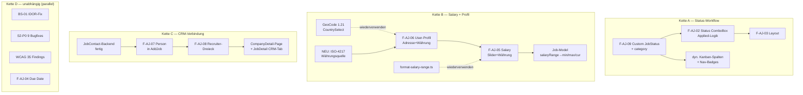

# JobSync — Konsolidiertes Backlog

**Erstellt:** 2026-05-31 | **Verifiziert gegen:** HEAD `663ff21` (Knowledge-Graph `c8e99df` + Code-grep)
**Methode:** 6 parallele Scan-Agenten über ALLE `.md` (538 Dateien) + Knowledge-Graph-Verifikation + Code-grep-Konfliktauflösung.

> **Single Source of Truth.** Diese Datei ersetzt verstreute Offene-Items-Listen aus:
> `s2-ux-polish-session.md`, `add-job-modal-ux-findings.md`, `open-items-2026-05-13.md`,
> `session-2026-05-12-open-items.md`, `gdpr-audit-report.md`, `interface-fragility-analysis.md`,
> `project_deferred_sprints_for_future_sessions.md`, `project_next_session_planning.md`,
> `project_s5b_deferred_items.md` + Memory-Handoffs.
> Quell-Dateien bleiben als Detail-Referenz; Status-Wahrheit lebt HIER.

> **Verifikations-Disziplin (Lehre dieser Session):** Doku-Wort "DONE"/"FIXED"/"FAIL" ist KEIN
> Beweis. Jeder Status unten ist code-grep-verifiziert. Scan-Agenten meldeten 9 längst-gefixte
> Items als "CRITICAL OPEN" (sie lasen veraltete Analyse-Docs). Code gewinnt immer.

---

## 0. Doku-Drift bereinigt (verifiziert ERLEDIGT, war fälschlich als offen gelistet)

Diese Items wurden von Scan-Agenten als offen/FAIL gemeldet, sind aber code-verifiziert **erledigt**.
Quell-Docs sollten entsprechend aktualisiert/markiert werden.

| Item | Behauptet offen in | Code-Beweis | Verdikt |
|------|--------------------|-------------|---------|
| Account Deletion (Art. 17) | gdpr-audit-report | `account.actions.ts` + `lib/account/execute-deletion.ts` | ERLEDIGT |
| DSAR Data-Export (Art. 15/20) | gdpr-audit, B2-scan | `lib/export/collect-user-data.ts` + `api/users/export/route.ts` | ERLEDIGT |
| PII-Egress Redaction | gdpr-audit | `lib/pii/index.ts` @ 3 AI-egress sites | ERLEDIGT |
| Retention-Cron | gdpr-audit, B2-scan | `instrumentation.ts:33-34` `startRetentionCron()` | ERLEDIGT |
| G1/IF-1 Event-Bus-Bypass (updateJob) | domain-expert, B2-scan | `job.actions.ts:524` statusChanged + `:593` emit | ERLEDIGT |
| F8 addJob statusId-Validierung | test-blindspots, B6-scan | `job.actions.ts:367-372` statusExists | ERLEDIGT |
| IF-3 CrmInterview.jobId Cascade | interface-fragility, B6-scan | `schema.prisma:1013` `onDelete: Cascade` | ERLEDIGT |
| IF-8 Notification.data Webhook-PII | interface-fragility, B6-scan | `webhook.channel.ts:97` `filterWebhookData` + allowlist | ERLEDIGT |
| Gap-2 Company.domain | crm-gap-analysis, B6-scan | `schema.prisma:306` + `enrichment-trigger.ts:214` autofill | ERLEDIGT |
| PERF-3 DispatchContext | s5b-report, B5-scan | `lib/notifications/dispatch-context.ts` | ERLEDIGT |
| PERF-2 async pbkdf2 | s5b-report, B5-scan | Memory `30ef25e` (LRU derived-key cache) | ERLEDIGT |
| G2/G2a/G2c anonymizePerson cascades | gdpr-audit | `person.actions.ts:382-428` | ERLEDIGT |
| G5 newJobsCount, G7 i18n, G9 ContactDeleted consumer | domain-expert | siehe project_next_session verifications | ERLEDIGT |
| F-AJ-01 Titel volle Breite | add-job-findings (frühere Session) | `AddJob.tsx:277` `md:col-span-2` | ERLEDIGT |
| email.ts multi-prefix split, CRM-Cron guards | deferred-memory | `35a5d55`, `crm-cron.ts:28-42/308` | ERLEDIGT |

**→ TODO:** Quell-Docs mit `[SUPERSEDED → BACKLOG.md]` markieren (separater Schritt).

---

## 1. CRITICAL — Security (verifiziert offen)

### BS-01 — deleteFile latente IDOR (ADR-019)
- **Datei:** `src/actions/profile.actions.ts:475-480`
- **Problem:** `export const deleteFile(fileId, callerUserId?)` in `"use server"`-Datei → vom Browser als
  Server-Action aufrufbar. Fehlt `callerUserId`, fällt where-clause auf `{ id: fileId }` zurück =
  Löschen fremder Dateien (IDOR).
- **Aktuelle Caller:** beide geben userId (`profile.actions.ts:400`, `api/profile/resume/route.ts:45`) →
  kein aktiver Exploit, ABER der Export macht es browser-erreichbar.
- **Fix:** Pattern A (ADR-019) — in `server-only`-Leaf verschieben ODER `callerUserId` required +
  internen `getCurrentUser()`-Gate. ~30 min.
- **Quelle:** s5-pre-implementation-checkup, BUGS.md

---

## 2. UX/UI — verifiziert offen

### 2a. S2-Pre-Audit P0 (9 Findings, code-grep offen)
Ursprung `s2-ux-polish-session.md` Pre-Audit. **NICHT** zu verwechseln mit der gelaufenen S2-Session
(deren 109 Findings sind erledigt). Diese 9 sind das offene Pre-Audit-Set:

| ID | Finding | Datei |
|----|---------|-------|
| P0-1 | NotificationSettings: kein Error-State bei Fetch-Failure (verifiziert: kein setError) | NotificationSettings.tsx |
| P0-2 | NotificationSettings: kein Confirm bei Global-Disable | NotificationSettings.tsx:111 |
| P0-3 | PushSettings: `bg-green-600` ohne dark:-Variante | PushSettings.tsx:~414 |
| P0-4 | StagedVacancyDetailSheet: Silent Error in runAction | StagedVacancyDetailSheet.tsx:81-95 |
| P0-5 | NotificationDropdown: Fetch-Failure → Spinner forever | NotificationDropdown.tsx |
| P0-6 | NotificationBell: Silent Error bei Poll-Failure | NotificationBell.tsx:50 |
| P0-7 | ActivityTimeline: Select `w-[200px]` Overflow @375px | ActivityTimeline.tsx:93 |
| P0-8 | NotificationSettings: natives `<select>` statt Shadcn | NotificationSettings.tsx:316 |
| P0-9 | NotificationSettings: `grid-cols-3` zu eng @375px | NotificationSettings.tsx:283 |

### 2b. WCAG-Compliance (35 Findings, 2 Audits, 0 remediated)
Beide Audits dokumentiert, NIE umgesetzt. Meist A11y-Detail (aria, Kontrast, motion-reduce).
- **Kanban-Audit (2026-04-02):** 21 Findings — 4 CRITICAL (Drag-Handle aria, aria-expanded, Mobile-Select/Search unlabelled), 4 HIGH, 9 MEDIUM, 3 LOW. → `docs/audits/wcag22-kanban-audit-2026-04-02.md`
- **S5b-Settings-Audit (2026-04-05):** 14 Findings — 1 CRITICAL (SMTP-Form nicht `<form>`), 4 HIGH (aria-invalid, password-toggle tabIndex, Kontrast×2), 5 MEDIUM, 4 LOW. → `docs/reviews/s5b/wcag-audit.md`

### 2c. Add-Job-Modal (F-AJ, offen-Teil)
Voll-Detail + Chains: `docs/add-job-modal-ux-findings.md`. Verifizierter Status:

| F-AJ | Status | Kern |
|------|--------|------|
| 01 Titel-Breite | **ERLEDIGT** | `md:col-span-2` da |
| 02 Applied-Toggle → Status-ComboBox | OFFEN | hängt an F-AJ-09 |
| 03 Status über Date Applied | OFFEN | Layout |
| 04 Due Date optional + Reset | OFFEN | `schema:52` noch `z.date()` |
| 05 Salary Slider+Währung+Fixum | OFFEN (Infra teilw.) | `format-salary-range.ts` wiederverwendbar; Job-Model migrieren |
| 06 Profil Adresse+Währung | TEILWEISE | CountrySelect/Subdivision/OHS da; Währung + User-Profil-Form fehlen |
| 07 CRM-Person im Add Job | TEILWEISE | JobContact-Backend fertig; AddJob-UI fehlt |
| 08 Recruiter-Dreieck | OFFEN | kein `recruitingCompanyId`/`relationshipType` |
| 09 Custom JobStatus | OFFEN | XL — JobStatus user-spezifisch + category + dyn. Kanban |

---

## 3. Abhängigkeitsketten (für Umsetzungs-Reihenfolge)

**Regel:** F-AJ-09 VOR F-AJ-02 (sonst Applied-Logik gegen feste Status, später Rewrite).
Kette D jederzeit parallel (kein Rewrite-Risiko). Kette A/B parallel zueinander; C wartet auf CRM-Basis.

---

## 4. Architektur / Tech-Debt (verifiziert offen)

| ID | Titel | Datei | Severity |
|----|-------|-------|----------|
| IF-2 | Event-Payload unsafe `as`-casts | event consumers | HIGH |
| IF-4 | degradation.ts ChannelRouter-Bypass (InApp-only Alerts) | degradation.ts:165/301/412 | HIGH |
| IF-5 | ActionResult.message untyped i18n-key | actionResult | HIGH |
| IF-7 | NotificationType 7-Datei-Fragment | notification types | HIGH |
| IF-6 | Promoter `JobStatusChanged` skip (nur VacancyPromoted) | promoter.ts | TEILWEISE |
| IF-9 | AI-Module Auth-Failure → handleAuthFailure nicht gewired (G2b-Rest) | ai-provider modules | HIGH |
| IF-10 | emitEvent Race Condition | event-bus | MEDIUM |
| IF-11/12 | State-Machine-Dup, DiscoveredJob Type-Cast | — | MEDIUM |
| 13 Events ohne Consumer | ReminderTriggered etc. fire-and-forget ins Nichts | feature-map-and-gaps | MEDIUM |
| D3 | notification-dispatch.allium 160 Parse-Errors (Allium v3) | spec | LOW (1-2h) |
| D4 | shared-entities.allium Company.domain Spec-Drift | spec | LOW (5min) |
| D5 | enrichment-trigger A-05 bounded-context (schreibt Company.domain direkt) | enrichment-trigger.ts | LOW |
| D1/D2 | runner.ts AI-SDK experimental_output deprecation + cast | runner.ts | LOW (je 30min) |

**Test-Lücken:** DAU-2 (changeJobStatus expectedFromStatusId), F6 (Toast "Dismiss" hardcoded),
F1-partial (errors.* keys 4 Locales), CRM-Consumer/Cron 0 Unit-Tests, Test-Fixture-Dup (6×).

---

## 5. CRM-Gaps (Twenty-Vergleich, blockieren ROADMAP 5.x)

| Gap | Titel | Blockiert | Status |
|-----|-------|-----------|--------|
| Gap-1 | Person→Job "Point of Contact" | 5.1/5.4/5.7 | OFFEN (= F-AJ-07) |
| Gap-2 | Company.domain | — | **ERLEDIGT** (verifiziert) |
| Gap-3 | headline vs role Trennung | 5.7/5.8 | OFFEN |
| Gap-4 | Social-Links Multi-Platform | 5.7/5.8 | TEILWEISE (socialProfiles JSON da) |
| Gap-5 | JobTimeline + CompanyTimeline UI | 5.1 | OFFEN (Component akzeptiert props, kein Page-Embed) |
| Gap-6 | Blocklist Domain-Pattern | 1.12 | OFFEN |
| Gap-7 | updated_by Tracking | 1.12/5.7 | OFFEN |

---

## 6. Dedizierte Sprints (zu groß für Cleanup-Pass)

| Item | Effort | Entry-Criteria |
|------|--------|----------------|
| H-P-09 Observability (OTel/Prometheus) | 2-3 Wochen | Stack-Entscheidung |
| PII-at-Rest (Person field-encryption, Art. 32) | multi-day | Design-Phase → Migration. Plan: `2026-05-30-next-sprint-pii-at-rest.md` |
| M-A-09 undoStore split-brain pipe-through | 2-3 Tage | ADR-030-Amendment + Migration |
| getStagedVacancies Cursor-Pagination | 2-3 Tage | User-Scale/Perf (präemptiv, kein Report) |
| F-AJ-09 Custom JobStatus | XL | Allium-Spec ZUERST (State-Machine + Kanban + API) |
| 3.11 Session-Recovery (Stale-Session Guard + usePersistedForm) | M | siehe ROADMAP 3.11 |

---

## 7. ROADMAP-Vorwärts-Features (geplant, kein Bug/Drift)

`docs/ROADMAP.md` ist code-verifiziert präzise (DONE-Marker stimmen). Offene Vorwärts-Arbeit:
- **Connectors 1.x:** Job-Discovery-Module (StepStone/Indeed), 1.2 Workflow (n8n/Zapier),
  1.7 Calendar (blockt 5.2), 1.12 Communication/Gmail-Sync (blockt 5.1)
- **UX 2.x:** Map, File-Explorer, Marketplace (je teilweise), CompanyDetail-Page
- **QoL 3.x:** Job-Gruppierung, Dedup-Fuzzy, Tiptap-Ausbau, CV-Parsing, Link-Autofill, Offline-CRUD
- **Docs 7.x:** API v1 Phase 2+, OpenAPI-Spec

→ Detail + Status in `docs/ROADMAP.md` (nicht hier duplizieren).

---

## 8. NOT-PLANNED + Design-Gated (NICHT als neu re-vorschlagen)

- **`docs/NOT-PLANNED.md`** — bewusst abgelehnt, mit Re-Eval-Triggern.
- **Design-gated** (brauchen Human-Entscheidung): 6× 40×40 Settings-Buttons (Input h-11 bump),
  react-day-picker cell-size, TasksTable density-toggle, Dark-Mode MatchScoreRing Kontrast-Audit.
- **Akzeptierte Risiken:** FL-1 google-favicon SSRF (domain-constructed), FL-2 Ollama IPv4-mapped-IPv6 (localhost by design).

---

## Statistik (verifiziert)

| Kategorie | Anzahl |
|-----------|--------|
| Doku-Drift bereinigt (war falsch-offen) | ~16 |
| CRITICAL Security offen | 1 (BS-01) |
| UX offen (S2-P0 9 + WCAG 35 + F-AJ 6) | 50 |
| Arch/Tech-Debt offen | ~13 |
| Test-Lücken | ~5 |
| CRM-Gaps offen | 5 |
| Dedizierte Sprints | 6 |
| ROADMAP-Vorwärts-Features | ~38 |
| Design-gated/Akzeptiert | ~10 |
