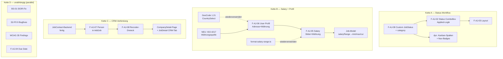

# JobSync — Konsolidiertes Backlog

**Erstellt:** 2026-05-31 | **Verifiziert gegen:** HEAD `663ff21` (Knowledge-Graph `c8e99df` + Code-grep)
**Methode:** 2 Runden, 9 parallele Scan-Agenten über ALLE `.md` (539 Repo + 8 Home-Dir) + Knowledge-Graph + Code-grep-Konfliktauflösung.
**Runde 2 (lückenlos):** 64 ungescannte Repo-Docs (ADRs/architecture/alte-prompts/specs) + 8 Home-Dir-Docs + WCAG-35 + Tech-Debt-Claims einzeln code-verifiziert.

> **Drift-Quote gemessen:** Scan-Agenten meldeten ~38 längst-gefixte Items als offen (lasen stale
> Analyse-Docs). Einzel-Verifikation: WCAG 11/35 gefixt (31%), Tech-Debt 11/20 gefixt (55%),
> Home-Dir 4/4 "neue" Items gefixt (100%). **Code-grep = einzige Wahrheit.** Alles unten verifiziert.

> **Single Source of Truth.** Diese Datei ersetzt verstreute Offene-Items-Listen aus:
> `s2-ux-polish-session.md`, `add-job-modal-ux-findings.md`, `open-items-2026-05-13.md`,
> `session-2026-05-12-open-items.md`, `gdpr-audit-report.md`, `interface-fragility-analysis.md`,
> `project_deferred_sprints_for_future_sessions.md`, `project_next_session_planning.md`,
> `project_s5b_deferred_items.md` + Memory-Handoffs.
> Quell-Dateien bleiben als Detail-Referenz; Status-Wahrheit lebt HIER.

> **Verifikations-Disziplin (Lehre dieser Session):** Doku-Wort "DONE"/"FIXED"/"FAIL" ist KEIN
> Beweis. Jeder Status unten ist code-grep-verifiziert. Scan-Agenten meldeten 9 längst-gefixte
> Items als "CRITICAL OPEN" (sie lasen veraltete Analyse-Docs). Code gewinnt immer.

---

## 0. Doku-Drift bereinigt (verifiziert ERLEDIGT, war fälschlich als offen gelistet)

Diese Items wurden von Scan-Agenten als offen/FAIL gemeldet, sind aber code-verifiziert **erledigt**.
Quell-Docs sollten entsprechend aktualisiert/markiert werden.

| Item | Behauptet offen in | Code-Beweis | Verdikt |
|------|--------------------|-------------|---------|
| Account Deletion (Art. 17) | gdpr-audit-report | `account.actions.ts` + `lib/account/execute-deletion.ts` | ERLEDIGT |
| DSAR Data-Export (Art. 15/20) | gdpr-audit, B2-scan | `lib/export/collect-user-data.ts` + `api/users/export/route.ts` | ERLEDIGT |
| PII-Egress Redaction | gdpr-audit | `lib/pii/index.ts` @ 3 AI-egress sites | ERLEDIGT |
| Retention-Cron | gdpr-audit, B2-scan | `instrumentation.ts:33-34` `startRetentionCron()` | ERLEDIGT |
| G1/IF-1 Event-Bus-Bypass (updateJob) | domain-expert, B2-scan | `job.actions.ts:524` statusChanged + `:593` emit | ERLEDIGT |
| F8 addJob statusId-Validierung | test-blindspots, B6-scan | `job.actions.ts:367-372` statusExists | ERLEDIGT |
| IF-3 CrmInterview.jobId Cascade | interface-fragility, B6-scan | `schema.prisma:1013` `onDelete: Cascade` | ERLEDIGT |
| IF-8 Notification.data Webhook-PII | interface-fragility, B6-scan | `webhook.channel.ts:97` `filterWebhookData` + allowlist | ERLEDIGT |
| Gap-2 Company.domain | crm-gap-analysis, B6-scan | `schema.prisma:306` + `enrichment-trigger.ts:214` autofill | ERLEDIGT |
| PERF-3 DispatchContext | s5b-report, B5-scan | `lib/notifications/dispatch-context.ts` | ERLEDIGT |
| PERF-2 async pbkdf2 | s5b-report, B5-scan | Memory `30ef25e` (LRU derived-key cache) | ERLEDIGT |
| G2/G2a/G2c anonymizePerson cascades | gdpr-audit | `person.actions.ts:382-428` | ERLEDIGT |
| G5 newJobsCount, G7 i18n, G9 ContactDeleted consumer | domain-expert | siehe project_next_session verifications | ERLEDIGT |
| F-AJ-01 Titel volle Breite | add-job-findings (frühere Session) | `AddJob.tsx:277` `md:col-span-2` | ERLEDIGT |
| email.ts multi-prefix split, CRM-Cron guards | deferred-memory | `35a5d55`, `crm-cron.ts:28-42/308` | ERLEDIGT |
| **— Runde-2 verifiziert ERLEDIGT (waren in §4/§5 falsch offen): —** | | | |
| IF-2 Event-Payload unsafe casts | interface-fragility, B6 | `crm-activity-logger.ts:30-32` safeParsePayload | ERLEDIGT |
| IF-4 degradation ChannelRouter-Bypass | interface-fragility, B6 | `degradation.ts:53-60` AutomationDegraded-Events (Sprint C) | ERLEDIGT |
| IF-6 Promoter JobStatusChanged+CompanyCreated skip | B6 | `promoter.ts:162-179` + `:288-302` beide emittiert | ERLEDIGT |
| IF-9 AI-Module Auth-Failure (G2b-Rest) | interface-fragility, B6 | `ai-provider/providers.ts:21-24` handleAuthFailure | ERLEDIGT |
| IF-11 State-Machine-Dup | interface-fragility, B6 | `validate-edit-transition.ts:11` import single-source | ERLEDIGT |
| DAU-2 changeJobStatus expectedFromStatusId | test-blindspots, B6 | `job.actions.ts:768/800` guard | ERLEDIGT |
| F1-partial errors.* 4-Locale | test-blindspots | zu Domain-Namespaces migriert | ERLEDIGT |
| Test-Fixture-Dup makeTestDispatchContext | s5-simplify-memory, B6 | `testFixtures.ts:1874` zentral | ERLEDIGT |
| CRM-ActivityLogger Unit-Tests | review-memory, B6 | `__tests__/crm-activity-logger.spec.ts` | ERLEDIGT |
| Gap-2 Company.domain | crm-gap, B6 | `schema.prisma:306` + autofill | ERLEDIGT |
| Gap-3 headline vs role | crm-gap, B6 | `schema.prisma:960` headline + role in CompanyAssociation | ERLEDIGT |
| Gap-4 socialProfiles multi-platform | crm-gap, B6 | `schema.prisma:961` + SocialProfile-VO | ERLEDIGT |
| WCAG O-1/O-2/O-3/O-4/O-7/P-5/R-1/R-2 (Kanban aria/labels) | kanban-audit, B3 | KanbanCard/Column/Board aria + sr-only verifiziert | ERLEDIGT (8) |
| WCAG A03/A06/A10 (SMTP toggle/contrast/form) | s5b-audit, B3 | SmtpSettings `<form>` + kein tabIndex + #636363 | ERLEDIGT (3) |
| CrmActivityLog.targetCompanyId FK | s3-handoff (home) | `@relation("ActivityLogCompany")` | ERLEDIGT |
| PersonDirectory companies JSON-Search | s3-handoff (home) | `person.actions.ts:204` `{companies:{contains}}` | ERLEDIGT |
| EURES Translator Feld-Mapping | eures-api-missing-fields (home) | 16 Feld-Mappings im Translator | ERLEDIGT (Notiz veraltet) |
| G3 degradation ChannelRouter (=IF-4) | gdpr/domain-expert | `degradation.ts` AutomationDegraded-Events | ERLEDIGT |
| G6 NotificationCreated dead event | domain-expert | `event-types.ts:30` entfernt | ERLEDIGT |
| G26 ENCRYPTION_KEY Startup-Check | domain-expert | `instrumentation.ts:3-5` throw | ERLEDIGT |
| G27 CRM i18n keys (companyNotFound/multiplePrimary) | domain-expert | `crm.ts:237/238` ×4 Locales | ERLEDIGT |
| API-v1 Cache-Control no-store (PII) | gdpr-audit | `with-api-auth.ts:99` | ERLEDIGT |

**→ TODO:** Quell-Docs mit `[SUPERSEDED → BACKLOG.md]` markieren (separater Schritt).
Bes. veraltet: `gdpr-audit-report.md`, `interface-fragility-analysis.md`, `crm-gap-analysis-twenty.md`,
beide WCAG-Audits (teil-fixed), Home-Dir s3-handoffs + eures-api-missing-fields.

---

## 1. CRITICAL — Security (verifiziert offen)

### BS-01 — deleteFile latente IDOR (ADR-019)
- **Datei:** `src/actions/profile.actions.ts:475-480`
- **Problem:** `export const deleteFile(fileId, callerUserId?)` in `"use server"`-Datei → vom Browser als
  Server-Action aufrufbar. Fehlt `callerUserId`, fällt where-clause auf `{ id: fileId }` zurück =
  Löschen fremder Dateien (IDOR).
- **Aktuelle Caller:** beide geben userId (`profile.actions.ts:400`, `api/profile/resume/route.ts:45`) →
  kein aktiver Exploit, ABER der Export macht es browser-erreichbar.
- **Fix:** Pattern A (ADR-019) — in `server-only`-Leaf verschieben ODER `callerUserId` required +
  internen `getCurrentUser()`-Gate. ~30 min.
- **Quelle:** s5-pre-implementation-checkup, BUGS.md

### 1b. GDPR-Long-Tail (verifiziert offen — aus gdpr-audit + domain-expert)
Runde-2 verifiziert: G3/G6/G27/Cache-Control/ENCRYPTION_KEY-startup = ERLEDIGT (→ §0). **Echt offen:**

| ID | Titel | Artikel | Datei | Severity |
|----|-------|---------|-------|----------|
| S6a | Kein GDPR-Audit-Trail für Job-CRUD (wer änderte was) | Art. 5(2) | — kein audit/ | HIGH |
| S6b | Kein GDPR-Audit-Trail für CRM-Read-Access (wer sah Person-Daten) | Art. 5(2) | — | HIGH |
| GDPR-JWT | JWT enthält email+name (nur `id` nötig) — Daten­minimierung | Art. 5(1)(c) | NextAuth jwt callback | MEDIUM |
| GDPR-Consent | `processingBasis` write-only, kein Enforcement/Widerruf | Art. 7 | person.model | MEDIUM |
| G25 | mergePersons: keine Target-Dedup (Task/Note doppelt bei Merge) | — | person.actions mergePersons | LOW |
| G26b | ADMIN_USER_IDS keine Startup-Validierung (ENCRYPTION_KEY hat sie) | — | instrumentation.ts | LOW |
| G28 | E2E-Cleanup fehlt CRM-FK-Reihenfolge (8 Entities) | — | e2e/cleanup-stale-data | LOW (Test) |
| GDPR-KeyRotation | Encryption-Key-Rotation nur dokumentiert, keine Infra | Art. 32 | encryption.ts | DEFERRED |

---

## 2. UX/UI — verifiziert offen

### 2a. S2-Pre-Audit P0 (9 Findings, code-grep offen)
Ursprung `s2-ux-polish-session.md` Pre-Audit. **NICHT** zu verwechseln mit der gelaufenen S2-Session
(deren 109 Findings sind erledigt). Diese 9 sind das offene Pre-Audit-Set:

| ID | Finding | Datei |
|----|---------|-------|
| P0-1 | NotificationSettings: kein Error-State bei Fetch-Failure (verifiziert: kein setError) | NotificationSettings.tsx |
| P0-2 | NotificationSettings: kein Confirm bei Global-Disable | NotificationSettings.tsx:111 |
| P0-3 | PushSettings: `bg-green-600` ohne dark:-Variante | PushSettings.tsx:~414 |
| P0-4 | StagedVacancyDetailSheet: Silent Error in runAction | StagedVacancyDetailSheet.tsx:81-95 |
| P0-5 | NotificationDropdown: Fetch-Failure → Spinner forever | NotificationDropdown.tsx |
| P0-6 | NotificationBell: Silent Error bei Poll-Failure | NotificationBell.tsx:50 |
| P0-7 | ActivityTimeline: Select `w-[200px]` Overflow @375px | ActivityTimeline.tsx:93 |
| P0-8 | NotificationSettings: natives `<select>` statt Shadcn | NotificationSettings.tsx:316 |
| P0-9 | NotificationSettings: `grid-cols-3` zu eng @375px | NotificationSettings.tsx:283 |

### 2b. WCAG-Compliance (23 verifiziert offen — von 35, 11 bereits gefixt, 1 downgraded)
Runde-2 Einzel-Code-Verifikation: 11 gefixt (siehe §0), 1 informational (A14). **23 echt offen**, meist A11y-Detail.
- **Kanban-Audit (2026-04-02)** → `docs/audits/wcag22-kanban-audit-2026-04-02.md`. OFFEN: O-5 (onDragOver ""), O-6 (role=group statt region), P-1 (color-only status, KanbanCard.tsx:60), P-2 (text-[10px] ×6, :138-171), P-3 (amber dark-contrast :167/171), P-4 (motion-reduce fehlt alert-dialog/toast), U-1 (transition-error kein hint), U-2 (StatusTransitionDialog kein aria-live), U-3 (KanbanEmptyState CTA), R-3 (ToastProvider hardcoded "Notification" toaster.tsx:19).
- **S5b-Settings-Audit (2026-04-05)** → `docs/reviews/s5b/wcag-audit.md`. OFFEN: A01 (aria-invalid SmtpSettings:410-514), A02 (autoComplete=email :506), A04 (aria-live cooldown/subscription), A05 (Rotate-Button 36px), A11 (bg-green-600 Kontrast 3.5:1 PushSettings:414), A12 (yellow-950/20 dark :427), A13 (h3 ohne h1/h2), A07 (Email kein dark media-query), A09 (Email html dir-Attr), A08 (Email layout-tables — role=presentation OK, kein Fix nötig).

### 2c. Add-Job-Modal (F-AJ, offen-Teil)
Voll-Detail + Chains: `docs/add-job-modal-ux-findings.md`. Verifizierter Status:

| F-AJ | Status | Kern |
|------|--------|------|
| 01 Titel-Breite | **ERLEDIGT** | `md:col-span-2` da |
| 02 Applied-Toggle → Status-ComboBox | OFFEN | hängt an F-AJ-09 |
| 03 Status über Date Applied | OFFEN | Layout |
| 04 Due Date optional + Reset | OFFEN | `schema:52` noch `z.date()` |
| 05 Salary Slider+Währung+Fixum | OFFEN (Infra teilw.) | `format-salary-range.ts` wiederverwendbar; Job-Model migrieren |
| 06 Profil Adresse+Währung | TEILWEISE | CountrySelect/Subdivision/OHS da; Währung + User-Profil-Form fehlen |
| 07 CRM-Person im Add Job | TEILWEISE | JobContact-Backend fertig; AddJob-UI fehlt |
| 08 Recruiter-Dreieck | OFFEN | kein `recruitingCompanyId`/`relationshipType` |
| 09 Custom JobStatus | OFFEN | XL — JobStatus user-spezifisch + category + dyn. Kanban |

---

## 3. Abhängigkeitsketten (für Umsetzungs-Reihenfolge)

**Regel:** F-AJ-09 VOR F-AJ-02 (sonst Applied-Logik gegen feste Status, später Rewrite).
Kette D jederzeit parallel (kein Rewrite-Risiko). Kette A/B parallel zueinander; C wartet auf CRM-Basis.

---

## 4. Architektur / Tech-Debt (verifiziert offen)

Runde-2 verifiziert: IF-2/IF-4/IF-6/IF-9/IF-11 ERLEDIGT (→ §0). **Echt offen:**

| ID | Titel | Datei:Zeile | Severity |
|----|-------|-------------|----------|
| IF-5 | ActionResult.message untyped i18n-key (string statt key-union) | actionResult.ts:31 | HIGH |
| IF-7 | NotificationType über 10 Dateien fragmentiert | 10 files | HIGH |
| IF-10 | emitEvent fire-and-forget (void+.catch, kein await) | events/index.ts:53-58 | MEDIUM |
| IF-12 | DiscoveredJob `as unknown as` Type-Cast | automations/[id]/page.tsx:267/269/278 | MEDIUM |
| D3 | notification-dispatch.allium 160 Parse-Errors (Allium v3) | spec | LOW (1-2h) |
| D4 | shared-entities.allium Company.domain Spec-Drift | spec | LOW (5min) |
| D5 | enrichment-trigger A-05 bounded-context (schreibt Company.domain direkt) | enrichment-trigger.ts | LOW |
| D1/D2 | runner.ts AI-SDK experimental_output deprecation + cast | runner.ts | LOW (je 30min) |

**Architektur-Note (kein Crash):** `audit-logger` konsumiert ALLE Events → jedes hat ≥1 Consumer.
Aber ReminderTriggered/NotificationCreated haben keinen FUNKTIONALEN Consumer über Logging hinaus. Spec-Drift.

**Test-Lücken (verifiziert offen):** F6 (Toast "Dismiss" hardcoded, toast.tsx:90), CRM-**Cron** 0 Unit-Tests
(crm-activity-logger HAT Tests). DAU-2, F1-partial, Test-Fixture-Dup = ERLEDIGT (→ §0).

---

## 5. CRM-Gaps (Twenty-Vergleich, blockieren ROADMAP 5.x)

Runde-2 verifiziert: Gap-2/Gap-3/Gap-4 ERLEDIGT (→ §0). **Echt offen:**

| Gap | Titel | Blockiert | Status |
|-----|-------|-----------|--------|
| Gap-1 | Person→Job "Point of Contact" | 5.1/5.4/5.7 | OFFEN (= F-AJ-07, UI-Teil) |
| Gap-5 | CompanyTimeline UI + JobDetail CRM-Tab | 5.1/5.5 | OFFEN (ActivityTimeline akzeptiert props, kein Page-Embed) |
| Gap-6 | CrmBlocklist Domain-Pattern (nur exact `handle`) | 1.12 | OFFEN |
| Gap-7 | updatedBy FK-Tracking (nur Name-based actor) | 1.12/5.7 | TEILWEISE |

---

## 6. Dedizierte Sprints (zu groß für Cleanup-Pass)

| Item | Effort | Entry-Criteria |
|------|--------|----------------|
| H-P-09 Observability (OTel/Prometheus) | 2-3 Wochen | Stack-Entscheidung |
| PII-at-Rest (Person field-encryption, Art. 32) | multi-day | Design-Phase → Migration. Plan: `2026-05-30-next-sprint-pii-at-rest.md` |
| M-A-09 undoStore split-brain pipe-through | 2-3 Tage | ADR-030-Amendment + Migration |
| getStagedVacancies Cursor-Pagination | 2-3 Tage | User-Scale/Perf (präemptiv, kein Report) |
| F-AJ-09 Custom JobStatus | XL | Allium-Spec ZUERST (State-Machine + Kanban + API) |
| 3.11 Session-Recovery (Stale-Session Guard + usePersistedForm) | M | siehe ROADMAP 3.11 |

---

## 7. ROADMAP-Vorwärts-Features (geplant, kein Bug/Drift)

`docs/ROADMAP.md` ist code-verifiziert präzise (DONE-Marker stimmen). Offene Vorwärts-Arbeit:
- **Connectors 1.x:** Job-Discovery-Module (StepStone/Indeed), 1.2 Workflow (n8n/Zapier),
  1.7 Calendar (blockt 5.2), 1.12 Communication/Gmail-Sync (blockt 5.1)
- **UX 2.x:** Map, File-Explorer, Marketplace (je teilweise), CompanyDetail-Page
- **QoL 3.x:** Job-Gruppierung, Dedup-Fuzzy, Tiptap-Ausbau, CV-Parsing, Link-Autofill, Offline-CRUD
- **Docs 7.x:** API v1 Phase 2+, OpenAPI-Spec

→ Detail + Status in `docs/ROADMAP.md` (nicht hier duplizieren).

---

## 8. NOT-PLANNED + Design-Gated (NICHT als neu re-vorschlagen)

- **`docs/NOT-PLANNED.md`** — bewusst abgelehnt, mit Re-Eval-Triggern.
- **Design-gated** (brauchen Human-Entscheidung): 6× 40×40 Settings-Buttons (Input h-11 bump),
  react-day-picker cell-size, TasksTable density-toggle, Dark-Mode MatchScoreRing Kontrast-Audit.
- **Akzeptierte Risiken:** FL-1 google-favicon SSRF (domain-constructed), FL-2 Ollama IPv4-mapped-IPv6 (localhost by design).

---

## Statistik (verifiziert)

| Kategorie | Anzahl |
|-----------|--------|
| Doku-Drift bereinigt (verifiziert war falsch-offen) | ~43 |
| CRITICAL Security offen | 1 (BS-01) |
| GDPR-Long-Tail offen | 6 (S6a/S6b/JWT/Consent/G25/G26b/G28) + 1 deferred |
| UX offen (S2-P0 9 + WCAG 23 + F-AJ 6) | 38 |
| Arch/Tech-Debt offen | 8 (IF-5/7/10/12 + D1-D5) |
| Test-Lücken offen | 2 (F6, CRM-Cron-Tests) |
| CRM-Gaps offen | 4 (Gap-1/5/6/7) |
| Dedizierte Sprints | 6 |
| ROADMAP-Vorwärts-Features | ~38 |
| Design-gated/Akzeptiert | ~10 |

**Verifikations-Vollständigkeit:** 539 Repo-`.md` + 8 Home-Dir-`.md` + 30 Allium-Specs gescannt.
319 Archive bewusst ausgeschlossen (historisch). 0 ungescannte Nicht-Archiv-Dateien verbleibend.
Jeder OFFEN/ERLEDIGT-Status code-grep-verifiziert (keine Doku-Wort-Vertrauen).
