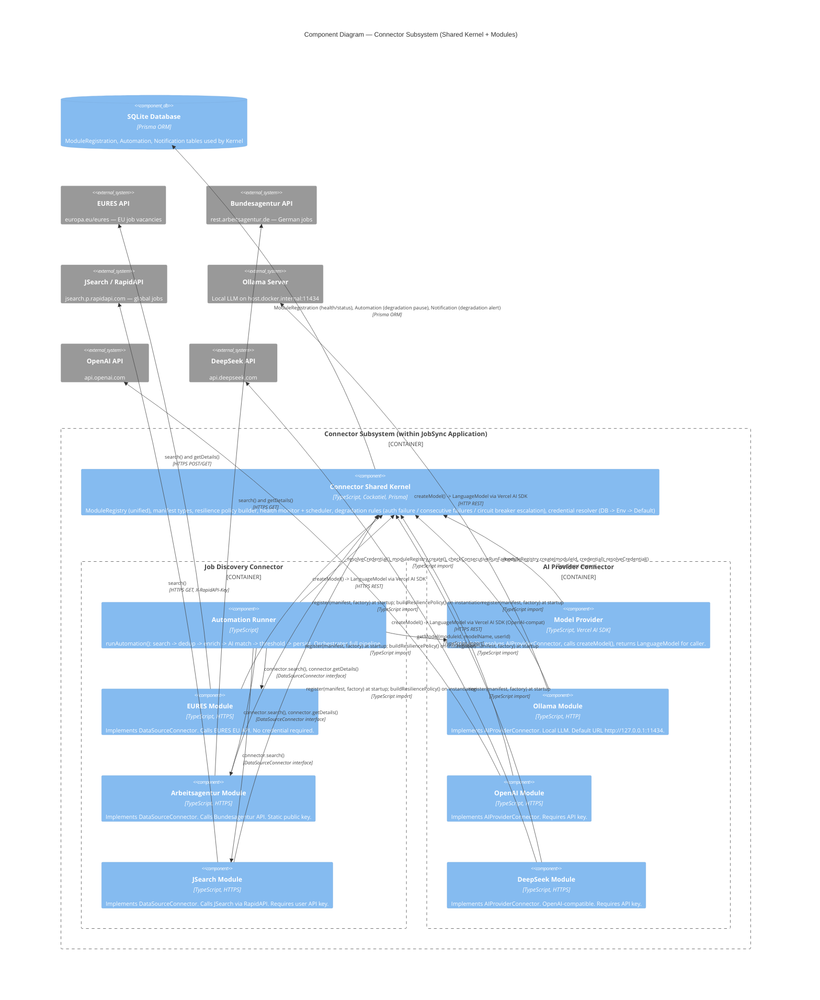
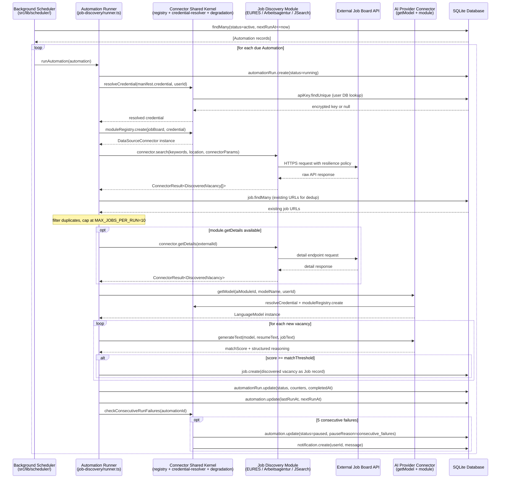

# C4 Component Level: JobSync Application Container

## Overview

- **Container**: JobSync Application (Node.js 20, Next.js 15)
- **Scope**: All logical components inside the single Docker container, after Roadmap 0.2–0.4
- **Architecture style**: Domain-Driven Design (DDD) with Anti-Corruption Layer (ACL), Repository pattern, and a unified Module Lifecycle Manager
- **Related diagrams**: [C4 Context](./c4-context.md) | [C4 Container](./c4-container.md)

This document inventories the eight logical components that make up the JobSync Application container, defines their responsibilities and interfaces, maps their dependencies, and provides Mermaid C4Component diagrams showing both the full internal structure and the focused connector subsystem.

---

## Component Inventory

| # | Component | Primary Path | Type | Technology |
|---|-----------|-------------|------|-----------|
| 1 | [Authentication Component](#1-authentication-component) | `src/auth.ts`, `src/middleware.ts` | Security | NextAuth.js v5, bcrypt |
| 2 | [Server Actions Layer](#2-server-actions-layer) | `src/actions/` | Repository / Application Service | Next.js Server Actions, Prisma, Zod |
| 3 | [Connector Shared Kernel](#3-connector-shared-kernel) | `src/lib/connector/` (top-level) | Shared Domain Library | TypeScript, Cockatiel, Prisma |
| 4 | [Job Discovery Connector](#4-job-discovery-connector) | `src/lib/connector/job-discovery/` | ACL / Integration | TypeScript, HTTPS REST |
| 5 | [AI Provider Connector](#5-ai-provider-connector) | `src/lib/connector/ai-provider/` | ACL / Integration | Vercel AI SDK, TypeScript |
| 6 | [Domain Models](#6-domain-models) | `src/models/` | Domain Library | TypeScript, Zod |
| 7 | [UI Components](#7-ui-components) | `src/components/`, `src/app/` | Presentation | React 19, Shadcn UI, Tailwind CSS |
| 8 | [i18n System](#8-i18n-system) | `src/i18n/` | Cross-Cutting Service | TypeScript, date-fns |

---

## 1. Authentication Component

### Overview

- **Name**: Authentication Component
- **Description**: Provides credential-based session management and route protection for the entire application.
- **Type**: Security Infrastructure
- **Technology**: NextAuth.js v5 (Auth.js), bcryptjs, JWT, Next.js Middleware

### Purpose

Handles all concerns around who can access the application. Verifies email/password credentials against bcrypt hashes stored in SQLite, issues signed JWT sessions, and enforces route-level guards through Next.js middleware. All server actions and API routes that access user data call `getCurrentUser()` (a thin wrapper over `auth()`) as their first step.

The component does not use external OAuth providers — authentication is self-contained inside the Docker container.

### Software Features

- **Credential authentication**: Email and password sign-in validated by Zod schema before bcrypt comparison
- **Session management**: Signed JWT sessions issued by NextAuth with `AUTH_SECRET` as the signing key
- **Route protection**: `src/middleware.ts` intercepts all requests to `/dashboard` and `/dashboard/**` and redirects unauthenticated users to the sign-in page
- **Session propagation**: `getCurrentUser()` utility resolves the current user from the active session; used as the authentication guard in all server actions and API routes
- **Registration flow**: New users created via `signUp()` server action with bcrypt password hashing

### Code Elements

- `src/auth.ts` — NextAuth initialisation, credentials provider, user lookup
- `src/auth.config.ts` — Authorisation callbacks, protected route patterns
- `src/middleware.ts` — Next.js edge middleware enforcing session on `/dashboard/**`
- `src/actions/auth.actions.ts` — `signUp()`, `signIn()`, `signOut()` server actions
- `src/utils/user.utils.ts` — `getCurrentUser()` helper used by all other components

### Interfaces

#### Session API (NextAuth)

- **Protocol**: HTTP POST / Cookie
- **Path**: `/api/auth/[...nextauth]`
- **Operations**:
  - `POST /api/auth/signin` — Credential sign-in (email, password)
  - `GET/POST /api/auth/callback/credentials` — NextAuth credential callback
  - `POST /api/auth/signout` — Session termination

#### Internal: `getCurrentUser(): Promise<User | null>`

Called by every server action and API route to gate access. Returns the authenticated user record or `null` if no valid session exists.

### Dependencies

- **Domain Models**: reads `User` model
- **SQLite Database**: user lookup and bcrypt verification via Prisma

---

## 2. Server Actions Layer

### Overview

- **Name**: Server Actions Layer
- **Description**: The application's Repository layer — all database reads and writes for every domain aggregate flow through typed server actions returning `ActionResult<T>`.
- **Type**: Application Service / Repository
- **Technology**: Next.js 15 Server Actions (`"use server"`), Prisma ORM, Zod validation

### Purpose

The Server Actions Layer is the single authorised path from UI components and API routes to the SQLite database. It implements the Repository pattern: each domain aggregate (Job, Automation, Profile, Task, Activity, etc.) has exactly one server action file that owns all mutations and queries for that aggregate. No other code creates Prisma queries outside this layer.

Every write operation validates input through a Zod schema before touching the database. Return types follow the `ActionResult<T>` contract: `{ success: true, data: T }` or `{ success: false, message: string }`, enabling type-safe error handling in React components without try-catch.

### Software Features

- **Aggregate repositories**: One action file per DDD aggregate — `job.actions.ts`, `automation.actions.ts`, `profile.actions.ts`, `task.actions.ts`, `activity.actions.ts`, `note.actions.ts`, `question.actions.ts`, `tag.actions.ts`
- **ActionResult contract**: `ActionResult<T>` discriminated union returned by all mutation actions (Pattern A); Pattern B functions return raw arrays for select lists; Pattern C (dashboard) returns custom shapes
- **Input validation**: All mutations validate inputs with Zod schemas imported from `src/models/`
- **Authentication gate**: Every action calls `getCurrentUser()` as its first step; unauthenticated calls return `{ success: false, message: "Not authenticated" }`
- **Module lifecycle actions**: `module.actions.ts` exposes `getModuleManifests()`, `activateModule()`, `deactivateModule()`, `runHealthCheck()`, `getActiveModules()` for the Connector Shared Kernel
- **Automation execution trigger**: `automation.actions.ts` delegates to the Automation Runner when a manual run is requested
- **Dashboard aggregation**: `dashboard.actions.ts` returns composite statistics (job counts by status, recent runs, upcoming tasks) in a single query burst
- **Settings persistence**: `userSettings.actions.ts` reads and writes user settings JSON (AI provider, model, locale, timezone, developer flags)
- **API key management**: `apiKey.actions.ts` stores and retrieves per-user encrypted API keys through the Encryption utility
- **Notification management**: `notification.actions.ts` queries and dismisses persistent notifications created by the degradation rules

### Code Elements

- `src/actions/job.actions.ts` — Job aggregate CRUD, status transitions, tag/note operations
- `src/actions/automation.actions.ts` — Automation CRUD, run trigger, discovered job review
- `src/actions/profile.actions.ts` — Resume, section, contact info, work experience, education CRUD
- `src/actions/task.actions.ts` — Task CRUD and status management
- `src/actions/activity.actions.ts` — Activity CRUD and timer operations
- `src/actions/note.actions.ts` — Note CRUD scoped to job records
- `src/actions/question.actions.ts` — Q&A bank CRUD
- `src/actions/tag.actions.ts` — Tag management and job/question associations
- `src/actions/module.actions.ts` — Module lifecycle operations (activate, deactivate, health check)
- `src/actions/dashboard.actions.ts` — Dashboard analytics aggregation
- `src/actions/userSettings.actions.ts` — User preference persistence
- `src/actions/apiKey.actions.ts` — Encrypted API key storage
- `src/actions/notification.actions.ts` — Persistent notification queries and dismissal
- `src/actions/company.actions.ts`, `jobLocation.actions.ts`, `jobSource.actions.ts`, `jobtitle.actions.ts` — Reference data entity management
- `src/models/actionResult.ts` — `ActionResult<T>` type definition

### Interfaces

#### `ActionResult<T>` (Shared Return Contract)

```typescript
interface ActionResult<T = undefined> {
  success: boolean;
  data?: T;
  total?: number;   // pagination total for list operations
  message?: string; // error message when success = false
}
```

#### Key Action Signatures

- `getJobsList(page, limit, filter?, search?): Promise<ActionResult<JobResponse[]>>`
- `createJob(data: JobForm): Promise<ActionResult<JobResponse>>`
- `getAutomationsList(page, limit): Promise<ActionResult<AutomationWithResume[]>>`
- `createAutomation(data: CreateAutomationInput): Promise<ActionResult<Automation>>`
- `getResumeList(page, limit): Promise<ActionResult<Resume[]>>`
- `activateModule(moduleId): Promise<ActionResult<{moduleId, status}>>`
- `deactivateModule(moduleId): Promise<ActionResult<{moduleId, status, pausedAutomations}>>`
- `runHealthCheck(moduleId): Promise<ActionResult<{moduleId, healthStatus, responseTimeMs, error?}>>`

### Dependencies

- **Authentication Component**: `getCurrentUser()` on every action
- **Domain Models**: input/output type contracts, Zod schemas for validation
- **Connector Shared Kernel**: `module.actions.ts` calls `moduleRegistry`, `checkModuleHealth()`
- **Job Discovery Connector**: `automation.actions.ts` calls `runAutomation()` for manual runs
- **SQLite Database**: all Prisma queries
- **Encryption utility**: `apiKey.actions.ts` calls `encrypt()` / `decrypt()`

---

## 3. Connector Shared Kernel

### Overview

- **Name**: Connector Shared Kernel
- **Description**: The unified registry, manifest types, resilience infrastructure, health monitoring, degradation rules, and credential resolution that all connector modules share.
- **Type**: Shared Domain Library (server-side only)
- **Technology**: TypeScript, Cockatiel (resilience), Prisma

### Purpose

The Connector Shared Kernel is the domain layer that enforces uniform behaviour across all pluggable connector modules — both job discovery and AI provider. Before Roadmap 0.4, resilience and registry logic was duplicated across individual modules. The Kernel centralises these concerns into a single `ModuleRegistry` (the unified registry replacing the older separate registries), a manifest-driven resilience policy builder, a health monitor, three degradation escalation rules, and a credential resolver.

Modules declare their requirements (credentials, health endpoints, resilience thresholds) through `ModuleManifest` objects. The Kernel then fulfils them — building resilience policies, executing health checks, resolving credentials — without the modules needing to know how these concerns are implemented.

### Software Features

- **Unified ModuleRegistry**: Single in-memory store for all modules (`ModuleRegistry` in `registry.ts`); supports `register()`, `get()`, `getByType()`, `getActive()`, `create()`, `setStatus()`, `updateHealth()`, `updateCircuitBreaker()`; idempotent re-registration (safe for Next.js HMR)
- **Manifest types**: `ModuleManifest`, `JobDiscoveryManifest`, `AiManifest` — Published Language between module implementations and the Kernel; carries credential requirements, health check config, resilience config, and optional model selection config
- **Manifest-driven resilience**: `buildResiliencePolicy(config)` constructs a composed Cockatiel policy (retry + circuit breaker + timeout + bulkhead) from `ResilienceConfig` in the manifest; shared by all modules instead of each maintaining its own resilience code
- **Token-bucket rate limiter**: `rate-limiter.ts` provides per-module request throttling, also driven by manifest config (`rateLimitTokens`, `rateLimitRefillMs`)
- **Health monitor**: `health-monitor.ts` — `checkModuleHealth(moduleId)` probes the module's declared endpoint, tracks consecutive failures, promotes health status through `UNKNOWN -> HEALTHY -> DEGRADED -> UNREACHABLE` transitions, persists results to `ModuleRegistration` table
- **Health scheduler**: `health-scheduler.ts` — `startHealthScheduler()` schedules periodic background health probes for all active modules at their manifest-declared `intervalMs`; HMR-safe via `globalThis` timers
- **Degradation rules** (`degradation.ts`):
  - `handleAuthFailure(moduleId)` — on 401/403, sets module to ERROR and pauses all active automations using it, with notifications
  - `checkConsecutiveRunFailures(automationId)` — after 5 consecutive failed automation runs, pauses the automation
  - `handleCircuitBreakerTrip(moduleId)` — after 3 circuit-breaker opens, pauses all active automations using the module
  - `handleCircuitBreakerRecovery(moduleId)` — resets CB failure counter on recovery
- **Credential resolver** (`credential-resolver.ts`): `resolveCredential(requirement, userId)` implements the three-step PUSH chain: User DB (decrypted ApiKey) → Environment variable fallback → Manifest default value
- **Connector params validator** (`params-validator.ts`): Validates connector-specific parameters (e.g., ESCO URI, NUTS code) before passing them to modules

### Code Elements

- `src/lib/connector/manifest.ts` — All manifest types, enums (`ConnectorType`, `ModuleStatus`, `HealthStatus`, `CircuitBreakerState`), and Published Language interfaces
- `src/lib/connector/registry.ts` — `ModuleRegistry` class and singleton `moduleRegistry` export
- `src/lib/connector/resilience.ts` — `buildResiliencePolicy()`, `ConnectorApiError`, `ResiliencePolicy` interface
- `src/lib/connector/rate-limiter.ts` — `TokenBucketRateLimiter` class
- `src/lib/connector/health-monitor.ts` — `checkModuleHealth()`, `checkAllModuleHealth()`
- `src/lib/connector/health-scheduler.ts` — `startHealthScheduler()`, `stopHealthScheduler()`
- `src/lib/connector/degradation.ts` — Three escalation rules and recovery handler
- `src/lib/connector/credential-resolver.ts` — `resolveCredential()` PUSH chain

### Interfaces

#### `ModuleRegistry` (Singleton: `moduleRegistry`)

- `register(manifest: ModuleManifest, factory: ConnectorFactory): void`
- `get(moduleId: string): RegisteredModule | undefined`
- `getByType(connectorType: ConnectorType): RegisteredModule[]`
- `getActive(connectorType: ConnectorType): RegisteredModule[]`
- `create(moduleId: string, ...args): AnyConnector`
- `setStatus(moduleId: string, status: ModuleStatus): boolean`
- `updateHealth(moduleId, healthStatus, lastCheck, lastSuccess?, consecutiveFailures?): boolean`
- `updateCircuitBreaker(moduleId, consecutiveFailures, cbState?, cbOpenSince?): boolean`

#### `buildResiliencePolicy(config: ResilienceConfig): ResiliencePolicy`

- `execute<T>(fn): Promise<T>` — run operation through composed Cockatiel policy
- `resilientFetch<T>(url, init, moduleName?): Promise<T>` — convenience method: rate limit + policy + fetch

#### `resolveCredential(requirement: CredentialRequirement, userId: string): Promise<string | undefined>`

#### Degradation handlers

- `handleAuthFailure(moduleId: string, errorDetail: string): Promise<{ pausedCount: number }>`
- `checkConsecutiveRunFailures(automationId: string): Promise<{ paused: boolean }>`
- `handleCircuitBreakerTrip(moduleId: string): Promise<{ pausedCount: number }>`
- `handleCircuitBreakerRecovery(moduleId: string): void`

### Dependencies

- **Domain Models**: `AutomationPauseReason` (canonical location for pause reason enum)
- **SQLite Database**: `ModuleRegistration` table for health/status persistence; `Automation`, `Notification` tables for degradation rule effects
- **Encryption utility** (via credential resolver): decrypts stored API keys

---

## 4. Job Discovery Connector

### Overview

- **Name**: Job Discovery Connector
- **Description**: The Anti-Corruption Layer that translates EURES, Bundesagentur, and JSearch external job board APIs into the canonical `DiscoveredVacancy` domain type, plus the Automation Runner that orchestrates the full discovery pipeline.
- **Type**: ACL / Integration Layer (server-side only)
- **Technology**: TypeScript, HTTPS REST, Cockatiel resilience (via Shared Kernel)

### Purpose

The Job Discovery Connector is the bounded context responsible for everything related to automated job discovery. It defines the `DataSourceConnector` interface that all job board modules must implement, registers the three built-in modules (EURES, Arbeitsagentur, JSearch), and provides the `runAutomation()` function that orchestrates the complete pipeline: search → deduplication → optional detail enrichment → AI matching → threshold filtering → persistence.

Each module operates in its own internal language (EURES uses `locationCodes` and `jvProfiles`; Arbeitsagentur uses `arbeitsort` and `refnr`; JSearch uses `job_city` and `employer_name`). These internal types never escape the module boundary; all inter-context communication happens through `DiscoveredVacancy`.

The facade registry (`ConnectorRegistry`) delegates to the Shared Kernel `ModuleRegistry`, maintaining backward API compatibility for callers that used the old separate registry.

### Software Features

- **`DataSourceConnector` interface**: Contract for all job board modules — `id`, `name`, `requiresApiKey`, `search(params): Promise<ConnectorResult<DiscoveredVacancy[]>>`, optional `getDetails(externalId): Promise<ConnectorResult<DiscoveredVacancy>>`
- **`DiscoveredVacancy` canonical type**: 12-field domain record representing a job found by automation (title, employer, location, description, sourceUrl, sourceBoard, postedAt, salary, employmentType, externalId, applicationDeadline, applicationInstructions)
- **`ConnectorResult<T>`**: Discriminated union wrapping all module responses; four error variants: `blocked`, `rate_limited`, `network`, `parse`
- **EURES module**: Calls `https://europa.eu/eures/api`; supports NUTS location codes, ESCO occupation URIs, language-aware job descriptions, and a detail endpoint for full vacancy data; three-level location combobox autocomplete (`autocomplete.ts`)
- **Arbeitsagentur module**: Calls `https://rest.arbeitsagentur.de/jobboerse/jobsuche-service/pc/v4/jobs`; German job market; coordinate-based location with configurable radius; no API key required (static public key `jobboerse-jobsuche`)
- **JSearch module**: Calls `https://jsearch.p.rapidapi.com/search`; Google Jobs aggregator; requires RapidAPI key; full job details returned in search response (no separate detail step needed)
- **Module manifests**: Each module declares a `JobDiscoveryManifest` (credentials, health endpoint, resilience thresholds); the Shared Kernel builds the actual policy from this declaration
- **Automation Runner** (`runner.ts`): Orchestrates the full pipeline — credential PUSH via `resolveCredential()`, `connector.search()`, URL-based deduplication against existing jobs, optional `connector.getDetails()` per-vacancy enrichment (capped at `MAX_JOBS_PER_RUN = 10`), AI match scoring, threshold comparison, Prisma job creation, `finalizeRun()` with next-schedule calculation, degradation check
- **Schedule calculator**: `schedule.ts` computes `nextRunAt` from `scheduleHour` and `scheduleFrequency` (daily, weekly, biweekly, monthly)
- **Vacancy mapper**: `mapper.ts` translates `DiscoveredVacancy` to a Prisma `Job` create payload, resolving or creating `JobTitle`, `Company`, and `Location` reference records
- **URL normaliser**: `utils.ts` normalises job source URLs for deduplication (strips tracking params, normalises trailing slashes)
- **Facade ConnectorRegistry**: `registry.ts` thin wrapper over `moduleRegistry` for backward compatibility

### Code Elements

- `src/lib/connector/job-discovery/types.ts` — `DiscoveredVacancy`, `DataSourceConnector`, `ConnectorResult<T>`, `ConnectorError`, `SearchParams`
- `src/lib/connector/job-discovery/runner.ts` — `runAutomation(automation): Promise<RunnerResult>`
- `src/lib/connector/job-discovery/mapper.ts` — `mapDiscoveredVacancyToJobRecord()`
- `src/lib/connector/job-discovery/schedule.ts` — `calculateNextRunAt()`, `ScheduleFrequency`
- `src/lib/connector/job-discovery/utils.ts` — `normalizeJobUrl()`
- `src/lib/connector/job-discovery/registry.ts` — `ConnectorRegistry` facade
- `src/lib/connector/register-all.ts` — Central module registration entry point (imports each module's index.ts to trigger self-registration)
- `src/lib/connector/job-discovery/index.ts` — Public barrel export
- `src/lib/connector/job-discovery/modules/eures/index.ts` — EURES `DataSourceConnector` implementation
- `src/lib/connector/job-discovery/modules/eures/manifest.ts` — EURES `JobDiscoveryManifest`
- `src/lib/connector/job-discovery/modules/eures/translator.ts` — EURES API response to `DiscoveredVacancy`
- `src/lib/connector/job-discovery/modules/eures/autocomplete.ts` — Location combobox API calls
- `src/lib/connector/job-discovery/modules/eures/countries.ts` — EU country list with NUTS codes
- `src/lib/connector/job-discovery/modules/arbeitsagentur/index.ts` — Arbeitsagentur `DataSourceConnector`
- `src/lib/connector/job-discovery/modules/arbeitsagentur/manifest.ts` — Arbeitsagentur manifest
- `src/lib/connector/job-discovery/modules/jsearch/index.ts` — JSearch `DataSourceConnector`
- `src/lib/connector/job-discovery/modules/jsearch/manifest.ts` — JSearch manifest

### Interfaces

#### `DataSourceConnector` (TypeScript interface)

```typescript
interface DataSourceConnector {
  readonly id: string;
  readonly name: string;
  readonly requiresApiKey: boolean;
  search(params: SearchParams): Promise<ConnectorResult<DiscoveredVacancy[]>>;
  getDetails?(externalId: string): Promise<ConnectorResult<DiscoveredVacancy>>;
}
```

#### `runAutomation(automation: Automation): Promise<RunnerResult>`

```typescript
interface RunnerResult {
  runId: string;
  status: AutomationRunStatus;
  jobsSearched: number;
  jobsDeduplicated: number;
  jobsProcessed: number;
  jobsMatched: number;
  jobsSaved: number;
  errorMessage?: string;
  blockedReason?: string;
}
```

### Dependencies

- **Connector Shared Kernel**: `moduleRegistry` (module lookup and creation), `resolveCredential()` (credential PUSH), `buildResiliencePolicy()` (module resilience), `checkConsecutiveRunFailures()` (post-run degradation check)
- **AI Provider Connector**: `getModel()` — obtains a `LanguageModel` for the AI matching step inside `runAutomation()`
- **Domain Models**: `Automation`, `AutomationRunStatus`, `JobBoard` types
- **Server Actions Layer**: called by `automation.actions.ts` to trigger manual runs
- **SQLite Database**: `AutomationRun` creation and update, `Job` creation, `Automation` schedule update, existing job URL lookup
- **External systems**: EURES API, Bundesagentur API, JSearch/RapidAPI (called only from within individual modules)

---

## 5. AI Provider Connector

### Overview

- **Name**: AI Provider Connector
- **Description**: The Anti-Corruption Layer for AI capabilities — model instantiation, resume preprocessing, job preprocessing, prompt management, and structured output extraction for resume review and job match scoring.
- **Type**: ACL / Integration Layer (server-side only)
- **Technology**: TypeScript, Vercel AI SDK (`ai` package), Zod (structured output schemas)

### Purpose

The AI Provider Connector abstracts the differences between Ollama (local HTTP), OpenAI (cloud HTTPS), and DeepSeek (cloud HTTPS) behind a single `AIProviderConnector` interface. It provides the Automation Runner and API routes with a unified `getModel()` function that resolves a Vercel AI SDK `LanguageModel` for any configured provider.

Beyond model access, the component owns all AI-specific domain logic: the system prompts for resume review and job matching, the Zod schemas defining structured output (`ResumeReviewSchema`, `JobMatchSchema`), and text preprocessing utilities that clean and normalise resume and job description text before sending it to the model.

The facade registry (`AIProviderRegistry`) delegates to the Shared Kernel `ModuleRegistry`, maintaining backward API compatibility.

### Software Features

- **`AIProviderConnector` interface**: Contract for all AI modules — `id`, `name`, `requiresApiKey`, `healthCheck(userId?)`, `listModels(userId?)`, `createModel(modelName, userId?)`
- **`AIConnectorResult<T>`**: Discriminated union for AI connector responses; four error variants: `unavailable`, `auth_failed`, `rate_limited`, `network`
- **Ollama module**: Calls `http://{configured_url}/api/`; supports dynamic model listing from `GET /api/tags`; no API key required by default; health check via `/api/tags`
- **OpenAI module**: Calls `https://api.openai.com`; model listing from `/models` endpoint; requires API key; health check via `/models`
- **DeepSeek module**: Calls `https://api.deepseek.com`; OpenAI-compatible API via `createOpenAI()` from Vercel AI SDK; requires API key
- **Module manifests**: Each module declares an `AiManifest` (extends `ModuleManifest` with `modelSelection` config for default model and list endpoint)
- **`getModel(moduleId, modelName, userId?): Promise<LanguageModel>`**: Single entry point for the Automation Runner and API routes; resolves the module, creates the model, throws on failure
- **Structured output schemas**: `JobMatchSchema` (matchScore 0-100, skill/experience/education reasoning), `ResumeReviewSchema` (content, language, formatting feedback)
- **AI prompts**: `JOB_MATCH_SYSTEM_PROMPT`, `RESUME_REVIEW_SYSTEM_PROMPT`, `buildJobMatchPrompt()`, `buildResumeReviewPrompt()` — all prompt construction centralised here
- **Resume preprocessing**: `preprocessResume()`, `convertResumeToText()` — extracts and normalises resume sections for AI input
- **Job preprocessing**: `preprocessJob()`, `convertJobToText()` — extracts and normalises job description for AI input
- **Text processing utilities**: `removeHtmlTags()`, `normalizeWhitespace()`, `normalizeBullets()`, `normalizeHeadings()`, `extractMetadata()`, `validateText()`
- **Rate limiting**: Per-user AI request rate limiter (`checkRateLimit()`) prevents abuse of the AI inference endpoints
- **Facade AIProviderRegistry**: `registry.ts` thin wrapper over `moduleRegistry` for backward compatibility

### Code Elements

- `src/lib/connector/ai-provider/types.ts` — `AIProviderConnector`, `AIConnectorResult<T>`, `AIConnectorError`
- `src/lib/connector/ai-provider/providers.ts` — `getModel()` function
- `src/lib/connector/ai-provider/registry.ts` — `AIProviderRegistry` facade
- `src/lib/connector/ai-provider/config.ts` — AI provider configuration constants
- `src/lib/connector/ai-provider/rate-limiter.ts` — `checkRateLimit()` per-user AI rate limiter
- `src/lib/connector/ai-provider/index.ts` — Public barrel export
- `src/lib/connector/register-all.ts` — Central module registration entry point (shared; already listed above)
- `src/lib/connector/ai-provider/modules/ollama/index.ts` — Ollama `AIProviderConnector`
- `src/lib/connector/ai-provider/modules/ollama/manifest.ts` — Ollama `AiManifest`
- `src/lib/connector/ai-provider/modules/openai/index.ts` — OpenAI `AIProviderConnector`
- `src/lib/connector/ai-provider/modules/openai/manifest.ts` — OpenAI `AiManifest`
- `src/lib/connector/ai-provider/modules/deepseek/index.ts` — DeepSeek `AIProviderConnector`
- `src/lib/connector/ai-provider/modules/deepseek/manifest.ts` — DeepSeek `AiManifest`
- `src/lib/connector/ai-provider/prompts/` — System prompts and prompt builder functions
- `src/lib/connector/ai-provider/tools/` — Preprocessing and text-processing utilities
- `src/models/ai.model.ts` — `AiModuleId` enum, model name enums (`OllamaModel`, `OpenaiModel`, `DeepseekModel`)
- `src/models/ai.schemas.ts` — `JobMatchSchema`, `ResumeReviewSchema`, structured output type definitions

### Interfaces

#### `AIProviderConnector` (TypeScript interface)

```typescript
interface AIProviderConnector {
  readonly id: string;
  readonly name: string;
  readonly requiresApiKey: boolean;
  healthCheck(userId?: string): Promise<AIConnectorResult<boolean>>;
  listModels(userId?: string): Promise<AIConnectorResult<string[]>>;
  createModel(modelName: string, userId?: string): Promise<AIConnectorResult<LanguageModel>>;
}
```

#### `getModel(moduleId: AiModuleId, modelName: string, userId?: string): Promise<LanguageModel>`

Used by the Automation Runner and AI inference API routes to obtain a Vercel AI SDK model instance.

#### AI Inference API (HTTP endpoints backed by this component)

- `POST /api/ai/resume/review` — Stream resume review via `generateText()` with `ResumeReviewSchema`
- `POST /api/ai/resume/match` — Score resume against job description via `generateText()` with `JobMatchSchema`
- `GET /api/ai/ollama/tags` — Proxy: list available Ollama models
- `GET /api/ai/deepseek/models` — Proxy: list available DeepSeek models

### Dependencies

- **Connector Shared Kernel**: `moduleRegistry` (module lookup and creation), `resolveCredential()` (API key PUSH), `buildResiliencePolicy()` (optional, per module)
- **Domain Models**: `AiModuleId`, `OllamaModel`, `OpenaiModel`, `DeepseekModel` enums; `JobMatchSchema`, `ResumeReviewSchema` Zod schemas
- **Job Discovery Connector**: called by `runner.ts` for AI match scoring during automation execution
- **Server Actions Layer**: AI inference API routes call `getModel()` after resolving user settings via `userSettings.actions.ts`
- **External systems**: Ollama server (local HTTP), OpenAI API, DeepSeek API

---

## 6. Domain Models

### Overview

- **Name**: Domain Models
- **Description**: Prisma-aligned TypeScript interfaces, Zod validation schemas, and domain enums that define the shared language of the JobSync application.
- **Type**: Domain Library (shared across all components)
- **Technology**: TypeScript, Zod

### Purpose

The Domain Models component provides the type system that all other components use to communicate. It is intentionally a pure library — no runtime behaviour, no database calls, no external dependencies beyond Zod. Every domain concept is defined here once and referenced everywhere else.

The models are kept intentionally aligned with the Prisma schema but are not identical to Prisma's generated types. They represent the domain view (value objects, aggregate interfaces, enums) rather than the database view, allowing the application layer to work with typed domain objects while Prisma handles persistence concerns.

### Software Features

- **Aggregate interfaces**: `JobResponse`, `Automation`, `AutomationWithResume`, `AutomationRun`, `DiscoveredJob`, `Resume`, `ResumeSection`, `WorkExperience`, `Education`, `ContactInfo`
- **Value object types**: `DiscoveredVacancy` (canonical job found by automation), `ActionResult<T>` (server action return contract), `EuresCountry`, `Tag`, `JobStatus`, `JobSource`, `JobLocation`, `Company`, `JobTitle`
- **Domain enums**: `JobBoard` ("jsearch" | "eures" | "arbeitsagentur"), `AutomationStatus` ("active" | "paused"), `AutomationPauseReason` (4 variants), `AutomationRunStatus` (6 variants), `DiscoveryStatus` ("new" | "accepted" | "dismissed"), `AiModuleId` ("ollama" | "openai" | "deepseek"), `SectionType` (8 resume section types)
- **Zod validation schemas**: One schema per form/input type — `AddJobFormSchema`, `CreateAutomationSchema`, `UpdateAutomationSchema`, `AddContactInfoFormSchema`, `AddExperienceFormSchema`, `CreateResumeFormSchema`, `SigninFormSchema`, `SignupFormSchema`, etc.
- **AI schemas**: `JobMatchSchema` (Zod schema for structured AI output), `ResumeReviewSchema` (structured review output), `AiSettings` type
- **Settings types**: `UserSettings` JSON shape, `AiSettings`, `defaultUserSettings`

### Code Elements

- `src/models/actionResult.ts` — `ActionResult<T>` interface
- `src/models/job.model.ts` — Job aggregate interfaces and enums
- `src/models/automation.model.ts` — Automation aggregate types and enums
- `src/models/automation.schema.ts` — `CreateAutomationSchema`, `UpdateAutomationSchema`
- `src/models/profile.model.ts` — Resume, section, and contact info types
- `src/models/ai.model.ts` — `AiModuleId` enum and model name enums
- `src/models/ai.schemas.ts` — `JobMatchSchema`, `ResumeReviewSchema`
- `src/models/task.model.ts` — Task types
- `src/models/activity.model.ts` — Activity types
- `src/models/note.model.ts` — Note types and schema
- `src/models/question.model.ts` — Question types
- `src/models/user.model.ts` — User entity type
- `src/models/userSettings.model.ts` — `UserSettings`, `AiSettings`, `defaultUserSettings`
- `src/models/apiKey.model.ts` — API key types and schema
- `src/models/notification.model.ts` — Notification types
- `src/models/*.schema.ts` — Zod validation schemas for all forms

### Interfaces

Domain Models expose TypeScript interfaces and Zod schemas only — no runtime operations. All components import directly from `@/models/*`.

### Dependencies

None. Domain Models depend only on the Zod library and TypeScript itself. All other components depend on Domain Models; Domain Models depend on nothing within the application.

---

## 7. UI Components

### Overview

- **Name**: UI Components
- **Description**: React components providing the full user interface — pages, feature modules, shared widgets, and the Next.js App Router page tree.
- **Type**: Presentation Layer
- **Technology**: React 19, Next.js 15 App Router, Shadcn UI, Tailwind CSS, TypeScript

### Purpose

The UI Components component encompasses all user-facing React code: the Next.js `app/` route tree (pages and layouts), feature-specific component modules per domain area, and shared reusable UI primitives. Client components consume the Server Actions Layer through Next.js server actions and API routes; they never call Prisma or connector code directly.

The component also owns all Next.js API route handlers (`src/app/api/`) that require streaming responses, EU taxonomy proxying, or file I/O beyond what server actions can provide.

### Software Features

- **Dashboard**: Radial charts (job counts by status), upcoming tasks summary, recent automation run history, key metrics cards
- **Job tracker**: Paginated job list with filter/search, job detail panel with notes, tag management, AI match score display, CSV export via SSE, discovered job review flow
- **Automation wizard**: Multi-step creation flow — job board selection (active modules only), keyword/location input, EURES location combobox (3-level NUTS hierarchy with SVG flags), ESCO occupation combobox (multi-select with popover details), resume selector, match threshold slider, schedule picker; run history; live log stream via SSE
- **Profile and resume**: Structured resume builder (contact info, summary, work experience, education, certifications); PDF upload and download; resume section CRUD
- **Settings**: AI provider configuration panel (module selector, model dropdown from live list, API key input with visibility toggle, health status badge, activation toggle); API key management; display preferences (language, timezone); developer settings (debug logging); error log viewer
- **Administration**: Company, job source, job title, and skill management tabs
- **Shared widgets**: EURES location combobox (`EuresLocationCombobox.tsx`), ESCO occupation combobox (`EuresOccupationCombobox.tsx`), chip-list multi-select (`ui/chip-list.tsx`), info tooltip (`ui/info-tooltip.tsx`), TipTap rich text editor (`TiptapEditor.tsx`), date picker, paginated table, records-per-page selector
- **EU taxonomy proxy routes**: `/api/eures/locations`, `/api/eures/occupations`, `/api/esco/search`, `/api/esco/details` — server-side proxies with auth guard, locale injection, and Next.js response caching
- **Automation execution routes**: `POST /api/automations/{id}/run` (rate-limited manual trigger), `GET /api/automations/{id}/logs` (SSE stream), `DELETE /api/automations/{id}/logs/clear`
- **AI inference routes**: `POST /api/ai/resume/review` (streaming), `POST /api/ai/resume/match`, Ollama and DeepSeek model proxy endpoints
- **File management routes**: `POST /api/profile/resume` (multipart upload), `GET /api/profile/resume?filePath=` (download)
- **Settings validation route**: `POST /api/settings/api-keys/verify`
- **Authentication UI**: Sign-in and sign-up pages under `(auth)/` route group

### Code Elements

- `src/app/` — Next.js App Router page tree (layouts, pages, error boundaries)
- `src/app/api/` — All REST and SSE API route handlers
- `src/components/dashboard/` — Dashboard page components
- `src/components/myjobs/` — Job tracker components
- `src/components/automations/` — Automation wizard, run history, discovered jobs, live logs
- `src/components/profile/` — Resume builder components
- `src/components/settings/` — AI settings, API key management, display settings, developer settings
- `src/components/tasks/` — Task list and management
- `src/components/activities/` — Activity tracker
- `src/components/questions/` — Q&A bank
- `src/components/admin/` — Reference data administration
- `src/components/auth/` — Sign-in and sign-up forms
- `src/components/ui/` — Shadcn UI primitives and custom shared widgets
- `src/components/Header.tsx`, `Sidebar.tsx`, `NavLink.tsx` — Application shell
- `src/components/EuresLocationCombobox.tsx`, `EuresOccupationCombobox.tsx` — EU taxonomy pickers (also in `automations/`)

### Interfaces

#### External-facing API routes

All routes enforce NextAuth session authentication:

| Method | Path | Description |
|--------|------|-------------|
| POST | `/api/automations/{id}/run` | Trigger manual automation run (rate-limited: 5/hour/user) |
| GET | `/api/automations/{id}/logs` | SSE stream of live automation log entries |
| DELETE | `/api/automations/{id}/logs/clear` | Clear in-memory log buffer |
| POST | `/api/ai/resume/review` | Stream structured resume review (rate-limited: 5/min/user) |
| POST | `/api/ai/resume/match` | Score resume against job description |
| GET | `/api/ai/ollama/tags` | List available Ollama models |
| GET | `/api/ai/deepseek/models` | List available DeepSeek models |
| GET | `/api/eures/locations` | NUTS location hierarchy with job counts |
| GET | `/api/eures/occupations` | EURES occupation categories |
| GET | `/api/esco/search` | ESCO occupation search (max 20, cached 5 min) |
| GET | `/api/esco/details` | ESCO occupation detail (cached 5 min) |
| POST | `/api/jobs/export` | Streaming CSV export of user jobs |
| POST | `/api/profile/resume` | Create/update resume with optional file upload |
| GET | `/api/profile/resume` | Download attached resume file |
| POST | `/api/settings/api-keys/verify` | Validate API key against live provider |

### Dependencies

- **Server Actions Layer**: all CRUD operations via Next.js server actions
- **Authentication Component**: session-based route guards, `auth()` in API routes
- **i18n System**: `useTranslations()` in client components; `t()` and `getUserLocale()` in server components and API routes
- **Connector Shared Kernel**: settings UI calls `getModuleManifests()`, `activateModule()`, `deactivateModule()` via `module.actions.ts`
- **AI Provider Connector**: AI inference API routes call `getModel()` directly
- **Job Discovery Connector**: manual run API route calls `runAutomation()` directly
- **Domain Models**: component props and form types
- **External systems** (via API proxy routes): EURES API, ESCO API, Eurostat NUTS API, Ollama, DeepSeek

---

## 8. i18n System

### Overview

- **Name**: i18n System
- **Description**: Dictionary-based internationalisation providing typed translation keys, locale-aware date/number/currency formatting, and a locale resolution chain for all four supported languages.
- **Type**: Cross-Cutting Concern / Infrastructure Library
- **Technology**: TypeScript, date-fns (locale-aware formatting), Next.js cookie integration

### Purpose

The i18n System ensures every user-visible string in the application can be rendered in English, German, French, or Spanish. It is designed as an adapter layer with two stable public surfaces — `@/i18n` for client components and `@/i18n/server` for server components, server actions, and API routes — so that the underlying implementation can be replaced (e.g., migration to LinguiJS macros) without changing any consumer code.

The system integrates with EU API calls: the user's locale is automatically passed to EURES, ESCO, Eurostat NUTS, and EURES occupation endpoints so that location names, occupation labels, and job descriptions are returned in the user's language.

### Software Features

- **Adapter pattern**: Two barrel modules (`@/i18n` for client, `@/i18n/server` for server) decouple all consumers from the internal dictionary implementation
- **Dictionary-based translation**: ~496 keys across 10 namespace files (nav, auth, dashboard, jobs, activities, tasks, automations, profile, questions, admin, settings/developer); all four locales must be present for every key
- **`useTranslations()` hook**: Client component hook that reads locale from the `<html lang>` attribute; returns `{ t(key): string, locale: string }`
- **`t(locale, key): string`**: Server-side translation function for server components, server actions, and API routes
- **Locale resolution**: User locale stored in `UserSettings.locale`; propagated to `<html lang>`, cookies (`NEXT_LOCALE`), and Next.js layout via `getUserLocale()`
- **Locale-aware formatters**: `formatDateShort`, `formatDateLong`, `formatDateTime`, `formatDateCompact`, `formatMonthYear`, `formatTime`, `formatISODate`, `formatNumber`, `formatDecimal`, `formatPercent`, `formatCurrency` — all using `date-fns` with locale-specific formats
- **Parameterised strings**: `{placeholder}` syntax with `.replace()` for dynamic content
- **Supported locales**: `en` (English), `de` (Deutsch), `fr` (Français), `es` (Español)
- **EU API locale injection**: `getLocaleFromCookie()` used in EURES/ESCO proxy routes to set `requestLanguage` / `language` parameters on outbound EU API calls
- **Server-only guard**: `@/i18n/server.ts` has `import "server-only"` preventing accidental import in client components

### Code Elements

- `src/i18n/index.ts` — Client barrel: `useTranslations`, `formatDate`, `formatNumber`, `SUPPORTED_LOCALES`
- `src/i18n/server.ts` — Server barrel: `t`, `getUserLocale`, `getLocaleFromCookie`, `formatDate`
- `src/i18n/use-translations.ts` — `useTranslations()` hook implementation
- `src/i18n/dictionaries.ts` — `mergeDictionaries()` assembles all namespace files; core keys (nav, auth, common, settings display)
- `src/i18n/dictionaries/dashboard.ts` — Dashboard namespace (~16 keys, 4 locales)
- `src/i18n/dictionaries/jobs.ts` — Jobs namespace (~70 keys, 4 locales)
- `src/i18n/dictionaries/activities.ts` — Activities namespace (~25 keys, 4 locales)
- `src/i18n/dictionaries/tasks.ts` — Tasks namespace (~50 keys, 4 locales)
- `src/i18n/dictionaries/automations.ts` — Automations namespace (~110 keys, 4 locales)
- `src/i18n/dictionaries/profile.ts` — Profile namespace (~20 keys, 4 locales)
- `src/i18n/dictionaries/questions.ts` — Questions namespace (~28 keys, 4 locales)
- `src/i18n/dictionaries/admin.ts` — Admin namespace (~37 keys, 4 locales)
- `src/i18n/dictionaries/settings.ts` — Settings and developer namespace (~55 keys, 4 locales)
- `src/i18n/locales.ts` — `SUPPORTED_LOCALES` constant and locale type
- `src/i18n/provider.tsx` — React context provider for locale state
- `src/lib/formatters.ts` — All locale-aware date/number formatting functions (date-fns backed)
- `src/lib/locale.ts` — Cookie-based locale resolution (internal, not directly imported)

### Interfaces

#### Client Component API (`@/i18n`)

```typescript
const { t, locale } = useTranslations();
t("namespace.key")          // type-safe translated string
formatDateShort(date, locale)
formatNumber(value, locale)
SUPPORTED_LOCALES           // ["en", "de", "fr", "es"]
```

#### Server Component / Action / API Route API (`@/i18n/server`)

```typescript
const locale = await getUserLocale();           // from UserSettings DB
const locale = await getLocaleFromCookie();     // from NEXT_LOCALE cookie (API routes)
t(locale, "namespace.key")
formatDateShort(date, locale)
```

### Dependencies

- **Server Actions Layer**: `getUserLocale()` calls `userSettings.actions.ts` to read the user's locale from the database (server components)
- **Authentication Component**: locale resolution reads the authenticated user's settings
- **Domain Models**: no direct dependency

---

## Component Relationship Map

The table below summarises the call direction between components. An arrow means the left component calls/imports from the right.

| Caller | Calls | Purpose |
|--------|-------|---------|
| UI Components | Server Actions Layer | All CRUD operations and data queries |
| UI Components | AI Provider Connector | AI inference API routes call `getModel()` directly |
| UI Components | Job Discovery Connector | Manual run API route calls `runAutomation()` |
| UI Components | i18n System | Translation and locale-aware formatting in all components |
| UI Components | Authentication Component | Session guard in all API routes |
| Server Actions Layer | Authentication Component | `getCurrentUser()` on every action |
| Server Actions Layer | Connector Shared Kernel | Module lifecycle operations |
| Server Actions Layer | Job Discovery Connector | `runAutomation()` for manual automation triggers |
| Server Actions Layer | Domain Models | Input validation schemas and return type contracts |
| Job Discovery Connector | Connector Shared Kernel | Registry, resilience, credential resolver, degradation |
| Job Discovery Connector | AI Provider Connector | `getModel()` for AI match scoring in the runner |
| Job Discovery Connector | Domain Models | `Automation`, `AutomationRunStatus`, `JobBoard` types |
| AI Provider Connector | Connector Shared Kernel | Registry, resilience, credential resolver |
| AI Provider Connector | Domain Models | `AiModuleId`, `JobMatchSchema`, `ResumeReviewSchema` |
| Connector Shared Kernel | Domain Models | `AutomationPauseReason` enum |
| Authentication Component | Domain Models | `User` entity type |

---

## Component Diagrams

### Full Application Component Diagram

This diagram shows all eight components inside the JobSync Application container and their relationships with each other and with external systems.

```mermaid
C4Component
    title Component Diagram — JobSync Application Container (Full)

    Container_Boundary(app, "JobSync Application (Next.js 15 / Node.js 20)") {

        Component(ui, "UI Components", "React 19, Next.js App Router, Shadcn UI", "All pages, feature modules, shared widgets, and API route handlers (EU proxy, AI inference, automation execution)")

        Component(actions, "Server Actions Layer", "Next.js Server Actions, Prisma, Zod", "Repository layer for all domain aggregates. Returns ActionResult<T>. Single authorised path to the database.")

        Component(auth, "Authentication Component", "NextAuth.js v5, bcrypt", "Credential sign-in, JWT session management, route protection via Next.js middleware")

        Component(kernel, "Connector Shared Kernel", "TypeScript, Cockatiel, Prisma", "Unified ModuleRegistry, manifest types, resilience policy builder, health monitor, degradation rules, credential resolver")

        Component(jobdisc, "Job Discovery Connector", "TypeScript, HTTPS REST", "DataSourceConnector ACL. EURES, Arbeitsagentur, JSearch modules. Automation Runner orchestrates search + AI match + persistence pipeline.")

        Component(aiprov, "AI Provider Connector", "TypeScript, Vercel AI SDK", "AIProviderConnector ACL. Ollama, OpenAI, DeepSeek modules. Structured AI prompts, preprocessing tools, rate limiter.")

        Component(models, "Domain Models", "TypeScript, Zod", "Prisma-aligned interfaces, domain enums, Zod validation schemas. Shared language for all components.")

        Component(i18n, "i18n System", "TypeScript, date-fns", "Dictionary-based i18n for EN/DE/FR/ES. Client and server adapters. Locale-aware date/number formatters.")

        ComponentDb(db, "SQLite Database", "Prisma ORM, SQLite 3", "Single .db file. All application data: jobs, automations, users, resumes, API keys, notifications.")
    }

    System_Ext(eures, "EURES API", "EU job vacancies and NUTS location data")
    System_Ext(arbeitsagentur, "Bundesagentur API", "German job vacancies")
    System_Ext(jsearch, "JSearch / RapidAPI", "Global job postings via Google Jobs")
    System_Ext(esco, "ESCO API", "EU occupation taxonomy")
    System_Ext(eurostat, "Eurostat NUTS API", "EU region names")
    System_Ext(ollama, "Ollama", "Local LLM inference server")
    System_Ext(openai, "OpenAI API", "Cloud LLM inference")
    System_Ext(deepseek, "DeepSeek API", "Cloud LLM inference")

    Rel(ui, actions, "Calls server actions for CRUD", "Next.js Server Action RPC")
    Rel(ui, auth, "Guards API routes with auth()", "NextAuth session check")
    Rel(ui, aiprov, "Calls getModel() in AI inference routes", "TypeScript import")
    Rel(ui, jobdisc, "Calls runAutomation() in manual run route", "TypeScript import")
    Rel(ui, i18n, "useTranslations() and t() for all UI strings", "TypeScript import")

    Rel(actions, auth, "getCurrentUser() on every action", "TypeScript import")
    Rel(actions, kernel, "Module lifecycle: activate, deactivate, health check", "TypeScript import")
    Rel(actions, jobdisc, "runAutomation() for manual runs", "TypeScript import")
    Rel(actions, models, "Input schemas and return type contracts", "TypeScript import")
    Rel(actions, db, "All Prisma queries", "Prisma ORM")

    Rel(jobdisc, kernel, "Registry, resilience, credentials, degradation", "TypeScript import")
    Rel(jobdisc, aiprov, "getModel() for AI matching in runner", "TypeScript import")
    Rel(jobdisc, models, "Automation types and domain enums", "TypeScript import")
    Rel(jobdisc, db, "AutomationRun, Job, Automation via Prisma", "Prisma ORM")

    Rel(aiprov, kernel, "Registry, resilience, credential resolver", "TypeScript import")
    Rel(aiprov, models, "AiModuleId, JobMatchSchema, ResumeReviewSchema", "TypeScript import")

    Rel(kernel, models, "AutomationPauseReason enum", "TypeScript import")
    Rel(kernel, db, "ModuleRegistration, Automation, Notification tables", "Prisma ORM")

    Rel(auth, models, "User entity type", "TypeScript import")
    Rel(auth, db, "User lookup, bcrypt verification", "Prisma ORM")

    Rel(jobdisc, eures, "Job vacancy search and detail", "HTTPS REST")
    Rel(jobdisc, arbeitsagentur, "German job vacancy search", "HTTPS REST")
    Rel(jobdisc, jsearch, "Global job search via RapidAPI key", "HTTPS REST")

    Rel(ui, eures, "EU taxonomy proxy /api/eures/*", "HTTPS REST (server-side proxy)")
    Rel(ui, esco, "Occupation proxy /api/esco/*", "HTTPS REST (server-side proxy)")
    Rel(ui, eurostat, "NUTS name resolution in location proxy", "HTTPS REST (server-side proxy)")

    Rel(aiprov, ollama, "Local LLM inference", "HTTP REST")
    Rel(aiprov, openai, "Cloud LLM inference", "HTTPS REST")
    Rel(aiprov, deepseek, "Cloud LLM inference", "HTTPS REST")
```



---

### Connector Subsystem Zoom: Shared Kernel + Both Connector Types

This focused diagram zooms into the three connector components and shows how the Shared Kernel governs both the Job Discovery and AI Provider connectors.



---

### Automation Execution Data Flow

This sequence diagram traces the data flow through components during a scheduled automation run — from the cron trigger through job discovery, AI scoring, and persistence.



---

## External System Interfaces Summary

| External System | Calling Component | Direction | Protocol | Auth |
|----------------|-------------------|-----------|----------|------|
| EURES Job Portal (`europa.eu/eures`) | Job Discovery Connector (EURES module) | Outbound | HTTPS REST | None |
| EURES API (location proxy) | UI Components (`/api/eures/*`) | Outbound | HTTPS REST | Session-guarded proxy |
| Bundesagentur API (`rest.arbeitsagentur.de`) | Job Discovery Connector (Arbeitsagentur module) | Outbound | HTTPS REST | Static public key |
| JSearch / RapidAPI (`jsearch.p.rapidapi.com`) | Job Discovery Connector (JSearch module) | Outbound | HTTPS REST | `X-RapidAPI-Key` (user encrypted key) |
| ESCO API (`ec.europa.eu/esco`) | UI Components (`/api/esco/*`) | Outbound | HTTPS REST | Session-guarded proxy |
| Eurostat NUTS API (`ec.europa.eu/eurostat`) | UI Components (in `/api/eures/locations`) | Outbound | HTTPS REST | None |
| Ollama (`http://host.docker.internal:11434`) | AI Provider Connector (Ollama module) | Outbound | HTTP REST | None (local) |
| OpenAI API (`api.openai.com`) | AI Provider Connector (OpenAI module) | Outbound | HTTPS REST | User encrypted API key |
| DeepSeek API (`api.deepseek.com`) | AI Provider Connector (DeepSeek module) | Outbound | HTTPS REST | User encrypted API key |

All outbound calls are made server-side only. The browser never calls external services directly.

---

## Architecture Decision References

| Decision | Document | Affects |
|----------|----------|---------|
| ACL Connector/Module pattern | [ADR-004](../adr/004-acl-connector-module-architecture.md) | Job Discovery Connector, AI Provider Connector, Connector Shared Kernel |
| Ollama URL validation and SSRF prevention | [ADR-009](../adr/009-ollama-url-validation-ssrf-prevention.md) | AI Provider Connector, UI Components (health check proxy) |
| Environment-based debug logging | [ADR-008](../adr/008-debug-logging-env-over-db.md) | i18n System, Server Actions Layer |
| Module Lifecycle Manager (unified registry) | `specs/module-lifecycle.allium` | Connector Shared Kernel, Server Actions Layer |
| ActionResult contract | `specs/action-result.allium` | Server Actions Layer, Domain Models |

---

## Related Documentation

- [C4 Context Diagram](./c4-context.md) — System boundary and external actors
- [C4 Container Diagram](./c4-container.md) — Docker container topology and interfaces
- [C4 Component: Connector Architecture](./c4-component-connector.md) — Pre-0.4 connector component detail (superseded in part by this document)
- [C4 Code: Connector](./c4-code-connector.md) — Code-level connector implementation details
- [Product Roadmap](../ROADMAP.md) — Feature milestones and planned components
