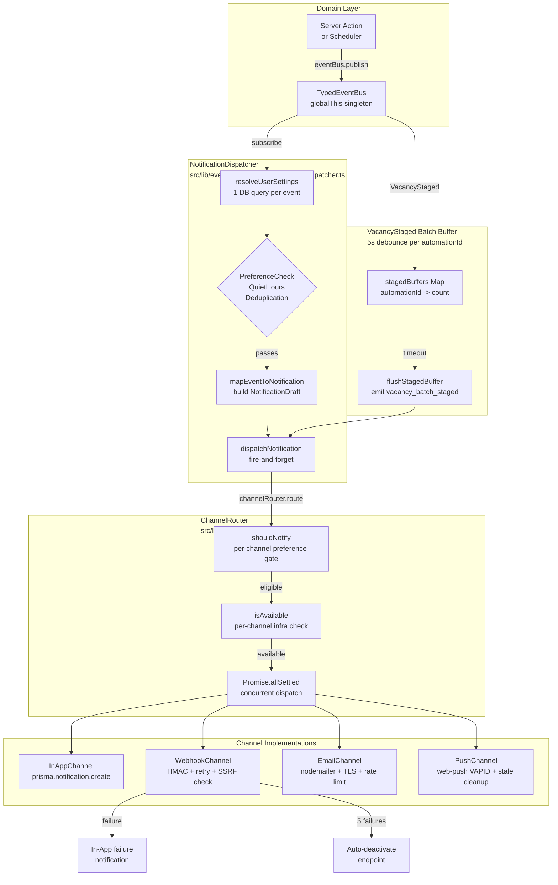

# Notification Channels — Architecture Document

**Status:** Implemented (ROADMAP 0.6 Phases 2–4)
**Date:** 2026-04-05
**Spec:** `specs/notification-dispatch.allium`

---

## Table of Contents

1. [Overview](#1-overview)
2. [Architecture Diagram](#2-architecture-diagram)
3. [Event Bus Integration](#3-event-bus-integration)
4. [NotificationDispatcher](#4-notificationdispatcher)
   - 4.1 [Pre-dispatch Filters](#41-pre-dispatch-filters)
   - 4.2 [VacancyStaged Batching](#42-vacancystaged-batching)
   - 4.3 [Fire-and-Forget Routing](#43-fire-and-forget-routing)
5. [NotificationChannel Interface](#5-notificationchannel-interface)
6. [ChannelRouter](#6-channelrouter)
   - 6.1 [Registration and Singleton](#61-registration-and-singleton)
   - 6.2 [Two-Phase Dispatch](#62-two-phase-dispatch)
   - 6.3 [Error Isolation](#63-error-isolation)
7. [Channel Implementations](#7-channel-implementations)
   - 7.1 [InAppChannel](#71-inappchannel)
   - 7.2 [WebhookChannel](#72-webhookchannel)
   - 7.3 [EmailChannel](#73-emailchannel)
   - 7.4 [PushChannel](#74-pushchannel)
8. [Security Model](#8-security-model)
   - 8.1 [SSRF Prevention](#81-ssrf-prevention)
   - 8.2 [Credential Encryption](#82-credential-encryption)
   - 8.3 [IDOR Protection](#83-idor-protection)
   - 8.4 [Server-Only Guards](#84-server-only-guards)
9. [Notification Preferences](#9-notification-preferences)
   - 9.1 [Data Model](#91-data-model)
   - 9.2 [shouldNotify Logic](#92-shouldnotify-logic)
   - 9.3 [Quiet Hours](#93-quiet-hours)
10. [Database Schema](#10-database-schema)
11. [Configuration Constants](#11-configuration-constants)
12. [Settings UI and Server Actions](#12-settings-ui-and-server-actions)
13. [Cross-Dependency Readiness](#13-cross-dependency-readiness)

---

## 1. Overview

JobSync delivers user-facing notifications through four independent channels:

| Channel | Delivery Mechanism | Infrastructure Required |
|---|---|---|
| **In-App** | Persistent `Notification` DB record shown in header bell | None (always available) |
| **Webhook** | HTTP POST with HMAC-SHA256 signing to user-configured URLs | User creates at least one `WebhookEndpoint` |
| **Email** | SMTP via nodemailer with locale-aware HTML templates | User configures `SmtpConfig` |
| **Push** | Browser push via Web Push / VAPID protocol | User enables push in browser, VAPID keys generated |

All four channels share the same dispatch pipeline: every domain event that crosses the notification boundary passes through the `NotificationDispatcher`, which applies preference checks, deduplication, and quiet hours before handing a `NotificationDraft` to the `ChannelRouter`. The `ChannelRouter` invokes all enabled channels concurrently. A failure in one channel has no effect on the others.

**Key design principle:** channels are additive and independent. The InApp channel (D0) is the MVP baseline. Webhook (D1), Email (D2), and Push (D3) were added as ROADMAP 0.6 phases without modifying the dispatcher or router — they simply registered a new `NotificationChannel` implementation.

---

## 2. Architecture Diagram

The following Mermaid diagram shows the complete notification pipeline, from domain event to delivery.



The diagram illustrates that the `TypedEventBus` is the only integration point between the domain layer and the notification subsystem. Adding a new notification-triggering event requires only a new subscription in `notification-dispatcher.ts` — no channel code changes are needed.

---

## 3. Event Bus Integration

The `TypedEventBus` (`src/lib/events/event-bus.ts`) is a synchronous-dispatch, async-handler in-process bus. It is a `globalThis` singleton that survives Next.js Hot Module Replacement.

The `NotificationDispatcher` subscribes to seven event types at application startup via `registerNotificationDispatcher()`:

| Domain Event | NotificationType Produced |
|---|---|
| `VacancyPromoted` | `vacancy_promoted` |
| `VacancyStaged` | `vacancy_batch_staged` (batched, see §4.2) |
| `BulkActionCompleted` | `bulk_action_completed` |
| `ModuleDeactivated` | `module_deactivated` |
| `ModuleReactivated` | `module_reactivated` |
| `RetentionCompleted` | `retention_completed` |
| `JobStatusChanged` | `job_status_changed` |

Module lifecycle events (`cb_escalation`, `consecutive_failures`, `auth_failure`, `module_unreachable`) are emitted by the degradation subsystem (`src/lib/connector/degradation.ts`) and handled through a separate path in the module lifecycle spec. They do reach the notification system via direct `prisma.notification.create` calls in degradation handlers rather than through the dispatcher. This is an existing pre-channel architecture that persists for those specific event types.

The `registerNotificationDispatcher()` function is called once during application bootstrap. The channel registrations inside `notification-dispatcher.ts` happen at module import time, which is the earliest possible moment:

```typescript
// src/lib/events/consumers/notification-dispatcher.ts
channelRouter.register(new InAppChannel());
channelRouter.register(new WebhookChannel());
channelRouter.register(new EmailChannel());
channelRouter.register(new PushChannel());
```

---

## 4. NotificationDispatcher

`src/lib/events/consumers/notification-dispatcher.ts`

The dispatcher is a stateless application service (in DDD terms). It consumes domain events and translates them into `NotificationDraft` objects for channel routing. Statefulness is limited to the in-memory batch buffer for `VacancyStaged` events.

### 4.1 Pre-dispatch Filters

Before a `NotificationDraft` is built, three checks gate the pipeline in sequence. All three checks share a single DB query: `resolveUserSettings()` loads `UserSettings.settings` JSON once per event and returns both `NotificationPreferences` and the user's locale.

**PreferenceCheck** evaluates the global kill switch (`prefs.enabled`) and the per-type override (`prefs.perType[type]?.enabled`). If either is false, the event is silently dropped.

**QuietHours** evaluates the current time against the user's configured window using `Intl.DateTimeFormat` in the user's IANA timezone. The check handles overnight windows (e.g., `22:00`–`07:00`) correctly. Dropped notifications are not queued — this is a defined MVP behavior. See §9.3 for details.

**Deduplication** queries for a recent notification with the same `(userId, type, moduleId)` tuple within the 5-minute dedup window. If one exists, the event is silently dropped. The window prevents notification spam when the same event fires multiple times in rapid succession (e.g., multiple circuit breaker trips for the same module).

### 4.2 VacancyStaged Batching

When an automation run stages N vacancies, individual `VacancyStaged` events arrive on the bus in rapid succession. Delivering N individual notifications would be disruptive. Instead, the dispatcher implements a debounce buffer:

- A `Map<automationId, { userId, count, timer }>` tracks in-flight batches.
- Each `VacancyStaged` event increments the count and resets a 5-second `setTimeout`.
- When the timer fires with no further events, `flushStagedBuffer()` emits a single `vacancy_batch_staged` notification with the accumulated count.
- Only automation-sourced staging is batched. Manual staging (where `automationId` is null) is passed through immediately.

This approach preserves individual `VacancyStaged` events on the bus (for audit consumers and future integrations) while delivering a user-friendly summary notification.

### 4.3 Fire-and-Forget Routing

Channel routing is fire-and-forget:

```typescript
channelRouter.route(draft, preferences).catch((err) => {
  console.error("[NotificationDispatcher] Channel routing failed:", err);
});
```

This is intentional. Webhook delivery can take up to 36 seconds (3 attempts × 10-second timeout + 1+5+30 second backoffs). Awaiting this in the EventBus publish loop would stall the calling Server Action and block subsequent event handlers. The tradeoff is that channel delivery errors are logged but not propagated to the caller.

---

## 5. NotificationChannel Interface

`src/lib/notifications/types.ts`

All four channels implement the same interface:

```typescript
interface NotificationChannel {
  readonly name: string;
  dispatch(notification: NotificationDraft, userId: string): Promise<ChannelResult>;
  isAvailable(userId: string): Promise<boolean>;
}
```

**`name`** must match a key in `NotificationPreferences.channels` (`"inApp"`, `"webhook"`, `"email"`, `"push"`). The `ChannelRouter` uses this string for the preference gate via `shouldNotify()`.

**`dispatch()`** must never throw. It returns a `ChannelResult` with `{ success, channel, error? }`. All internal errors are caught and returned as failed results. The contract ensures that one misbehaving channel implementation cannot corrupt the router's `Promise.allSettled` loop.

**`isAvailable()`** performs an infrastructure readiness check. This is distinct from the preference gate:
- `shouldNotify()` checks whether the user has the channel enabled in preferences.
- `isAvailable()` checks whether the channel has the infrastructure to actually deliver (active endpoints, configured SMTP, active VAPID keys with subscriptions).

The separation keeps preference logic in one place (`notification.model.ts`) and infrastructure logic in each channel implementation.

The `NotificationDraft` passed to each channel carries:

```typescript
interface NotificationDraft {
  userId: string;
  type: NotificationType;
  message: string;       // pre-rendered i18n string
  moduleId?: string;
  automationId?: string;
  data?: Record<string, unknown>;  // structured payload for webhook/email
}
```

Messages are pre-rendered in the dispatcher using `t(locale, key)` with placeholder substitution. This ensures locale-correct messages are used for both in-app display and webhook payloads.

---

## 6. ChannelRouter

`src/lib/notifications/channel-router.ts`

### 6.1 Registration and Singleton

The `ChannelRouter` is a `globalThis` singleton:

```typescript
const g = globalThis as unknown as { __channelRouter?: ChannelRouter };
if (!g.__channelRouter) g.__channelRouter = new ChannelRouter();
export const channelRouter = g.__channelRouter;
```

This pattern ensures the same instance is used across HMR cycles and across all Server Action invocations within a single process. Duplicate registration (e.g., from multiple imports) is guarded: `register()` checks by `channel.name` and logs a warning rather than duplicating.

### 6.2 Two-Phase Dispatch

The `route()` method executes in three phases:

**Phase 1 — Synchronous preference gating.** The router filters the registered channel list using `shouldNotify(prefs, draft.type, channelId)`. This is a pure function call with no I/O. Channels whose preference flag is false are excluded before any async work begins.

**Phase 2 — Concurrent availability check and dispatch.** For each eligible channel, the router calls `isAvailable()` and, if true, `dispatch()` in a single async chain. All eligible channels run concurrently via `Promise.allSettled()`:

```typescript
const settled = await Promise.allSettled(
  eligibleChannels.map(async (channel) => {
    const available = await channel.isAvailable(draft.userId);
    if (!available) return null;
    return channel.dispatch(draft, draft.userId);
  }),
);
```

**Phase 3 — Result collection.** The router iterates the settled results, converting rejections to failed `ChannelResult` objects and collecting successes. It returns `{ anySuccess, results }`.

### 6.3 Error Isolation

`Promise.allSettled()` is used instead of `Promise.all()` precisely because one channel failure must not prevent delivery to other channels. A webhook endpoint timeout does not delay or cancel the in-app notification. An SMTP misconfiguration does not block push delivery.

Unhandled rejections from channel implementations (which should not happen given the interface contract) are caught in Phase 3 and converted to failed results with the error message logged.

---

## 7. Channel Implementations

### 7.1 InAppChannel

`src/lib/notifications/channels/in-app.channel.ts`

The simplest channel. `dispatch()` calls `prisma.notification.create()` with the draft fields. `isAvailable()` always returns `true` — the database is always reachable.

The in-app channel is the fallback baseline. Even when all other channels fail, the notification is persisted for the user to see on their next visit.

The `Notification` record schema:
- `userId`, `type`, `message` — always set
- `moduleId`, `automationId` — conditionally set from the draft
- `read: false` — default, updated by user interaction
- `createdAt` — auto-set by Prisma

### 7.2 WebhookChannel

`src/lib/notifications/channels/webhook.channel.ts`

The most complex channel. Delivers to all active `WebhookEndpoint` records for the user that subscribe to the notification type.

**Delivery flow per endpoint:**

1. SSRF re-validation of the stored URL via `validateWebhookUrl()` (see §8.1).
2. AES-GCM decryption of the stored HMAC signing secret.
3. HMAC-SHA256 signature computation over the JSON payload.
4. HTTP POST with `redirect: "manual"` (open redirect prevention), 10-second `AbortController` timeout.
5. Retry with backoff: up to 3 attempts at 1s, 5s, 30s delays.

**Webhook payload envelope:**

```json
{
  "event": "module_deactivated",
  "timestamp": "2026-04-05T14:30:00.000Z",
  "data": { "moduleId": "eures", "affectedAutomationCount": 2 }
}
```

**Request headers:**

```
Content-Type: application/json
X-Webhook-Signature: sha256=<hmac>
X-Webhook-Event: module_deactivated
User-Agent: JobSync-Webhook/1.0
```

The `X-Webhook-Signature` header uses the same convention as Stripe and GitHub webhooks. Receivers can verify authenticity by computing `HMAC-SHA256(secret, rawBody)` and comparing against the `sha256=` prefix value.

**Failure handling:**

| Condition | Action |
|---|---|
| All 3 retry attempts fail | Atomic `failureCount` increment via `{ increment: 1 }` |
| After increment | Create in-app notification: "Webhook delivery failed for event X to URL" |
| `failureCount >= 5` | Set `endpoint.active = false` + create in-app deactivation notification |
| Any successful delivery | Reset `failureCount` to 0 |
| Redirect response (3xx) | Treated as failure (SSRF bypass prevention) |

The `failureCount` increment uses Prisma's atomic increment (`{ increment: 1 }`) rather than a read-then-write pattern. This prevents race conditions when two concurrent notifications both fail against the same endpoint.

All endpoints for a user are delivered concurrently via `Promise.allSettled()`, independent of each other.

### 7.3 EmailChannel

`src/lib/notifications/channels/email.channel.ts`

Delivers via nodemailer using the user's `SmtpConfig`. `isAvailable()` checks for an active `SmtpConfig` record.

**Dispatch steps:**

1. Rate limit check: 10 emails per minute per user (sliding window, `globalThis` singleton).
2. Load `SmtpConfig` (active only) for the user.
3. AES-GCM password decryption.
4. SSRF re-validation of the SMTP host via `validateSmtpHost()` (see §8.1).
5. Locale resolution via `resolveUserLocale()`.
6. Recipient email lookup from the user's NextAuth account (`prisma.user.email`).
7. Template rendering via `renderEmailTemplate(type, data, locale)`.
8. Nodemailer transporter creation with TLS enforcement.
9. `sendMail()` followed by `transporter.close()` in a `finally` block.

**TLS enforcement:**

Port 465 uses implicit TLS (`secure: true`). All other ports use STARTTLS (`requireTLS: true` in nodemailer options). Both paths set `rejectUnauthorized: true` and `minVersion: 'TLSv1.2'`. Self-signed certificates are rejected.

**Email template structure:**

Templates (`src/lib/email/templates.ts`) are locale-aware HTML emails with inline CSS (required for email client compatibility). The subject line is prepended with `[JobSync] `. All user-supplied content is HTML-escaped via `escapeHtml()`. Plain text fallbacks are included. The `lang` attribute on the `<html>` element reflects the user's locale.

### 7.4 PushChannel

`src/lib/notifications/channels/push.channel.ts`

Delivers browser push notifications via the VAPID protocol using the `web-push` npm library. `isAvailable()` requires both a `VapidConfig` record AND at least one `WebPushSubscription` record for the user.

**Dispatch steps:**

1. Rate limit check: 20 pushes per minute per user.
2. Load `VapidConfig` for the user.
3. Load all `WebPushSubscription` records for the user.
4. AES-GCM decryption of the VAPID private key.
5. VAPID subject resolution (prefers `mailto:` from SMTP config, falls back to `mailto:noreply@jobsync.local`).
6. Build push payload: `{ title: "JobSync", body: message, url: "/dashboard", tag: type }`.
7. Concurrent delivery to all subscriptions via `Promise.allSettled()`.

**Subscription key storage:** Each `WebPushSubscription` stores `p256dh` and `auth` keys AES-encrypted at rest. The IV field stores two parts separated by `|` (`ivP256dh|ivAuth`) because both keys are encrypted independently.

**Stale subscription handling:**

| Push service response | Action |
|---|---|
| 410 Gone | Delete subscription (browser unsubscribed) |
| 404 Not Found | Delete subscription (some services use 404 instead of 410) |
| 401 / 403 | Log VAPID auth failure, preserve subscription |
| Other error | Log error, continue to next subscription |

The distinction between 410/404 (stale subscription, silently delete) and 401/403 (VAPID authentication issue, preserve subscription) is critical. Deleting subscriptions on auth failures would cause permanent data loss from transient VAPID configuration issues.

**Service Worker:** `public/sw-push.js` is a minimal push-only service worker — not a full PWA. It handles two events:
- `push`: parses JSON payload, calls `self.registration.showNotification()`.
- `notificationclick`: validates that the click URL starts with `/` and does not start with `//` (preventing open redirect to absolute URLs), then calls `clients.openWindow()`.

**VAPID key rotation:** The user can rotate VAPID keys from Settings. Rotation atomically deletes all `WebPushSubscription` records and the old `VapidConfig` in a single Prisma transaction, then generates a new key pair. All browsers must re-subscribe after rotation. The Settings UI shows a confirmation dialog that explicitly warns of this consequence.

---

## 8. Security Model

### 8.1 SSRF Prevention

User-supplied network targets are validated at two points: on save (creation/update) and again on every dispatch. The dual validation is necessary because DNS resolution can change after a URL is stored (DNS rebinding attack).

**Webhook URL validation** (`src/lib/url-validation.ts`, `validateWebhookUrl()`):

Blocks the following address ranges in IPv4, IPv6, and IPv4-mapped IPv6 form:

| Range | RFC | Reason |
|---|---|---|
| `127.0.0.0/8` | RFC 1122 | Loopback |
| `169.254.0.0/16` | RFC 3927 | Link-local / IMDS |
| `10.0.0.0/8` | RFC 1918 | Private |
| `172.16.0.0/12` | RFC 1918 | Private |
| `192.168.0.0/16` | RFC 1918 | Private |
| `100.64.0.0/10` | RFC 6598 | Carrier-Grade NAT |
| `192.0.0.0/24` | RFC 6890 | IETF Protocol Assignments |
| `198.18.0.0/15` | RFC 2544 | Benchmarking |
| `240.0.0.0/4` | RFC 1112 | Reserved |
| `fc00::/7` | RFC 4193 | IPv6 Unique Local |
| `fe80::/10` | RFC 4291 | IPv6 Link-Local |
| `::ffff:0:0/96` | — | IPv4-mapped IPv6 (re-validated recursively) |
| `metadata.google.internal` | — | GCP IMDS |
| Non-`http(s)` protocols | — | Protocol restriction |
| URLs with embedded credentials | — | Credential leakage |

Additionally, `redirect: "manual"` is set on all webhook fetch calls. The response handler treats 3xx responses as delivery failures, preventing open redirect attacks where a legitimate-looking URL redirects to an internal target.

**SMTP host validation** (`src/lib/smtp-validation.ts`, `validateSmtpHost()`):

Applies the same range blocks as the webhook validator, but operates on bare hostnames rather than full URLs because SMTP configurations supply `host` and `port` separately.

### 8.2 Credential Encryption

All secrets stored in the database use AES-256-GCM encryption via `src/lib/encryption.ts`.

**Encryption scheme:**
- Algorithm: AES-256-GCM with 128-bit auth tag
- Key derivation: PBKDF2-SHA256, 100,000 iterations, 32-byte output
- Per-record random salt (16 bytes) and IV (12 bytes)
- Storage format: `"salt:<hex>:<base64-payload>"` (new format) or plain base64 (legacy format, still decryptable)

**What is encrypted:**

| Entity | Encrypted Fields |
|---|---|
| `WebhookEndpoint` | `secret` (HMAC signing key) |
| `SmtpConfig` | `password` |
| `VapidConfig` | `privateKey` |
| `WebPushSubscription` | `p256dh`, `auth` (subscription keys) |

Decryption happens exactly at send time and the plaintext is never stored, logged, or returned in API responses. The UI shows only masked prefixes (`whsec_****xxxx` for webhook secrets, `****xxxx` for SMTP passwords).

The `ENCRYPTION_KEY` environment variable must be set; the application throws at startup if it is missing. It is never auto-generated or defaulted.

### 8.3 IDOR Protection

All Prisma queries in channel implementations include `userId` in the `where` clause (ADR-015). This prevents a crafted request from accessing another user's configuration:

```typescript
// WebhookChannel
const endpoints = await prisma.webhookEndpoint.findMany({
  where: { userId, active: true },
  ...
});

// Failure count update includes userId
await prisma.webhookEndpoint.update({
  where: { id: endpoint.id, userId },
  ...
});
```

The pattern `{ id, userId }` in compound where clauses ensures that even if `id` is guessable, it can only be accessed by its owner.

### 8.4 Server-Only Guards

Every channel implementation file begins with `import "server-only"`. The ChannelRouter, NotificationDispatcher, and all supporting libraries (`encryption.ts`, `smtp-validation.ts`, `email-rate-limit.ts`, etc.) carry the same guard. The Next.js build pipeline enforces at compile time that these modules are never imported into client component trees.

---

## 9. Notification Preferences

### 9.1 Data Model

`NotificationPreferences` is stored as a JSON column within `UserSettings.settings` rather than as a dedicated table. This avoids an additional DB migration for what is effectively a settings document:

```typescript
interface NotificationPreferences {
  enabled: boolean;                                        // global kill switch
  channels: {
    inApp: boolean;
    webhook: boolean;
    email: boolean;
    push: boolean;
  };
  perType: Partial<Record<NotificationType, { enabled: boolean }>>;
  quietHours?: {
    enabled: boolean;
    start: string;    // "HH:mm"
    end: string;      // "HH:mm"
    timezone: string; // IANA timezone
  };
}
```

**Default state** for new users (preferences not yet written to DB):

```typescript
{
  enabled: true,
  channels: { inApp: true, webhook: false, email: false, push: false },
  perType: {},
}
```

Preferences are created lazily on first Settings access, not at user registration. The dispatcher's `resolveUserSettings()` falls back to `DEFAULT_NOTIFICATION_PREFERENCES` if no `UserSettings` row exists.

### 9.2 shouldNotify Logic

`src/models/notification.model.ts` exports `shouldNotify(prefs, type, channel?, now?)`.

The function implements a three-layer check:

1. **Global gate:** `prefs.enabled === false` → return false for any type, any channel.
2. **Channel gate (when `channel` is specified):** `prefs.channels[channel] === false` → return false. When `channel` is omitted, the function returns true if _any_ channel is enabled. This two-mode behavior allows the dispatcher to short-circuit draft construction when all channels are off.
3. **Per-type gate:** If `prefs.perType[type]?.enabled === false` → return false.
4. **Quiet hours gate:** If `prefs.quietHours.enabled` and the current time (in the user's timezone) falls within the configured window → return false.

The `ChannelRouter` calls `shouldNotify(prefs, draft.type, channelId)` for each channel in Phase 1. The dispatcher calls `shouldNotify(prefs, type)` (no channel) before building the draft — this avoids the I/O cost of template rendering and locale resolution for events that no channel would receive.

### 9.3 Quiet Hours

Quiet hours suppress notifications during a user-configured time window. The implementation uses `Intl.DateTimeFormat` to convert the current UTC time to the user's IANA timezone before comparison. Overnight windows (e.g., `22:00`–`07:00`) are handled by checking `currentMinutes >= startMinutes OR currentMinutes < endMinutes` when `start > end`.

Current behavior: suppressed notifications are dropped, not queued. This is the documented MVP behavior. A future iteration may queue notifications with a `deliverAt` field instead. The open question in the spec notes both options.

---

## 10. Database Schema

Four Prisma models support the notification channels. All use `userId` as a tenant isolation field.

**`WebhookEndpoint`**
- `userId`, `url`, `secret` (encrypted), `iv`, `events` (JSON array), `active`, `failureCount`
- Constraint: max 10 per user (enforced in `webhook.actions.ts`)
- No unique constraint on URL — a user may have multiple endpoints at the same URL subscribed to different event sets

**`SmtpConfig`**
- `userId @unique` — exactly one config per user
- `host`, `port`, `username`, `password` (encrypted), `iv`, `fromAddress`, `tlsRequired`, `active`

**`VapidConfig`**
- `userId @unique` — exactly one key pair per user
- `publicKey` (plaintext, shared with browsers), `privateKey` (encrypted), `iv`
- Deleted and recreated atomically on key rotation

**`WebPushSubscription`**
- `userId`, `endpoint`, `p256dh` (encrypted), `auth` (encrypted), `iv` (stores two IVs: `ivP256dh|ivAuth`)
- Unique constraint: `@@unique([userId, endpoint])` — prevents duplicate subscriptions from the same browser
- Constraint: max 10 per user (enforced in `push.actions.ts`)
- Deleted on 410/404 from push service, or on VAPID key rotation

---

## 11. Configuration Constants

These constants govern channel behavior. They are defined in the respective channel implementations and documented in the Allium spec.

| Constant | Value | Location |
|---|---|---|
| `DEDUP_WINDOW_MINUTES` | 5 min | `shouldNotify()` / spec |
| `WEBHOOK_FETCH_TIMEOUT_MS` | 10,000 ms | `webhook.channel.ts` |
| `WEBHOOK_MAX_ATTEMPTS` | 3 | `webhook.channel.ts` |
| `WEBHOOK_RETRY_BACKOFFS_MS` | [1000, 5000, 30000] | `webhook.channel.ts` |
| `WEBHOOK_AUTO_DEACTIVATE_THRESHOLD` | 5 failures | `webhook.channel.ts` |
| `EMAIL_RATE_LIMIT_PER_MINUTE` | 10 | `email-rate-limit.ts` |
| `EMAIL_TEST_COOLDOWN_SECONDS` | 60 | `email-rate-limit.ts` |
| `PUSH_RATE_LIMIT_PER_MINUTE` | 20 | `push/rate-limit.ts` |
| `PUSH_TEST_COOLDOWN_SECONDS` | 60 | `push/rate-limit.ts` |
| `MAX_PUSH_SUBSCRIPTIONS_PER_USER` | 10 | `push.actions.ts` |
| `MAX_WEBHOOK_ENDPOINTS_PER_USER` | 10 | `webhook.actions.ts` |
| `VACANCY_STAGED_FLUSH_DELAY_MS` | 5,000 | `notification-dispatcher.ts` |
| `NOTIFICATION_RETENTION_DAYS` | 30 | spec / retention service |
| `MAX_NOTIFICATIONS_DISPLAYED` | 50 | spec / bell UI |

Rate limiters use in-memory sliding window counters on `globalThis`. They do not persist across server restarts and do not coordinate across multiple processes. This is a known single-process limitation (SEC-16 in the project's issue tracker), acceptable for the self-hosted deployment model.

---

## 12. Settings UI and Server Actions

Each channel has a dedicated Settings UI component and server action file.

**Webhook Channel:**
- UI: `src/components/settings/WebhookSettings.tsx`
- Actions: `src/actions/webhook.actions.ts`
- Operations: create endpoint (URL + event selection), list endpoints, toggle active, delete, view secret once on creation

**Email Channel:**
- UI: `src/components/settings/SmtpSettings.tsx`
- Actions: `src/actions/smtp.actions.ts`
- Operations: save/update SMTP config, get config (password masked), test connection, delete config
- Test email rate limited at 1 per 60 seconds

**Push Channel:**
- UI: `src/components/settings/PushSettings.tsx`
- Actions: `src/actions/push.actions.ts`
- Operations: subscribe (register browser), unsubscribe, get VAPID public key, rotate VAPID keys, send test push
- Test push rate limited at 1 per 60 seconds

All server actions return `ActionResult<T>` and include `userId` from `getCurrentUser()` in all Prisma queries. They never accept a `userId` parameter from the client (ADR-015, ADR-019).

The notification preference settings (global toggle, per-type overrides, quiet hours, channel selection) are managed through `src/components/settings/NotificationSettings.tsx` and persisted to `UserSettings.settings` JSON.

---

## 13. Cross-Dependency Readiness

The notification channel architecture was deliberately designed to be consumed by future roadmap features with minimal integration work.

### ROADMAP 1.5 — Job Alerts

Job Alerts will notify users when new vacancies matching saved search criteria appear. The integration path is:

1. A new `JobAlertMatched` domain event is published by the alert evaluation service (or the automation runner).
2. `registerNotificationDispatcher()` adds a subscription: `eventBus.subscribe(DomainEventType.JobAlertMatched, handleJobAlertMatched)`.
3. A new `NotificationType` value `job_alert_matched` is added to the enum in `notification.model.ts`.
4. The handler builds a `NotificationDraft` and calls `dispatchNotification()`.

No changes to the `ChannelRouter`, channel implementations, or preference model are required. The new type automatically becomes available in the per-type preference toggle UI via `CONFIGURABLE_NOTIFICATION_TYPES`.

### ROADMAP 5.4 — CRM Reminders

CRM Reminders (follow-up nudges, interview preparation alerts) require timed delivery rather than immediate event-driven delivery. The current architecture dispatches immediately. Two integration paths are possible:

**Path A — Direct dispatcher (immediate):** The CRM task due-date evaluation runs on a cron schedule and emits `CrmReminderDue` domain events when tasks become due. The dispatcher handles them immediately, same as other events. This is the simplest path and works well for follow-up reminders that trigger on a schedule.

**Path B — Queued delivery with `deliverAt`:** More complex. Requires a delivery queue table and a worker that polls for due notifications. This would also enable the "quiet hours queue" behavior currently specified as a future improvement (§9.3). The `NotificationDraft` interface would gain an optional `deliverAt` field that the dispatcher passes to a queue rather than directly to the `ChannelRouter`.

The current architecture does not block either path. Path A requires no architectural changes. Path B requires adding a delivery queue, but the channel abstraction remains unchanged — queued items eventually reach the `ChannelRouter` with the same interface.

### Adding a New Notification Type

To add a new `NotificationType` (e.g., `interview_reminder`):

1. Add the literal to the `NotificationType` union in `src/models/notification.model.ts`.
2. Add it to `CONFIGURABLE_NOTIFICATION_TYPES` in the same file.
3. Add an i18n key in `src/i18n/dictionaries/` for all 4 locales.
4. Add a subject key mapping in `src/lib/email/templates.ts` (`SUBJECT_KEYS`).
5. Add the message key mapping in `buildNotificationMessage()` in the same file.
6. Add a handler in `notification-dispatcher.ts` and subscribe it to the relevant event type.

### Adding a New Channel

To add a fifth channel:

1. Create `src/lib/notifications/channels/new.channel.ts` implementing `NotificationChannel`.
2. Register it in `notification-dispatcher.ts`: `channelRouter.register(new NewChannel())`.
3. Add the channel key to `NotificationPreferences.channels` and `ChannelConfig`.
4. Add a settings UI component and server action for channel configuration.

The `ChannelRouter`, `shouldNotify()`, and all existing channels require no modification.

---

## File Reference

| File | Role |
|---|---|
| `specs/notification-dispatch.allium` | Authoritative behavioral specification |
| `src/lib/notifications/types.ts` | `NotificationChannel`, `NotificationDraft`, `ChannelResult`, webhook DTO types |
| `src/lib/notifications/channel-router.ts` | `ChannelRouter` singleton, concurrent dispatch |
| `src/lib/events/consumers/notification-dispatcher.ts` | Event subscriptions, pre-dispatch filters, batch buffer |
| `src/lib/notifications/channels/in-app.channel.ts` | InAppChannel — DB persistence |
| `src/lib/notifications/channels/webhook.channel.ts` | WebhookChannel — HMAC, retry, auto-deactivation |
| `src/lib/notifications/channels/email.channel.ts` | EmailChannel — nodemailer, TLS, rate limit |
| `src/lib/notifications/channels/push.channel.ts` | PushChannel — VAPID, stale cleanup |
| `src/models/notification.model.ts` | `NotificationPreferences`, `shouldNotify()`, `NotificationType` |
| `src/lib/email/templates.ts` | Locale-aware HTML email rendering |
| `src/lib/push/vapid.ts` | VAPID key generation, storage, rotation |
| `src/lib/push/rate-limit.ts` | Push dispatch rate limiter (20/min) |
| `src/lib/email-rate-limit.ts` | Email dispatch rate limiter (10/min) |
| `src/lib/url-validation.ts` | `validateWebhookUrl()` — SSRF prevention for webhooks |
| `src/lib/smtp-validation.ts` | `validateSmtpHost()` — SSRF prevention for SMTP |
| `src/lib/encryption.ts` | AES-256-GCM encrypt/decrypt |
| `src/lib/events/event-bus.ts` | `TypedEventBus` singleton |
| `src/actions/webhook.actions.ts` | Webhook endpoint CRUD |
| `src/actions/smtp.actions.ts` | SMTP config CRUD + test |
| `src/actions/push.actions.ts` | Push subscription CRUD + test + VAPID rotation |
| `public/sw-push.js` | Minimal push-only service worker |
