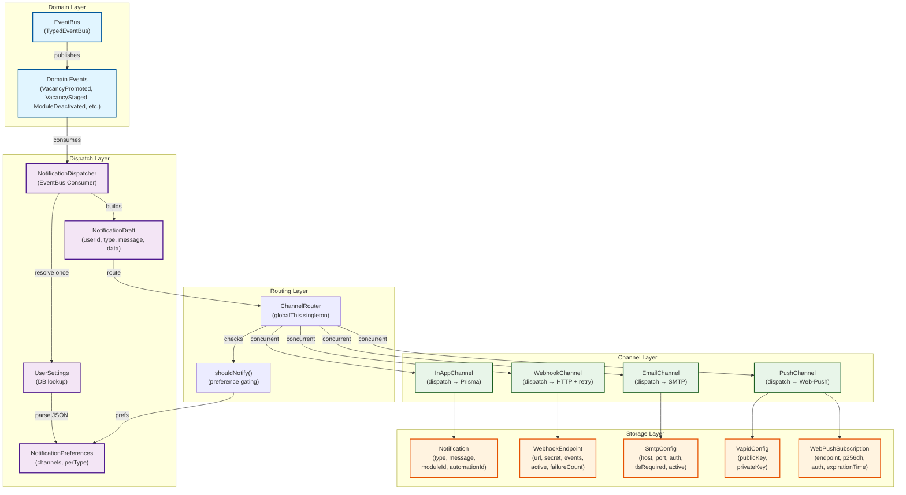
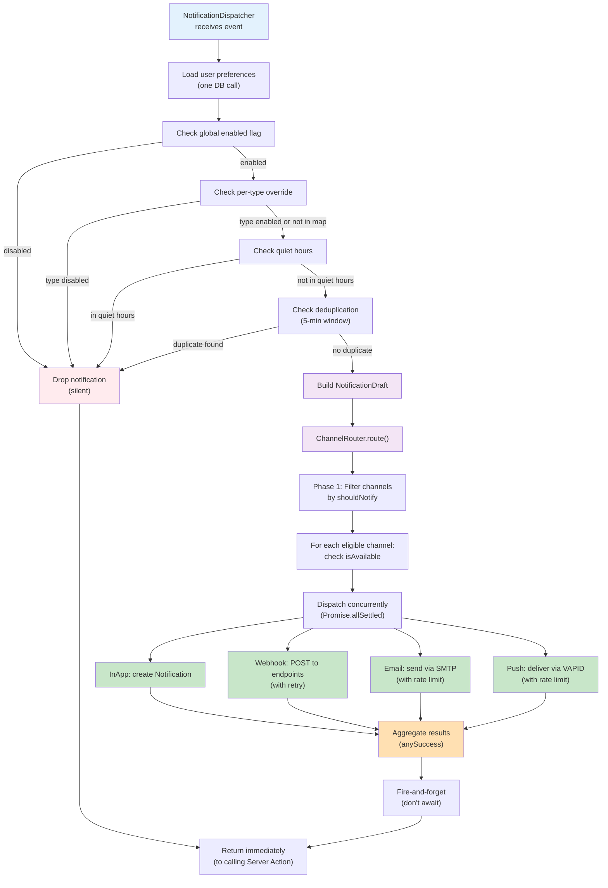
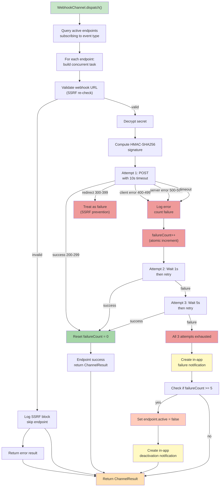
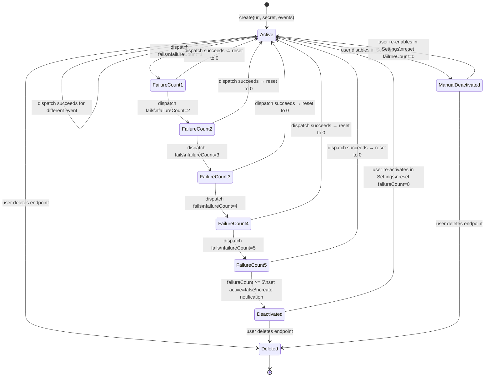

# JobSync Notification Channel Architecture Diagrams

This document contains Mermaid diagrams illustrating the multi-channel notification delivery system. All diagrams are generated from the authoritative spec: `specs/notification-dispatch.allium`.

---

## 1. Component Diagram — Channel Architecture

Shows the high-level component relationships and data flow from domain events through channel dispatching.



**Key Design Principles:**
- **Event-Driven:** EventBus publishes domain events; Dispatcher subscribes.
- **Single Preferences Resolution:** User preferences loaded once per notification.
- **Preference Gating:** Each channel independently gated by `shouldNotify()`.
- **Concurrent Dispatch:** All eligible channels dispatched concurrently via `Promise.allSettled()`.
- **Error Isolation:** One channel failure does not block others.
- **Singleton Pattern:** ChannelRouter uses `globalThis` to survive HMR.

---

## 2. Sequence Diagram — Complete Notification Flow

Illustrates the full lifecycle of a notification from event publication to multi-channel dispatch.

```mermaid
sequenceDiagram
    participant App as Application<br/>(Server Action)
    participant EB as EventBus
    participant Disp as NotificationDispatcher
    participant DB as Database
    participant Router as ChannelRouter
    participant Ch as Channels<br/>(InApp, Webhook, Email, Push)
    participant Ext as External Services<br/>(HTTP endpoints, SMTP, Push Service)

    App->>EB: publish(DomainEvent)
    Note over EB: event.type = "VacancyPromoted"<br/>event.payload.userId = "usr_123"

    EB->>Disp: notify(event)
    Note over Disp: Consumer receives event

    Disp->>DB: findUnique(userSettings, { userId })
    Note over DB: Single DB call for<br/>prefs + locale
    DB-->>Disp: { settings: JSON }

    Disp->>Disp: parsePreferences()<br/>parseLocale()
    Note over Disp: Extract preferences and locale<br/>from UserSettings JSON

    Disp->>Disp: resolveUserSettings()
    Note over Disp: { preferences, locale }

    Disp->>Disp: mapEventToNotification()
    Note over Disp: Build NotificationDraft

    Disp->>Router: route(draft, preferences)
    Note over Router: Phase 1: Sync preference gating

    Router->>Router: filter channels by<br/>shouldNotify(prefs, type, channel)
    Note over Router: Only eligible channels proceed

    Router->>Router: Phase 2: Concurrent<br/>availability + dispatch
    par InApp Channel
        Router->>Ch: InAppChannel.isAvailable()
        Ch->>DB: (always true)
        Ch-->>Router: true
        Router->>Ch: InAppChannel.dispatch()
        Ch->>DB: create(Notification)
        DB-->>Ch: { id }
        Ch-->>Router: ChannelResult { success: true }
    and Webhook Channel
        Router->>Ch: WebhookChannel.isAvailable()
        Ch->>DB: count(activeEndpoints)
        DB-->>Ch: 2
        Ch-->>Router: true
        Router->>Ch: WebhookChannel.dispatch()
        Ch->>DB: findMany(WebhookEndpoints, active)
        DB-->>Ch: [endpoint1, endpoint2]
        Ch->>Ch: decrypt secrets<br/>validate URLs<br/>sign payloads
        Ch->>Ext: POST to endpoint1 (with retry: 1s, 5s, 30s)
        Ext-->>Ch: 200 OK
        Ch->>Ext: POST to endpoint2
        Ext-->>Ch: 500 Error
        Ch->>DB: increment(failureCount)
        DB-->>Ch: { failureCount: 1 }
        Ch->>DB: create(in-app failure notification)
        DB-->>Ch: { id }
        Ch-->>Router: ChannelResult { success: true }
    and Email Channel
        Router->>Ch: EmailChannel.isAvailable()
        Ch->>DB: count(activeSmtpConfigs)
        DB-->>Ch: 1
        Ch-->>Router: true
        Router->>Ch: EmailChannel.dispatch()
        Ch->>DB: findFirst(SmtpConfig, active)
        DB-->>Ch: { host, port, username, password (encrypted) }
        Ch->>Ch: checkEmailRateLimit(userId)
        Note over Ch: 10/min per user
        Ch->>Ch: decrypt password<br/>validate SMTP host
        Ch->>Ext: connect to SMTP, sendMail()
        Ext-->>Ch: SMTP 250 OK
        Ch-->>Router: ChannelResult { success: true }
    and Push Channel
        Router->>Ch: PushChannel.isAvailable()
        Ch->>DB: findUnique(VapidConfig)<br/>count(subscriptions)
        DB-->>Ch: found + 3 subs
        Ch-->>Router: true
        Router->>Ch: PushChannel.dispatch()
        Ch->>DB: findMany(subscriptions)
        DB-->>Ch: [sub1, sub2, sub3]
        Ch->>Ch: decrypt VAPID key<br/>decrypt sub keys<br/>checkPushRateLimit()
        Note over Ch: 20/min per user
        par Subscription 1
            Ch->>Ext: web-push.sendNotification()
            Ext-->>Ch: success
        and Subscription 2
            Ch->>Ext: web-push.sendNotification()
            Ext-->>Ch: 410 Gone
            Ch->>DB: delete(subscription)
            DB-->>Ch: deleted
        and Subscription 3
            Ch->>Ext: web-push.sendNotification()
            Ext-->>Ch: success
        end
        Ch-->>Router: ChannelResult { success: true }
    end

    Router->>Router: Phase 3: Aggregate results<br/>anySuccess = true if >=1 channel succeeded
    Router-->>Disp: ChannelRouterResult { anySuccess, results[] }

    Disp->>Disp: log results
    Note over Disp: Fire-and-forget routing<br/>does NOT await channels
    Disp-->>EB: (callback returns)

    Note over App: Server action continues<br/>without blocking on notification delivery
```



**Key Flow Insights:**
1. **Single DB Query:** Preferences and locale resolved in one call.
2. **Three-Phase Routing:**
   - Phase 1: Synchronous preference gating (fast, no I/O).
   - Phase 2: Concurrent availability check + dispatch (all channels in parallel).
   - Phase 3: Results aggregation.
3. **Fire-and-Forget:** Dispatcher does NOT await channel results; returns immediately.
4. **Independent Error Isolation:** Each channel result collected; one failure doesn't block others.
5. **Rate Limiting:** Per-channel (Email: 10/min, Push: 20/min).
6. **Encryption:** Secrets decrypted only at dispatch time.

---

## 3. Entity-Relationship Diagram — Data Model

Shows the database schema and relationships for all notification-related entities.

```mermaid
erDiagram
    USER ||--|| USER-SETTINGS : has
    USER ||--o{ NOTIFICATION : receives
    USER ||--o{ WEBHOOK-ENDPOINT : owns
    USER ||--|| SMTP-CONFIG : configures
    USER ||--|| VAPID-CONFIG : owns
    USER ||--o{ WEBPUSH-SUBSCRIPTION : owns

    USER-SETTINGS {
        string userId PK
        json settings "{ notifications: { enabled, channels, perType, quietHours } }"
    }

    NOTIFICATION {
        string id PK
        string userId FK
        string type "vacancy_promoted | vacancy_batch_staged | module_deactivated | ..."
        string message
        string moduleId FK "optional"
        string automationId FK "optional"
        boolean read "default: false"
        datetime createdAt
    }

    WEBHOOK-ENDPOINT {
        string id PK
        string userId FK
        string url "SSRF-validated"
        string secret "AES-encrypted HMAC key"
        string iv "AES initialization vector"
        json events "[\"vacancy_promoted\", \"module_deactivated\", ...]"
        boolean active "auto-deactivated after 5 failures"
        integer failureCount "reset on success"
        datetime createdAt
        datetime updatedAt
    }

    SMTP-CONFIG {
        string id PK
        string userId FK "unique"
        string host "SSRF-validated"
        integer port "default: 587"
        string username
        string password "AES-encrypted"
        string iv "AES initialization vector"
        string fromAddress
        boolean tlsRequired "default: true"
        boolean active "default: true"
        datetime createdAt
        datetime updatedAt
    }

    VAPID-CONFIG {
        string id PK
        string userId FK "unique"
        string publicKey
        string privateKey "AES-encrypted"
        string iv "AES initialization vector"
        datetime createdAt
        datetime updatedAt
    }

    WEBPUSH-SUBSCRIPTION {
        string id PK
        string userId FK
        string endpoint "push service URL"
        string p256dh "AES-encrypted"
        string auth "AES-encrypted"
        string iv "AES initialization vector (dual: ivP256dh|ivAuth)"
        datetime expirationTime "optional"
        datetime createdAt
        datetime updatedAt
    }
```

**Entity Relationships:**
- **USER → USER-SETTINGS:** 1:1 — Preferences stored as JSON.
- **USER → NOTIFICATION:** 1:many — User receives multiple notifications.
- **USER → WEBHOOK-ENDPOINT:** 1:many — User configures multiple endpoints.
- **USER → SMTP-CONFIG:** 1:1 — One SMTP config per user.
- **USER → VAPID-CONFIG:** 1:1 — One VAPID key pair per user.
- **USER → WEBPUSH-SUBSCRIPTION:** 1:many — Multiple browser subscriptions per user.

**Encryption:**
- WEBHOOK-ENDPOINT.secret: AES-256-GCM encrypted; decrypted only for HMAC signing.
- SMTP-CONFIG.password: AES-256-GCM encrypted; decrypted only at send time.
- VAPID-CONFIG.privateKey: AES-256-GCM encrypted; decrypted only for signing.
- WEBPUSH-SUBSCRIPTION.p256dh, auth: AES-256-GCM encrypted; decrypted only at dispatch.

**Validation:**
- WEBHOOK-ENDPOINT.url: Validated against SSRF rules on **create AND dispatch**.
- SMTP-CONFIG.host: Validated against SSRF rules on **save AND dispatch**.

---

## 4. Channel Comparison Table

Summary of the four notification channels: transport, encryption, rate limiting, and failure handling.

| Channel | Transport | Encryption | Rate Limit | Failure Handling | Auto-Deactivation | Recovery |
|---------|-----------|-----------|----------|------------------|------------------|-----------|
| **InApp** | Database (Prisma) | N/A (in-memory) | None | Logged to stderr | No | Always available |
| **Webhook** | HTTP POST + HMAC-SHA256 signature | AES-256-GCM (secret at rest) | None (concurrent endpoints) | Create in-app notification (best-effort) | Yes: 5 consecutive failures → auto-deactivate | Manual re-enable in Settings |
| **Email** | SMTP (TLS enforced: v1.2+) | AES-256-GCM (password at rest); STARTTLS or implicit TLS (port 465) | 10/min per user | Logged to stderr | No (rate limit prevents cascade) | Check SMTP config in Settings |
| **Push** | Web-Push (VAPID protocol) | AES-256-GCM (VAPID key + subscription keys at rest) | 20/min per user | Logged to stderr; 410/404 subscriptions auto-deleted | No (rate limit prevents cascade) | Re-enable in browser; delete stale subscriptions |

### Detailed Channel Behavior

#### InAppChannel
- **Availability:** Always true (requires only database).
- **Dispatch:** Create `Notification` record directly.
- **Failure:** Logged; best-effort (no retry).
- **Encryption:** None (in-memory data structure).
- **Security:** IDOR protected via `userId` in Prisma query.

#### WebhookChannel
- **Availability:** Check for active endpoints: `count(WebhookEndpoint where active=true) > 0`.
- **Dispatch:** Query all active endpoints subscribing to event type.
  1. Decrypt secret (AES).
  2. Validate URL (SSRF re-check on dispatch).
  3. Compute HMAC-SHA256 signature.
  4. POST with 3 retry attempts (backoff: 1s, 5s, 30s).
  5. Increment `failureCount` on failure; reset to 0 on success.
  6. Create in-app failure notification (best-effort).
  7. Auto-deactivate after 5 consecutive failures.
- **Failure Handling:**
  - Per-endpoint: atomic increment via Prisma `{ increment: 1 }`.
  - Threshold check: if `failureCount >= 5`, set `active = false`.
  - Deactivation notification: create in-app notification about deactivation.
- **SSRF Protection:** URL validated on **create AND dispatch** (DNS rebinding).
- **Encryption:** Secret AES-encrypted at rest; decrypted only for HMAC computation.

#### EmailChannel
- **Availability:** Check for active SMTP config: `count(SmtpConfig where active=true) > 0`.
- **Dispatch:**
  1. Check rate limit: 10 emails/min per user.
  2. Load SmtpConfig (active).
  3. Decrypt password (AES).
  4. Validate SMTP host (SSRF re-check on dispatch).
  5. Resolve user's account email.
  6. Render template (locale-aware HTML + text).
  7. Create nodemailer transporter with TLS enforcement (`minVersion: "TLSv1.2"`, `rejectUnauthorized: true`).
  8. Send email; close transporter.
- **Failure Handling:** Logged to stderr; no retry (SMTP transporter handles retries internally).
- **Rate Limiting:** Sliding window: 10 emails/min per user (per-user state in `globalThis`).
- **SSRF Protection:** SMTP host validated on **save AND dispatch**.
- **Encryption:** Password AES-encrypted at rest; decrypted only at send time.
- **TLS:** STARTTLS (port 587) or implicit TLS (port 465); minimum TLS v1.2; `rejectUnauthorized: true`.

#### PushChannel
- **Availability:** Check VAPID keys AND subscriptions: `vapidConfig exists && subscriptions.length > 0`.
- **Dispatch:**
  1. Check rate limit: 20 pushes/min per user.
  2. Load VapidConfig and decrypt private key (AES).
  3. Load all WebPushSubscriptions; decrypt p256dh + auth (AES).
  4. Resolve VAPID subject (from SMTP fromAddress or fallback to `noreply@jobsync.local`).
  5. Build payload: `{ title: "JobSync", body: message, url: "/dashboard", tag: type }`.
  6. Deliver to all subscriptions concurrently via `web-push.sendNotification()`.
  7. Handle response codes:
     - 200: Success.
     - 410 Gone / 404 Not Found: Delete subscription (stale).
     - 401 / 403: Log VAPID auth failure; preserve subscription (transient).
     - Other: Log error; continue to next subscription.
- **Failure Handling:** Logged to stderr; per-subscription error isolation (one failure doesn't block others).
- **Rate Limiting:** Sliding window: 20 pushes/min per user (per-user state in `globalThis`).
- **Stale Subscription Cleanup:** 410/404 responses trigger silent deletion.
- **Encryption:** VAPID private key + subscription keys (p256dh, auth) AES-encrypted at rest.

---

## 5. Preference Gating Flow Diagram

Illustrates how user preferences are applied at dispatch time.



**Decision Points:**
1. **Global Enabled Flag:** If false, all notifications dropped.
2. **Per-Type Override:** Each NotificationType can be individually disabled.
3. **Quiet Hours:** If enabled and current time within window, drop (not queued).
4. **Deduplication:** If same (type, moduleId) within 5 minutes, drop.
5. **Channel Gating:** Each channel independently checked via `shouldNotify()`.
6. **Availability:** Each channel checks infrastructure (endpoints, SMTP config, VAPID keys).

---

## 6. Webhook Delivery with Retry

Detailed flow for webhook endpoint delivery including retry logic and failure handling.



**Retry Logic:**
- **Attempt 1:** Immediate.
- **Attempt 2:** 1 second backoff.
- **Attempt 3:** 5 seconds backoff.
- **Total time:** Up to 36 seconds (1s + 5s + 30s delays).

**Failure Count:**
- Incremented atomically via Prisma `{ increment: 1 }`.
- Reset to 0 on any successful delivery.
- Auto-deactivation at threshold (5).

**SSRF Protection:**
- URL validated on **create** (WebhookEndpoint creation).
- URL re-validated on **dispatch** (DNS rebinding defense).

---

## 7. State Machine — Webhook Endpoint Lifecycle

Shows the states and transitions of a webhook endpoint.



---

## 8. Architecture Decision Summary

| Aspect | Decision | Rationale |
|--------|----------|-----------|
| **Preference Storage** | JSON in UserSettings (not separate table) | Flexibility; avoids complex joins; preferences are user config, not audit trail. |
| **Preference Resolution** | Single DB call per notification | Efficiency; avoids N queries. Preferences loaded once, applied to all channels. |
| **Channel Dispatch** | Concurrent via `Promise.allSettled()` | Performance; one slow channel doesn't block others. Error isolation per channel. |
| **Fire-and-Forget** | Don't await channel routing | Prevents blocking server actions; webhooks can retry for up to 36s. |
| **Encryption** | AES-256-GCM for secrets at rest | Industry standard; supports rotation; decrypted only at use time. |
| **SSRF Validation** | On create AND dispatch | DNS rebinding defense; URL resolution may change between validations. |
| **Webhook Retry** | 3 attempts, backoff 1s/5s/30s | Balances resilience (36s total) vs. timely failure notification. |
| **Webhook Auto-Deactivation** | 5 consecutive failures | After 5 failures (over hours/days), clear signal of broken configuration. Prevents cascade. |
| **Email Rate Limit** | 10/min per user | Prevents accidental mail spam; user action → 1 email, not 10. |
| **Push Rate Limit** | 20/min per user | Higher limit than email (browser push < SMTP cost); still prevents spam. |
| **Batch Summaries** | Buffer VacancyStaged for 5s | 5s wait balances timeliness (user sees summary soon) vs. batching efficiency. |
| **Singleton Pattern** | `globalThis` for Router/EventBus | Survives HMR during development; consistent across request cycles. |

---

## 9. Resilience Patterns

### Webhook Delivery Resilience
- **Retry:** 3 attempts with exponential backoff (1s, 5s, 30s).
- **Timeout:** 10 seconds per attempt.
- **Failure Notification:** In-app notification on exhaustion.
- **Auto-Deactivation:** After 5 consecutive failures (not transient), disable endpoint.
- **Error Isolation:** One endpoint failure doesn't block others.

### Email Delivery Resilience
- **Rate Limiting:** 10/min per user; prevents cascade if misconfigured.
- **Error Logging:** Failures logged to stderr; no retry (SMTP handles internally).
- **Graceful Degradation:** If SmtpConfig deleted/invalid, channel skipped.

### Push Delivery Resilience
- **Rate Limiting:** 20/min per user.
- **Stale Subscription Cleanup:** 410/404 responses trigger auto-delete.
- **VAPID Auth Failures:** 401/403 logged but subscriptions preserved (transient issue).
- **Concurrent Delivery:** All subscriptions attempted; one failure doesn't block others.

### Overall Dispatcher Resilience
- **Preference Defaults:** If preferences not found, use `DEFAULT_NOTIFICATION_PREFERENCES`.
- **Locale Fallback:** If locale not found or invalid, use `DEFAULT_LOCALE`.
- **Channel Error Isolation:** One channel error caught; routing continues to other channels.
- **No Cascading Failures:** Dispatcher is fire-and-forget; failures don't block server actions.

---

## 10. Security Matrix

| Threat | Mitigation | Implementation |
|--------|-----------|-----------------|
| **SSRF (Webhook URL)** | Validate on create + re-validate on dispatch | `validateWebhookUrl()` blocks private IPs, IMDS, non-https, embedded creds |
| **SSRF (SMTP Host)** | Validate on save + re-validate on dispatch | `validateSmtpHost()` blocks private IPs, IMDS, non-smtp ports |
| **Credential Exposure** | AES-256-GCM encryption at rest | Webhook secret, SMTP password, VAPID key, push keys all encrypted |
| **Secret Decryption Scope** | Decrypt only at use time | HMAC computation, SMTP sendMail, VAPID signing, push keys |
| **IDOR** | All Prisma queries include userId | findFirst/findMany/update/delete all filter by userId |
| **Webhook Signature Bypass** | HMAC-SHA256 in X-Webhook-Signature header | Endpoints validate signature before processing |
| **Open Redirect** | Webhook response code 300-399 treated as failure | `redirect: "manual"` prevents silent follow-through |
| **Rate Limit DoS** | Per-user rate limits on email (10/min) and push (20/min) | In-memory sliding window; resets per minute |
| **TLS Downgrade** | Enforce TLS v1.2+; rejectUnauthorized=true | SMTP transporter config; `minVersion: "TLSv1.2"` |
| **Webhook URL Enumeration** | No error messages leaking endpoint URLs | Delivery failures logged, not returned to user |

---

## References

- **Allium Spec:** `specs/notification-dispatch.allium` — Authoritative specification.
- **Dispatcher:** `src/lib/events/consumers/notification-dispatcher.ts` — Event consumer.
- **ChannelRouter:** `src/lib/notifications/channel-router.ts` — Multi-channel router.
- **Channels:** `src/lib/notifications/channels/*.ts` — 4 channel implementations.
- **Types:** `src/lib/notifications/types.ts` — Channel interfaces and contracts.
- **Models:** `src/models/notification.model.ts` — Preference checking logic.

