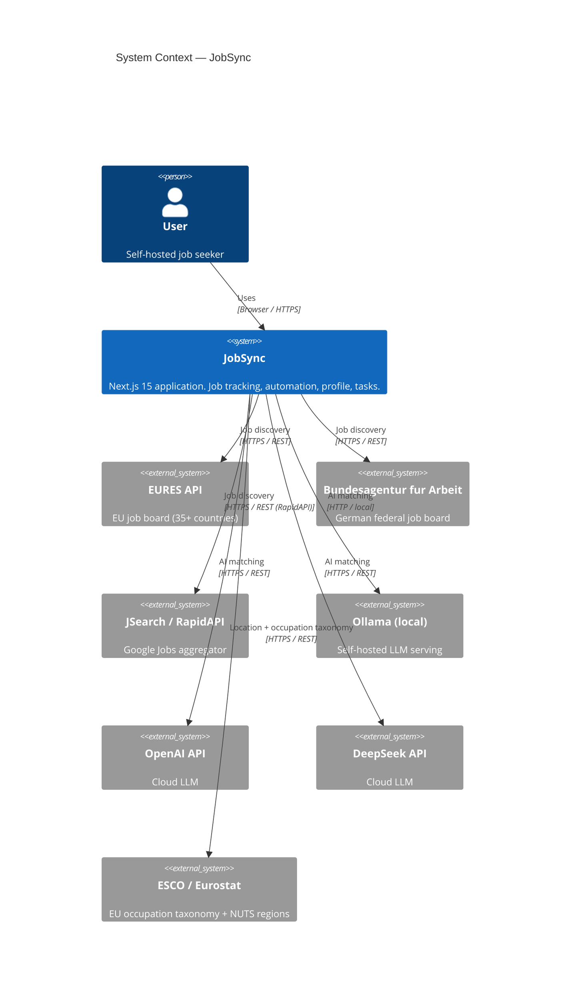
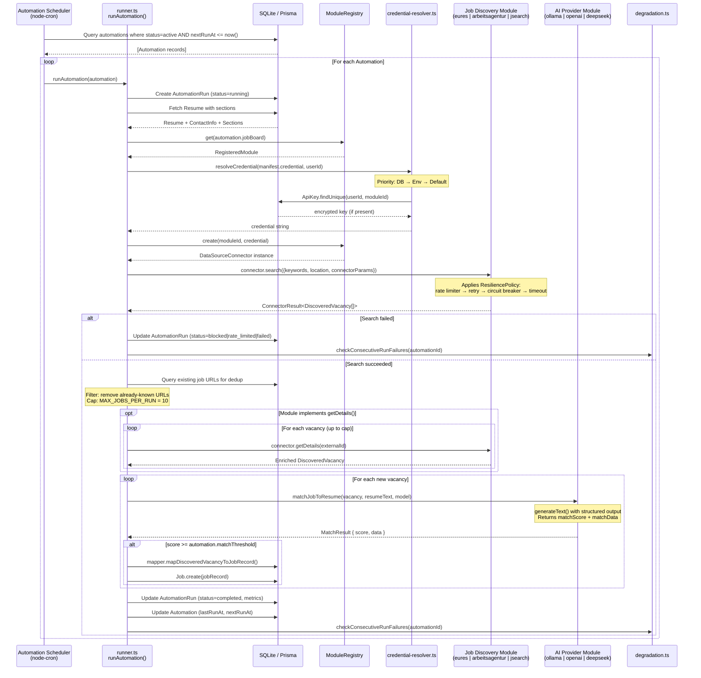
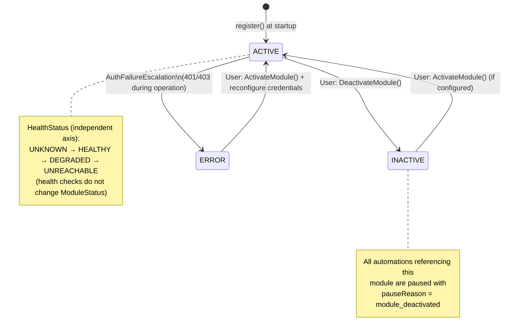

# JobSync — Architecture Overview

**Version:** 0.4 (post Module Lifecycle Manager)
**Date:** 2026-03-29
**Audience:** Backend and frontend developers, technical architects, onboarding engineers

---

## Table of Contents

1. [Executive Summary](#1-executive-summary)
2. [System Context](#2-system-context)
   - 2.1 [What JobSync Is](#21-what-jobsync-is)
   - 2.2 [Users and Actors](#22-users-and-actors)
   - 2.3 [External Systems](#23-external-systems)
   - 2.4 [System Context Diagram](#24-system-context-diagram)
3. [Key Architecture Patterns](#3-key-architecture-patterns)
   - 3.1 [App / Connector / Module — The ACL Pattern](#31-app--connector--module--the-acl-pattern)
   - 3.2 [Module Lifecycle Manager](#32-module-lifecycle-manager)
   - 3.3 [ActionResult\<T\> — Typed Server Actions](#33-actionresultt--typed-server-actions)
   - 3.4 [Domain-Driven Design Idioms](#34-domain-driven-design-idioms)
   - 3.5 [Allium Specifications](#35-allium-specifications)
4. [Component Overview](#4-component-overview)
   - 4.1 [Next.js App Layer](#41-nextjs-app-layer)
   - 4.2 [Server Actions (Repositories)](#42-server-actions-repositories)
   - 4.3 [Connector Domain Boundary](#43-connector-domain-boundary)
   - 4.4 [Module Implementations](#44-module-implementations)
   - 4.5 [i18n Adapter Layer](#45-i18n-adapter-layer)
   - 4.6 [Schedulers](#46-schedulers)
5. [Data Flow — Automation Run](#5-data-flow--automation-run)
   - 5.1 [Automation Run Flow Diagram](#51-automation-run-flow-diagram)
   - 5.2 [Step-by-Step Narrative](#52-step-by-step-narrative)
6. [Module Lifecycle](#6-module-lifecycle)
   - 6.1 [Registration](#61-registration)
   - 6.2 [Activation and Deactivation](#62-activation-and-deactivation)
   - 6.3 [Health Monitoring](#63-health-monitoring)
   - 6.4 [Degradation Rules](#64-degradation-rules)
   - 6.5 [Credential Resolution (PUSH)](#65-credential-resolution-push)
   - 6.6 [Module Lifecycle State Diagram](#66-module-lifecycle-state-diagram)
7. [Data Model](#7-data-model)
   - 7.1 [Core Aggregates](#71-core-aggregates)
   - 7.2 [Connector Domain Tables](#72-connector-domain-tables)
   - 7.3 [Profile Aggregate](#73-profile-aggregate)
   - 7.4 [Domain Model Invariants](#74-domain-model-invariants)
8. [Technology Stack](#8-technology-stack)
   - 8.1 [Runtime and Framework](#81-runtime-and-framework)
   - 8.2 [Data Persistence](#82-data-persistence)
   - 8.3 [Resilience (Cockatiel)](#83-resilience-cockatiel)
   - 8.4 [AI Integration (Vercel AI SDK)](#84-ai-integration-vercel-ai-sdk)
   - 8.5 [UI Layer](#85-ui-layer)
   - 8.6 [Authentication](#86-authentication)
   - 8.7 [Testing Infrastructure](#87-testing-infrastructure)
9. [Security Model](#9-security-model)
10. [Deployment and Operations](#10-deployment-and-operations)
11. [Roadmap Context](#11-roadmap-context)
12. [Appendix: Ubiquitous Language Glossary](#12-appendix-ubiquitous-language-glossary)

---

## 1. Executive Summary

JobSync is a self-hosted web application for tracking job applications. It runs as a single Next.js 15 process backed by a SQLite database via Prisma. Its principal distinguishing feature is a pluggable automation system that periodically searches external job boards, scores discovered vacancies against the user's resume using an LLM, and saves matching jobs directly into the user's job pipeline.

The architecture is organized around three separation concerns:

1. **The App layer** handles user interaction: CRUD for jobs, tasks, activities, profiles, and automations. All mutations go through typed server actions (`ActionResult<T>`).

2. **The Connector domain boundary** is an Anti-Corruption Layer (ACL) that insulates the app from external API volatility. Each external integration is a self-contained Module with a declared manifest describing its identity, credential requirements, health-check strategy, and resilience configuration.

3. **The Module Lifecycle Manager** (completed in roadmap milestone 0.4) governs how modules register, activate, degrade, and affect dependent automations. Its rules are formally specified in `specs/module-lifecycle.allium` and enforced by runtime code in `src/lib/connector/`.

The system is designed to run without cloud dependencies: Ollama provides local AI matching; EURES and Arbeitsagentur are free public APIs. API keys are optional and per-user, encrypted at rest.

---

## 2. System Context

### 2.1 What JobSync Is

JobSync is a self-hosted job application tracker. A user installs and runs it on their own machine or private server. There is no multi-tenancy at the infrastructure level — each deployment is single-owner, though the data model supports multiple user accounts within the same database.

Core capabilities:

- **Job board management** — track applications across all stages (applied, interviewing, offered, rejected)
- **Automation** — schedule recurring searches on job boards; AI scores each discovered vacancy against a resume; matched jobs are saved automatically
- **Profile and resume builder** — structured CV data used for AI job matching
- **Task and activity tracking** — schedule interview prep, follow-up tasks, activities
- **EURES/ESCO integration** — European job search with hierarchical location selection and occupation taxonomy
- **Multi-locale UI** — English, German, French, Spanish

### 2.2 Users and Actors

| Actor | Interaction |
|---|---|
| **User** | Primary actor. Manages jobs, automations, profile, settings. Can activate/deactivate modules. |
| **System** | Background actor. Runs automation schedules, performs health checks, applies degradation rules, pauses automations on failure. |

There is no admin-vs-user role split beyond a basic per-user data ownership model enforced at the Prisma query level.

### 2.3 External Systems

| System | Role | Connector Module | Auth |
|---|---|---|---|
| **EURES API** | EU job board search (35+ countries) | `eures` (Job Discovery) | None (public API) |
| **Bundesagentur fur Arbeit** | German federal employment agency job search | `arbeitsagentur` (Job Discovery) | None (public API) |
| **JSearch / RapidAPI** | Google Jobs aggregator via RapidAPI gateway | `jsearch` (Job Discovery) | API key (per-user) |
| **Ollama** | Local LLM serving for job-resume matching | `ollama` (AI Provider) | Endpoint URL (localhost default) |
| **OpenAI** | Cloud LLM for job-resume matching | `openai` (AI Provider) | API key (per-user) |
| **DeepSeek** | Cloud LLM for job-resume matching | `deepseek` (AI Provider) | API key (per-user) |
| **ESCO API** | EU occupation taxonomy — used in automation wizard | Proxy routes only | Auth-gated proxy |
| **Eurostat NUTS API** | EU regional location names (localized) | Proxy routes only | Auth-gated proxy |

**Shared-Client Pattern:** RapidAPI is a transport gateway, not itself a module. JSearch is the module behind it. The `jsearch` manifest declares `credential.moduleId = "rapidapi"` to look up the correct API key from the `ApiKey` table.

### 2.4 System Context Diagram



---

## 3. Key Architecture Patterns

### 3.1 App / Connector / Module — The ACL Pattern

The most important structural decision in JobSync is the three-layer separation between the application, the connector boundary, and the module implementations.

```
App Layer  (Next.js pages, server actions, UI components)
    |
    |  speaks only domain types:
    |  DiscoveredVacancy, ConnectorResult<T>, ActionResult<T>
    v
Connector Boundary  (src/lib/connector/)
    |  — ModuleRegistry: manifest storage + factory resolution
    |  — DataSourceConnector interface (job discovery contract)
    |  — AIProviderConnector interface (AI contract)
    |  — ResiliencePolicy: Cockatiel policies from manifests
    |  — CredentialResolver: DB → Env → Default resolution chain
    v
Module Implementations  (modules/eures/, modules/arbeitsagentur/, ...)
    — each speaks its own external API's language internally
    — each translates to DiscoveredVacancy at its boundary
    — each declares a ModuleManifest at registration time
```

This is an Anti-Corruption Layer (ACL) in DDD terminology. The connector boundary acts as a translation surface so that EURES-specific concepts (`jvProfile`, `locationCode`) never leak into the app layer. The app always receives `DiscoveredVacancy` regardless of which module performed the search.

**Why this matters for maintenance:** Adding a new job board requires only three files — `manifest.ts`, `index.ts` (implementing `DataSourceConnector`, self-registering at the bottom), and one import line in `register-all.ts`. No existing application code changes. No hardcoded arrays to update.

### 3.2 Module Lifecycle Manager

Prior to roadmap milestone 0.4, modules were stateless factories: registered once, always active, with no health tracking. The Module Lifecycle Manager introduces:

- **ModuleManifest** — a published contract each module declares at startup, describing credentials, health check configuration, and resilience parameters
- **Unified ModuleRegistry** — a single in-memory store of `RegisteredModule` entities (manifest + runtime state). The old `ConnectorRegistry` and `AIProviderRegistry` are thin facades delegating to it
- **Activation/Deactivation** — modules can be toggled; deactivating a module pauses all automations that reference it
- **Health monitoring** — periodic HTTP probes against module-declared endpoints update a `HealthStatus` enum per module
- **Degradation rules** — three escalation rules automatically pause automations before runaway failures consume rate limits or produce noise

The authoritative specification for all lifecycle rules is `specs/module-lifecycle.allium`. The TypeScript implementation in `src/lib/connector/` is derived from that spec; when the spec and code diverge, the spec wins.

### 3.3 ActionResult\<T\> — Typed Server Actions

All mutating server actions return `ActionResult<T>`:

```typescript
// src/models/actionResult.ts
export interface ActionResult<T = undefined> {
  success: boolean;
  data?: T;
  total?: number;
  message?: string;
}
```

This pattern has three variants documented in `specs/action-result.allium`:

| Pattern | Description | Example |
|---|---|---|
| **A** | Full `ActionResult<DomainType>` — used by all CRUD mutations | `ActionResult<Job>`, `ActionResult<Automation>` |
| **B** | Raw array return for read-only list queries | `getAllCompanies(): Company[]` |
| **C** | Custom return shapes for dashboard aggregations | `getDashboardStats()` |

Pattern A covers 73 server action functions. The `T` parameter is always a specific domain type, never `unknown`. The `handleError()` utility returns `ActionResult<never>`, which is type-compatible with any `ActionResult<T>` at the call site.

### 3.4 Domain-Driven Design Idioms

JobSync applies DDD idioms throughout:

**Bounded Contexts.** Each connector module is its own bounded context. EURES internally works with `jvProfile`, `locationCode`, `requestLanguage`. Arbeitsagentur works with `arbeitsort`, `beruf`, `refnr`. These internal types never cross the context boundary. The shared domain type `DiscoveredVacancy` is the only cross-context currency.

**Aggregates.** The schema is organized into aggregates with clear ownership:

- **Job Aggregate** — Job + Notes + Tags + Status (modified via `job.actions.ts`)
- **Automation Aggregate** — Automation + AutomationRun + discovered Jobs (via `automation.actions.ts`)
- **Profile Aggregate** — Profile + Resume + Sections + ContactInfo (via `profile.actions.ts`)

No aggregate is modified from outside its action file.

**Repository Pattern.** Server actions (`src/actions/*.ts`) serve as repositories. Each aggregate has exactly one action file that owns all mutations for that aggregate.

**Value Objects.** `DiscoveredVacancy`, `ActionResult<T>`, `EuresCountry` are value objects — they carry data, have no mutable identity, and are compared by value.

**Ubiquitous Language.** The project enforces consistent terminology across code, UI strings, specs, and commits. `DiscoveredVacancy` is never called "scraped job". `Automation` is never called "cron job". See the [Glossary](#12-appendix-ubiquitous-language-glossary) for the full list.

### 3.5 Allium Specifications

Allium is a domain-specific specification language used in this project to formally capture business rules before implementation. Specifications live in `specs/*.allium` and are treated as the single source of truth for domain behavior.

Current specifications:

| File | Scope |
|---|---|
| `specs/module-lifecycle.allium` | Module registration, activation, health, degradation |
| `specs/action-result.allium` | Classification of server action return patterns |
| `specs/base-combobox.allium` | Combobox interaction model |
| `specs/ui-combobox-keyboard.allium` | Keyboard navigation spec for combobox |
| `specs/e2e-test-infrastructure.allium` | E2E test pipeline rules |

The workflow is: write the Allium spec first, derive TypeScript types from the spec, implement the rules, cross-reference the spec in code comments.

---

## 4. Component Overview

### 4.1 Next.js App Layer

The Next.js 15 App Router organizes the frontend into route segments under `src/app/`:

```
src/app/
  (auth)/              — Sign in, sign up pages (unauthenticated)
  dashboard/
    myjobs/            — Job list and detail views
    automations/       — Automation wizard, run history, status
    activities/        — Activity log
    tasks/             — Task management
    profile/           — Resume builder
    questions/         — Interview Q&A bank
    settings/          — API keys, AI settings, module activation
    admin/             — Developer/admin tools
  api/
    auth/              — NextAuth.js endpoints
    automations/[id]/  — Run trigger, logs
    ai/                — Ollama proxy, resume match/review
    esco/              — ESCO taxonomy proxy
    eures/             — EURES location/occupation proxy
    jobs/export/       — CSV export
    settings/          — API key verification
```

Pages are React Server Components by default. Client interactivity is isolated to leaf components. The middleware at `src/middleware.ts` enforces NextAuth session checks on all `/dashboard/*` routes.

### 4.2 Server Actions (Repositories)

Server actions live in `src/actions/` and form the repository layer:

| File | Aggregate | Key Responsibilities |
|---|---|---|
| `job.actions.ts` | Job | CRUD, status transitions, bulk operations |
| `automation.actions.ts` | Automation | Create/update, trigger run, pause/resume |
| `profile.actions.ts` | Profile | Resume builder, section management |
| `activity.actions.ts` | Activity | Activity log CRUD |
| `task.actions.ts` | Task | Task CRUD, status updates |
| `module.actions.ts` | Module | Activate/deactivate modules, persist state |
| `notification.actions.ts` | Notification | Read/dismiss notifications |
| `apiKey.actions.ts` | ApiKey | Store/retrieve/verify encrypted API keys |
| `dashboard.actions.ts` | (read-only) | Aggregated dashboard statistics (Pattern C) |

All actions imported from `src/actions/` are `"use server"` — they execute exclusively on the Node.js server side.

### 4.3 Connector Domain Boundary

The connector boundary lives in `src/lib/connector/` and is the architectural heart of the automation system:

```
src/lib/connector/
  manifest.ts            — Type definitions: ModuleManifest, RegisteredModule, enums
  registry.ts            — Unified ModuleRegistry (singleton)
  register-all.ts        — Central entry point: imports each module's index.ts to trigger self-registration
  credential-resolver.ts — PUSH credential resolution (DB → Env → Default)
  resilience.ts          — buildResiliencePolicy() from manifest config
  health-monitor.ts      — checkModuleHealth() + checkAllModuleHealth()
  health-scheduler.ts    — startHealthScheduler() — periodic probes
  degradation.ts         — handleAuthFailure(), checkConsecutiveRunFailures(),
                           handleCircuitBreakerTrip(), handleCircuitBreakerRecovery()
  rate-limiter.ts        — TokenBucketRateLimiter
  params-validator.ts    — Validate connectorParams against module schema

  job-discovery/
    types.ts             — DataSourceConnector interface, DiscoveredVacancy, ConnectorResult<T>
    registry.ts          — ConnectorRegistry facade
    runner.ts            — runAutomation() — orchestrates search, dedup, AI match, save
    mapper.ts            — mapDiscoveredVacancyToJobRecord()
    schedule.ts          — calculateNextRunAt()
    modules/
      eures/             — EURES module (manifest.ts + index.ts)
      arbeitsagentur/    — Arbeitsagentur module
      jsearch/           — JSearch/RapidAPI module

  ai-provider/
    types.ts             — AIProviderConnector interface, AIConnectorResult<T>
    registry.ts          — AIProviderRegistry facade
    index.ts             — getModel() — resolves LanguageModel from module ID
    modules/
      ollama/            — Ollama module (manifest.ts + index.ts)
      openai/            — OpenAI module
      deepseek/          — DeepSeek module
```

**Key design decisions preserved here:**

- The `moduleRegistry` singleton is the only authoritative source of module state at runtime.
- Both `ConnectorRegistry` and `AIProviderRegistry` are facades; they exist only to preserve existing import paths.
- `register-all.ts` is the single central entry point for module registration; each module self-registers in its own `index.ts` and `register-all.ts` triggers those registrations via import.
- The `Function` type is not used in the registry. Factories use `(...args: never[]) => unknown` to satisfy TypeScript parameter contravariance while remaining callable at runtime.

### 4.4 Module Implementations

Each module follows an identical structure:

```
modules/{name}/
  manifest.ts  — declares ModuleManifest (or JobDiscoveryManifest / AiManifest)
  index.ts     — implements DataSourceConnector or AIProviderConnector
```

The manifest file is data-only. The index file contains the HTTP client and translation logic. A module's `search()` implementation speaks the external API's native types internally, but translates to `DiscoveredVacancy[]` before returning. A module never returns raw API types to its caller.

**Current module inventory:**

| Module ID | Type | Credential | Resilience | Health Check |
|---|---|---|---|---|
| `eures` | Job Discovery | None | Cockatiel (retry 3x exp, CB, timeout 15s, rate limit 3/500ms, bulkhead 5) | Yes |
| `arbeitsagentur` | Job Discovery | None | Cockatiel (retry 3x exp, CB, timeout 15s, rate limit 3/500ms, bulkhead 5) | Yes |
| `jsearch` | Job Discovery | RapidAPI key (required) | None | No |
| `ollama` | AI Provider | Endpoint URL (default: localhost:11434) | None | Yes (`/api/tags`) |
| `openai` | AI Provider | API key (required) | None | Yes (`/models`) |
| `deepseek` | AI Provider | API key (required) | None | Yes (`/models`) |

### 4.5 i18n Adapter Layer

The i18n system uses an adapter pattern with two public surfaces:

- `@/i18n` — client components (exports `useTranslations` hook, `formatDate`, `formatNumber`)
- `@/i18n/server` — server components and actions (exports `t()`, `getUserLocale()`)

Both surfaces hide the underlying dictionary implementation. The current backend is a static dictionary in `src/i18n/dictionaries/` with four locale files (en, de, fr, es). The adapter allows switching to LinguiJS macros without changing consumer code.

Translations are organized into namespaces matching the feature areas: `dashboard`, `jobs`, `activities`, `tasks`, `automations`, `profile`, `questions`, `admin`, `settings`. All four locales must be updated whenever UI strings change.

### 4.6 Schedulers

Two schedulers start at application boot via `src/instrumentation.ts` (Next.js instrumentation hook, Node.js runtime only):

**Automation Scheduler** (`src/lib/scheduler/`): Uses `node-cron`. Scans for active automations whose `nextRunAt` is in the past and triggers `runAutomation()` for each. Respects `scheduleHour` per automation.

**Health Scheduler** (`src/lib/connector/health-scheduler.ts`): Reads all active modules with health check configs from the registry. For each, schedules an initial probe after a 10-second warm-up delay, then repeats at the `intervalMs` declared in the module manifest (default 5 minutes). Uses `globalThis` to survive Next.js Hot Module Replacement without duplicating timers.

---

## 5. Data Flow — Automation Run

### 5.1 Automation Run Flow Diagram



### 5.2 Step-by-Step Narrative

**Step 1 — Scheduler trigger.** The `node-cron` scheduler runs once per hour and queries `Automation` records where `status = 'active'` and `nextRunAt <= now()`. Each matching automation becomes a separate `runAutomation()` invocation.

**Step 2 — Run record creation.** The runner immediately creates an `AutomationRun` row with `status = 'running'`. This provides an audit trail even if the process dies mid-run.

**Step 3 — Resume fetch.** The user's resume is loaded with all sections (contact info, work experience, education). This data is serialized to plain text for the AI matching prompt.

**Step 4 — Credential resolution (PUSH).** The runner calls `resolveCredential()` with the module manifest's `CredentialRequirement`. The resolution chain is: (1) user's encrypted API key from the `ApiKey` table; (2) environment variable named by `envFallback`; (3) `defaultValue` from the manifest. The resolved credential is passed to the module factory as a constructor argument — the module never reaches out to resolve credentials itself.

**Step 5 — Job search.** The module's `search()` method executes. For modules with a `ResiliencePolicy`, requests pass through a Cockatiel policy stack: token bucket rate limiter, retry with exponential backoff, circuit breaker, request timeout, bulkhead. Transient errors (5xx, network) are retried; persistent errors open the circuit breaker.

**Step 6 — Deduplication and cap.** Discovered vacancies are filtered against the user's existing job URLs (normalized to strip tracking parameters). At most 10 new vacancies proceed to AI matching per run.

**Step 7 — Detail enrichment (optional).** If the module implements `getDetails(externalId)`, a second API call fetches richer metadata for each vacancy. This runs after deduplication and the cap, so at most 10 detail calls are made per run.

**Step 8 — AI matching.** Each vacancy is scored against the resume using the Vercel AI SDK's `generateText()` with structured output (Zod schema). The prompt instructs the model to return a `matchScore` (0–100) and reasoning. If the score meets `automation.matchThreshold`, the vacancy proceeds to saving.

**Step 9 — Job persistence.** `mapDiscoveredVacancyToJobRecord()` translates `DiscoveredVacancy` to the Prisma `Job` shape, creating or finding the related `Company`, `JobTitle`, and `Location` records. The job is saved with `automationId`, `matchScore`, and `matchData` linking it back to the run.

**Step 10 — Run finalization.** The `AutomationRun` is updated with final status and counters (`jobsSearched`, `jobsDeduplicated`, `jobsProcessed`, `jobsMatched`, `jobsSaved`). The `Automation` record's `nextRunAt` is recalculated. If status is `'failed'`, `checkConsecutiveRunFailures()` checks whether the degradation threshold has been reached.

---

## 6. Module Lifecycle

### 6.1 Registration

Modules register at application startup, not at request time. Each module self-registers at the bottom of its own `index.ts`, and `register-all.ts` triggers those registrations by importing each module:

```typescript
// Example: src/lib/connector/job-discovery/modules/eures/index.ts
// Self-registration at bottom of file:
moduleRegistry.register(euresManifest, createEuresConnector);
// Triggered by: src/lib/connector/register-all.ts importing each module
```

Registration is idempotent — re-registering the same module ID is a no-op, making it safe for Next.js Hot Module Replacement. On registration, the `RegisteredModule` entity is initialized with `status = ACTIVE`, `healthStatus = UNKNOWN`, `circuitBreakerState = CLOSED`, `consecutiveFailures = 0`.

The Allium invariant `UniqueModuleIds` enforces that no two modules share the same ID across all connector types.

### 6.2 Activation and Deactivation

**Activation** (`module.actions.ts: activateModule()`): Transitions `ModuleStatus` from `INACTIVE` or `ERROR` to `ACTIVE`. Requires the module to be configured (credentials present if required). Does not auto-restart automations that were paused when the module was previously deactivated — the user must manually resume each automation.

**Deactivation** (`module.actions.ts: deactivateModule()`): Transitions `ModuleStatus` to `INACTIVE`. As a side effect, all `Automation` records with `jobBoard = moduleId` and `status = 'active'` are paused with `pauseReason = 'module_deactivated'`. A `Notification` record is created for each affected automation's owner.

**Automation wizard filtering.** The automation wizard's module selector calls `moduleRegistry.getActive(ConnectorType.JOB_DISCOVERY)`, which returns only modules with `status = ACTIVE`. Deactivated modules are invisible to the wizard — the Allium invariant `DeactivatedModulesHidden` enforces this.

**Settings UI.** The settings page iterates over registered manifests via `moduleRegistry.getByType()`. The credential field and settings schema for each module are rendered from the manifest — there are no hardcoded module lists in UI components (Allium invariant `SettingsFromManifest`).

### 6.3 Health Monitoring

Modules that declare a `healthCheck` configuration in their manifest are periodically probed. The health scheduler (`health-scheduler.ts`) starts at application boot and issues a `GET` request to the module's declared endpoint.

**Probe logic (health-monitor.ts):**
- Absolute URLs (e.g., `https://eures.ec.europa.eu/...`) are probed directly.
- Relative paths (e.g., `/api/tags` for Ollama) are resolved against the module's `credential.defaultValue` (the base URL).
- A successful HTTP 2xx response sets `healthStatus = HEALTHY`.
- The first failure sets `healthStatus = DEGRADED`.
- Three or more consecutive failures set `healthStatus = UNREACHABLE` and emit a notification (but do not pause the automation — that is the circuit breaker's job).

Health check results are written to the `ModuleRegistration` table for persistence across restarts and displayed as color-coded indicators in the Settings UI.

**Important distinction:** Health checks answer "can I reach you?" (periodic ping). Circuit breaker state answers "are you actually working?" (real request outcomes). Only the latter justifies pausing automations. A module can be `healthStatus = UNREACHABLE` but still run automations if the circuit breaker has not escalated.

### 6.4 Degradation Rules

Three escalation rules are implemented in `degradation.ts`, derived directly from `specs/module-lifecycle.allium`:

**Rule 1 — AuthFailureEscalation.**
- Triggered when a module detects a 401 or 403 response during a real request.
- Sets `module.status = ERROR` immediately.
- Pauses all active automations using the module with `pauseReason = 'auth_failure'`.
- Rationale: a single auth failure is definitive — retrying with the same invalid credential is pointless.

**Rule 2 — ConsecutiveRunFailureEscalation.**
- Triggered at the end of every failed automation run.
- Queries the last 5 `AutomationRun` records for the automation.
- If all 5 are `status = 'failed'`, pauses the automation with `pauseReason = 'consecutive_failures'`.
- Threshold is per-automation, not per-module, because different automations may exercise different code paths.

**Rule 3 — CircuitBreakerEscalation.**
- Triggered when a Cockatiel circuit breaker opens.
- Each trip increments `RegisteredModule.consecutiveFailures`.
- After 3 consecutive CB opens (without recovery), pauses all active automations using the module with `pauseReason = 'cb_escalation'`.
- Circuit breaker recovery (`handleCircuitBreakerRecovery()`) resets the counter to zero, allowing re-escalation if the module degrades again.

**Notifications.** All three rules create persistent `Notification` records in the database. Notifications survive across sessions, ensuring the user sees alerts even after restarting the browser.

**What does NOT trigger pausing:** A single `rate_limited` response, a single timeout, or an `UNREACHABLE` health check result. These are self-healing conditions.

### 6.5 Credential Resolution (PUSH)

Prior to roadmap milestone 0.4, modules called `resolveApiKey()` ad-hoc inside their own code (PULL pattern). The current PUSH pattern inverts this:

```
Runner resolves credential before creating the module instance.
The module receives the credential as a constructor argument.
The module never calls credential resolution itself.
```

The resolution chain in `credential-resolver.ts`:

1. **User DB** — `ApiKey.findUnique({ userId, moduleId })` — the user's encrypted key, decrypted with AES-GCM.
2. **Environment variable** — `process.env[credential.envFallback]` — operator-level fallback (e.g., `OPENAI_API_KEY`).
3. **Default value** — `credential.defaultValue` — used for Ollama's `http://127.0.0.1:11434` default, which works without any user configuration.

If a credential is `required: true` in the manifest and none of the three sources yields a value, module instantiation fails before the external API is called.

### 6.6 Module Lifecycle State Diagram



---

## 7. Data Model

### 7.1 Core Aggregates

The Prisma schema (`prisma/schema.prisma`) maps to these aggregate boundaries:

**Job Aggregate**

```
Job (root)
  ├── JobTitle        (shared reference, per-user)
  ├── Company         (shared reference, per-user)
  ├── Location        (shared reference, per-user)
  ├── JobStatus       (global enum table)
  ├── JobSource       (per-user, created on module activation)
  ├── Note[]          (cascade delete)
  ├── Tag[]           (many-to-many)
  ├── Interview[]
  └── Resume?         (reference — which resume was matched)
```

Jobs carry automation discovery fields: `automationId`, `matchScore`, `matchData`, `discoveryStatus`, `discoveredAt`. These fields are planned for migration to a `StagedVacancy` aggregate in roadmap milestone 0.5.

**Automation Aggregate**

```
Automation (root)
  ├── AutomationRun[]  (cascade delete)
  └── Job[]           (discovered jobs — SetNull on automation delete)
```

Key fields: `jobBoard` (module ID), `keywords`, `location`, `connectorParams` (JSON string), `resumeId`, `matchThreshold`, `scheduleHour`, `status`, `pauseReason`.

**Profile Aggregate**

```
Profile (root)
  └── Resume[]
        ├── ContactInfo?
        ├── ResumeSection[]
        │     ├── Summary?
        │     ├── WorkExperience[]
        │     ├── Education[]
        │     └── LicenseOrCertification[]
        └── File?
```

### 7.2 Connector Domain Tables

**`ApiKey`** — per-user, per-module encrypted credentials:

```
userId + moduleId  (composite unique key)
encryptedKey       (AES-GCM encrypted)
iv                 (initialization vector — empty string if unencrypted legacy row)
last4              (display hint)
lastUsedAt         (updated on credential resolution)
```

**`ModuleRegistration`** — persisted module lifecycle state:

```
moduleId           (unique)
connectorType      (job_discovery | ai_provider)
status             (active | inactive | error)
healthStatus       (healthy | degraded | unreachable | unknown)
activatedAt
deactivatedAt
```

This table is the persistence layer for what the in-memory `ModuleRegistry` holds in `RegisteredModule.status`. On startup, the in-memory registry initializes all modules as `ACTIVE`. The application then reconciles with the `ModuleRegistration` table to restore the user's previous activation choices.

**`Notification`** — persistent alert records:

```
userId
type               (module_deactivated | auth_failure | cb_escalation | consecutive_failures | ...)
message
moduleId?
automationId?
read               (default false)
createdAt
```

### 7.3 Profile Aggregate

The profile system maintains structured CV data used for AI job matching. A `User` can have multiple `Profile` records, each containing multiple `Resume` objects. Resumes are built from typed sections (summary, experience, education, certifications). The runner serializes the active resume to plain text before passing it to the AI matching prompt.

### 7.4 Domain Model Invariants

The following invariants are enforced in code (primarily by the action files and degradation rules):

| Invariant | Enforcement |
|---|---|
| Every paused automation has a `pauseReason` | Degradation rules always set `pauseReason` when transitioning to `paused` |
| Active automation references an active module | `ModuleDeactivation`, `AuthFailureEscalation`, `CircuitBreakerEscalation` pause automations before or when their module becomes inactive/error |
| Settings UI shows only registered manifests | `moduleRegistry.getByType()` — no hardcoded arrays |
| Deactivated modules hidden from automation wizard | `moduleRegistry.getActive()` filter |
| `null` in DB maps to `\| null` in domain model | Domain models in `src/models/*.model.ts` mirror Prisma nullability |

---

## 8. Technology Stack

### 8.1 Runtime and Framework

| Technology | Version | Role |
|---|---|---|
| **Next.js** | 15.x | Full-stack React framework. App Router. Server Actions. |
| **React** | 19.x | UI rendering |
| **TypeScript** | 5.x | Type safety across the entire codebase |
| **Bun** | (current) | Package manager and script runner |
| **Node.js** | (system) | Runtime for production. Jest tests also run under system Node. |
| **node-cron** | 4.x | Cron scheduling for automation runs |

Next.js 15 with the App Router is the core framework choice. Server Actions replace traditional REST endpoints for mutations. The `instrumentation.ts` hook starts background schedulers once at process boot in the Node.js runtime (not the Edge runtime).

### 8.2 Data Persistence

| Technology | Version | Role |
|---|---|---|
| **Prisma** | 6.x | ORM and migration manager |
| **SQLite** | (bundled) | Database engine. Single file (`prisma/dev.db`). |
| **bcryptjs** | 2.x | Password hashing |
| **AES-GCM** | (Node.js crypto) | API key encryption at rest |

SQLite is a deliberate choice for a self-hosted single-user application. It eliminates the need for a separate database process, simplifies backups (copy one file), and performs adequately for the expected data volumes (thousands of jobs, hundreds of automation runs).

On NixOS, the Prisma query engine binary requires patching to work with the NixOS read-only store. The `scripts/env.sh` script handles this automatically via `patchelf`.

### 8.3 Resilience (Cockatiel)

| Technology | Version | Role |
|---|---|---|
| **Cockatiel** | 3.x | Resilience policies: retry, circuit breaker, timeout, bulkhead |
| **TokenBucketRateLimiter** | (internal) | Token bucket implementation for rate limiting |

Cockatiel provides composable resilience policies. The `buildResiliencePolicy()` function in `resilience.ts` constructs a policy stack from a module's `ResilienceConfig`:

1. **Retry** — retries on 5xx and 429 responses with exponential backoff
2. **Circuit Breaker** — opens after N consecutive failures, half-opens after cooldown
3. **Timeout** — cooperative cancellation via `AbortSignal`
4. **Bulkhead** — limits concurrent requests (`maxConcurrent`)
5. **Rate Limiter** — token bucket applied before the Cockatiel stack

Policies are composed with `wrap()` and stored in the `ResiliencePolicy` object returned by `buildResiliencePolicy()`. Each module instantiation creates its own policy instance — policies are not shared between module instances.

The `resilientFetch()` convenience method on `ResiliencePolicy` handles the full stack: acquire rate limiter token, execute within composed policy, throw `ConnectorApiError` on non-OK HTTP responses.

### 8.4 AI Integration (Vercel AI SDK)

| Technology | Version | Role |
|---|---|---|
| **ai (Vercel AI SDK)** | 6.x | Model abstraction, structured output, streaming |
| **@ai-sdk/openai** | 3.x | OpenAI provider adapter |
| **@ai-sdk/deepseek** | 2.x | DeepSeek provider adapter |
| **ollama-ai-provider-v2** | 2.x | Ollama provider adapter |

The Vercel AI SDK provides a unified `LanguageModel` interface. The `getModel()` function in `src/lib/connector/ai-provider/index.ts` resolves the correct adapter based on the user's selected `AiModuleId`. The runner calls `generateText()` with a structured output schema (Zod) to extract a typed `matchScore` and reasoning from the model's response.

Model selection is lazy (resolved at run time from user settings), unlike job discovery credentials which are resolved eagerly via the PUSH pattern. This is documented as intentional in ADR-013: full settings push for AI models is deferred to a later phase.

### 8.5 UI Layer

| Technology | Role |
|---|---|
| **Shadcn UI** | Accessible component library built on Radix UI primitives |
| **Radix UI** | Headless accessible primitives (dialog, select, popover, etc.) |
| **Tailwind CSS 3.x** | Utility-first styling |
| **Lucide React** | Icon set |
| **Recharts / Nivo** | Dashboard charts (bar, calendar heatmap) |
| **TipTap** | Rich text editor for job descriptions and notes |
| **React Hook Form + Zod** | Form state management and validation |
| **date-fns** | Date formatting and arithmetic |
| **next-themes** | Dark/light theme switching |

The UI follows a strict pattern: every user-visible string is translated via the i18n adapter. Date and number formatting always passes the user's locale explicitly — `formatDateShort(date, locale)` not `format(date, "MMM d, yyyy")`.

### 8.6 Authentication

| Technology | Version | Role |
|---|---|---|
| **NextAuth.js** | 5.x (beta) | Session management, credential-based auth |
| **bcryptjs** | 2.x | Password hashing with salt rounds |

Authentication is credentials-based (email + password). NextAuth.js manages session cookies. The middleware (`src/middleware.ts`) enforces authentication on all `/dashboard/*` routes. All API proxy routes (`/api/esco/*`, `/api/eures/*`) also check `auth()` to prevent unauthenticated access to EU APIs.

OAuth providers are not currently configured but NextAuth.js supports adding them without structural changes.

### 8.7 Testing Infrastructure

| Tool | Role |
|---|---|
| **Jest 29 + ts-jest** | Unit and component tests. Runs under system Node.js. |
| **Testing Library** | DOM assertions and React component testing |
| **Playwright** | End-to-end browser tests (Chromium) |
| **bun runtime** | Dictionary consistency validation (`test-dictionaries.ts`) |

Test files follow a mirrored structure: `__tests__/*.spec.ts` for unit/integration tests, `e2e/` for Playwright tests. The E2E suite has two projects: `smoke` (auth-free) and `crud` (session-backed via stored auth state).

The connector test suite (added in milestone 0.4) covers 114 test cases across 6 suites: Registry, Credentials, Manifests, Degradation, Health, and Resilience. Pagination safety caps (`MAX_PAGES = 20`) are tested as regression guards.

---

## 9. Security Model

**Authentication boundary.** The Next.js middleware enforces session checks on all `/dashboard/*` routes. Unauthenticated requests are redirected to `/sign-in`. API proxy routes additionally call `auth()` explicitly.

**SSRF prevention.** ESCO URI user input is validated to start with `http://data.europa.eu/esco/` before being passed to the EU API. Health check URLs are validated against a blocklist of private/metadata address ranges (`url-validation.ts: isBlockedHealthCheckUrl()`). Ollama's user-configurable base URL is validated before use.

**Credential storage.** API keys are encrypted with AES-GCM before persisting to the `ApiKey` table. The encryption key is derived from the server's secret. Only the last 4 characters are stored in plaintext for display purposes. Credentials are decrypted in `credential-resolver.ts` at request time, held in memory only for the duration of the module instantiation.

**Environment variables.** The `.env` file is gitignored. The `envFallback` mechanism in the manifest allows operators to configure API keys at the server level without user-level DB entries, but this is treated as a deployment-level concern.

**Server-only boundaries.** Files that must never execute in the browser use `import "server-only"` (e.g., `credential-resolver.ts`, `degradation.ts`, `health-monitor.ts`, `@/i18n/server.ts`). Next.js will throw a build error if a server-only import reaches a client bundle.

**Rate limit exposure.** All three degradation rules protect against runaway API consumption. The rate limiter prevents exceeding per-module token bucket limits. Circuit breakers stop retrying against broken endpoints. Auth failure escalation immediately halts calls to endpoints that would reject them.

---

## 10. Deployment and Operations

**Runtime requirements.** A Node.js environment with write access to the filesystem (for the SQLite database file and Prisma engine). The application listens on port 3737 by default.

**Development (NixOS, recommended).** `devenv shell` enters the Nix-managed environment. `devenv up` starts the Next.js dev server, Prisma Studio, and other configured processes. The `devenv.nix` file is the authoritative environment specification.

**Development (non-Nix / VM).** The `scripts/` directory provides shell scripts that auto-download and patch Prisma engine binaries for NixOS environments with read-only Nix stores. `scripts/env.sh` must be sourced before running Prisma commands.

**Database management.**
- `db-migrate` / `scripts/prisma-migrate.sh` — run pending migrations
- `scripts/prisma-generate.sh` — regenerate the Prisma client after schema changes
- The database file lives at the path specified by `DATABASE_URL` in `.env`

**Background processes.** Two schedulers start automatically when the Next.js server starts (via `src/instrumentation.ts`): the automation cron scheduler and the module health scheduler. These run in the same Node.js process as the web server — there is no separate worker process.

**Logging.** The automation logger (`src/lib/automation-logger.ts`) writes structured log entries per run. The `DEBUG` environment variable enables additional connector-level logging (`debugLog()`).

**Building for production.** `bun run build` produces a standard Next.js `.next/` build. The build must complete with zero TypeScript errors — `bun run build` is part of the pre-commit validation check.

---

## 11. Roadmap Context

Understanding which milestones are complete and which are planned helps orient architectural decisions:

| Milestone | Status | Summary |
|---|---|---|
| **0.1** ACL Connector Migration | Done | Migrated from `src/lib/scraper/` to the App/Connector/Module pattern |
| **0.2** ActionResult\<T\> Typing | Done | 73 server actions fully typed; `handleError(): ActionResult<never>` |
| **0.3** Domain Model Alignment | Done | Domain models aligned with Prisma schema; 86% reduction in `as unknown as` casts |
| **0.4** Module Lifecycle Manager | Done | Manifests, unified registry, PUSH credentials, health, resilience, degradation |
| **0.5** Vacancy Pipeline | Planned | Staged vacancies, Inbox as event hub, Archive/Trash, domain events |
| **1.x** New Connectors | Planned | Additional job boards |
| **2.x** UX/UI | Planned | Marketplace UI, onboarding, automation wizard improvements |
| **4.x** Application Documents | Planned | Document generation |
| **5.x** CRM | Planned | Contact management, domain events bus |

The Vacancy Pipeline (0.5) will introduce `StagedVacancy` as a new aggregate, separating discovery from tracking. The automation discovery fields currently on `Job` (`automationId`, `matchScore`, `matchData`, `discoveryStatus`, `discoveredAt`) will migrate to `StagedVacancy`.

The CRM feature (5.x) will introduce an explicit Domain Event Bus, formalizing what currently happens implicitly through `AutomationRun` status transitions. The groundwork is described in CLAUDE.md under "Domain Events (Future)".

---

## 12. Appendix: Ubiquitous Language Glossary

This glossary defines the canonical terms used in code, UI strings, specs, commit messages, and documentation. Using the wrong term in any of these contexts is a violation of the ubiquitous language.

| Term | Definition | Do NOT use |
|---|---|---|
| **DiscoveredVacancy** | A job found by an automation run. The canonical cross-context transfer object from any Job Discovery module to the app layer. | "scraped job", "result", "listing" |
| **Connector** | The Anti-Corruption Layer that translates an external API's types to JobSync domain types. Implements `DataSourceConnector` or `AIProviderConnector`. | "scraper", "fetcher", "provider" (as a type name) |
| **Module** | A concrete external system behind a Connector. Registers with a `ModuleManifest`. Examples: `eures`, `openai`, `ollama`. | "API", "service", "provider" (as a domain concept) |
| **ModuleManifest** | The published contract a module declares at registration time. Describes identity, credentials, health check, and resilience configuration. | "config", "metadata" |
| **AiModuleId** | The enum identifying an AI Module (`ollama`, `openai`, `deepseek`). | `AiProvider`, `ProviderType` |
| **Automation** | A scheduled job search configuration: keywords + location + module + resume + threshold + schedule. | "cron job", "task", "job agent" |
| **AutomationRun** | A single execution of an Automation. Records metrics and final status. | "execution", "run record" |
| **ActionResult\<T\>** | The typed response from a server action. Has `success: boolean`, `data?: T`, `message?: string`. | `Promise<any>`, untyped response |
| **ConnectorResult\<T\>** | The typed response from a Connector's `search()` or `getDetails()` call. Either `{ success: true; data: T }` or `{ success: false; error: ConnectorError }`. | Raw exceptions, untyped returns |
| **ModuleRegistry** | The unified singleton registry storing all `RegisteredModule` entities (manifests + runtime state). | "provider registry", "connector map" |
| **RegisteredModule** | The runtime entity in the registry. Combines an immutable manifest with mutable runtime state (status, health, circuit breaker). | "plugin", "registered connector" |
| **ResiliencePolicy** | A Cockatiel policy stack built from a module's `ResilienceConfig`. Wraps HTTP calls with retry, circuit breaker, timeout, and bulkhead logic. | "retry wrapper", "error handler" |
| **Degradation** | The set of rules that automatically pause automations when a module fails persistently. Three rules: auth failure, consecutive run failures, circuit breaker escalation. | "error handling", "failover" |
| **pauseReason** | The enum value stored on a paused `Automation` explaining why it was paused: `module_deactivated`, `auth_failure`, `consecutive_failures`, `cb_escalation`. | "error reason", "pause cause" |

---

*This document reflects the state of the codebase as of roadmap milestone 0.4. It should be updated when milestone 0.5 (Vacancy Pipeline) introduces the `StagedVacancy` aggregate and domain event bus.*

*Related documents:*
- `docs/adr/013-module-lifecycle-manager.md` — architectural decision record for the Module Lifecycle Manager
- `specs/module-lifecycle.allium` — authoritative formal specification for all lifecycle rules
- `docs/architecture/c4-container.md` — C4 container diagram
- `docs/architecture/c4-context.md` — C4 context diagram
- `CLAUDE.md` — project guidelines and development conventions
