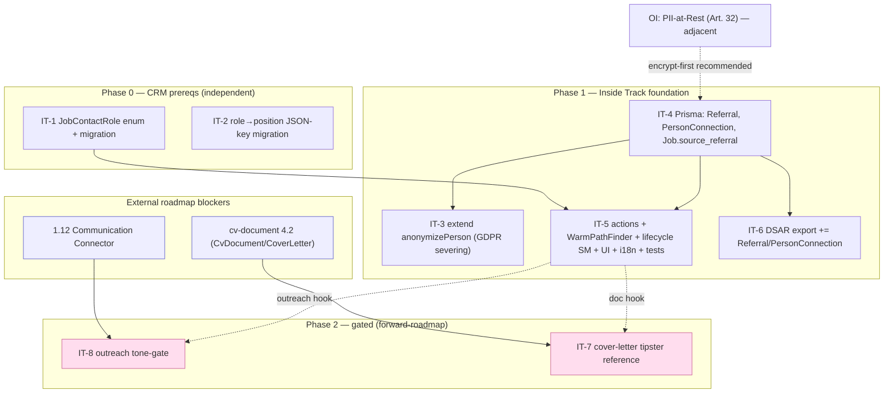

# Inside Track — Implementation Debt (ordered)

Snapshot 2026-06-15. Spec layer DONE (`inside-track.allium` + `crm.allium` role changes +
`crm-gdpr.allium` erasure fix, branch `inside-track-spec`, 0 allium errors). **No code written yet.**
This file orders the implementation work + verifies it against `/tmp/jobsync-open-items.md`.

All facts below verified against current code this session (FEEDING-RULE: graph = hypothesis).

## A. Session-driven debt (NET-NEW from our specs)

| ID | Item | Verified state | Effort | Depends on |
|----|------|----------------|--------|------------|
| **IT-1** | `JobContactRole` enum | code = free-text `String?`, no runtime check | S | — |
| **IT-2** | `CompanyAssociation.role` → `position` | code uses `role` key in `companies` JSON VO (`person.model.ts:32`, `parseCompanies`, PersonForm) | S | — |
| **IT-4** | Prisma models: `Referral`(+kind/forwarded_to/insider/via), `PersonConnection`, `Job.source_referral` | 0 models exist | M | — |
| **IT-3** | extend `anonymizePerson` (sever tipster/forwarded_to/insider, null `via`, delete PersonConnection, decline/detach Referral, scrub drafts) | code KEEPS Person row (status=anonymized); no inside-track severing | S | IT-4 |
| **IT-5** | inside-track Welle 1: actions + Referral lifecycle SM + `WarmPathFinder` (1-hop CompanyAssociation + 2-hop PersonConnection) + `resolve_applied_status` fallback + UI (TipCapture/ReferralWorkspace/finder) + i18n(4) + tests | nothing | L | IT-4, IT-1 |
| **IT-6** | DSAR export: add Referral+PersonConnection to `collect-user-data` + `UserDataExport` (gdpr-data-rights) | export covers crm only | S | IT-4 |
| **IT-7** | cover-letter tipster reference (TipsterReference late-bind) | cv-document not built | M | **cv-document 4.2** |
| **IT-8** | referral outreach tone-gate (no cold template to private contacts) | communication = spec only, no code | M | **1.12 Communication** |

## B. open-items.md — verified (all ACCURATE, none stale)

| open-items item | Verified | Relation to inside-track |
|-----------------|----------|--------------------------|
| PII-at-Rest (Person field-encryption, Art. 32) | confirmed: Person PII **plaintext** | **Adjacent** — inside-track adds more Person refs; encrypt-first is cleaner |
| M-A-09 undoStore split-brain | `undo.actions.ts` exists | independent |
| getStagedVacancies cursor-pagination | confirmed `skip: offset` | independent |
| 3.11 Session-Recovery (usePersistedForm) | confirmed: no `usePersistedForm` | independent (would help TipCapture form UX) |
| H-P-09 Observability | — | independent (2-3wk) |
| 1.12 Communication / Gmail-Sync | confirmed: spec only, no code | **blocks IT-8** (+ CRM 5.1) |
| 1.7 Calendar | confirmed: no code | independent (blocks 5.2) |
| 2.20 CompanyDetail page | — | unblocks company-timeline; mild synergy with WarmPathFinder |
| Welle-1 follow-ups (handleError i18n swallow, person.pii_read audit, RoPA) | — | independent |
| 3 cosmetic + KeyRotation (deferred) | — | independent |

**Stale check:** none stale. **Net-new vs snapshot:** the entire inside-track debt (IT-1..8) is NOT in
open-items.md — it postdates that snapshot. **gdpr-data-rights.allium:** needs no rework now (0 role/position
refs); only IT-6 touches it later.

## C. Recommended order

**Phase 0 — CRM prereqs (independent, low-risk, do first):** IT-1, IT-2.
Pure migrations, no inside-track dependency. Unblock role badges (ROADMAP 2244) immediately.

**Phase 1 — Inside Track foundation:** IT-4 first (models/migration), then IT-3 + IT-5 + IT-6 in parallel.
Ships warm-path discovery + referral lifecycle. This is the user-visible Vitamin-B value.

**Phase 2 — gated extensions (forward):** IT-8 after 1.12 Communication; IT-7 after cv-document 4.2.

**Adjacent decision:** sequence **PII-at-Rest (OI)** before/with Phase 1 — adding more Person PII (tipster,
network) while Person fields are plaintext widens the Art. 32 gap. Recommend encrypt-first or co-deliver.

## D. Cross-dependency graph

**Critical path:** IT-4 → (IT-3 ∥ IT-5 ∥ IT-6). IT-1/IT-2 fully parallel to everything.
IT-7/IT-8 are blocked by external roadmap items (cv-document 4.2, 1.12) — defer until those land.

## E. Phase 2 — Gated extensions: design context (deferred, NOT yet tracked)

These are **out of welle5 scope** and have **no conductor track** (deliberate — creating
one now is premature; register a track when the blocker is prioritized). Their design
substance lives in `specs/inside-track.allium` `open question`s; consolidated here so a cold
resume has one entry point. **SoT stays the Allium spec.**

### IT-8 — Referral outreach tone-gate
- **Blocker / trigger:** 1.12 Communication Connector implemented (spec `communication-connector.allium` exists; no code). Start when 1.12 lands.
- **Open design question (verbatim from `specs/inside-track.allium`):** a referral-driven
  outreach to a PRIVATE contact (friend/family/former_colleague) must not use a cold-recruiter
  template. **Where is it enforced** — a guard in communication-connector keyed on
  `ConnectionKind` / `processing_basis`, or an automation-modes register flag? Cold templates
  only for arms-length tipsters?
- **SoT anchors:** `inside-track.allium` scope note (outreach "register"), `ConnectionKind` enum, `PersonConnection`.

### IT-7 — Cover-letter tipster reference
- **Blocker / trigger:** cv-document 4.2 built (`cv-document.allium` is DRAFT; no CoverLetter/CvDocument code/model). Start when 4.2 lands.
- **Open design question (G-E, verbatim):** the tipster name is intentionally rendered into a
  generated cover letter ("über {tipster} …"), which conflicts with cv-document's
  `CloudAiAlwaysRedacted` when generation/review runs on a cloud AI provider — that name is
  third-party PII egress. **Design decision for the 4.2 integration:** redact-then-reinsert
  locally, gate on `is_local`, or require explicit per-tipster consent for the named reference?
- **SoT anchors:** `inside-track.allium` `external entity CoverLetterDraft` (FORWARD-LOOKING comment),
  `value TipsterReference`, `invariant TipsterReferenceResolvesLive`, the draft-scrub arm of
  `AnonymizeCascadesToInsideTrack`.

**When unblocked:** create a conductor track (e.g. `welle6-inside-track-outreach` / `-coverletter`),
resolve the open question above first (allium:tend on inside-track + the blocker spec), then implement.

