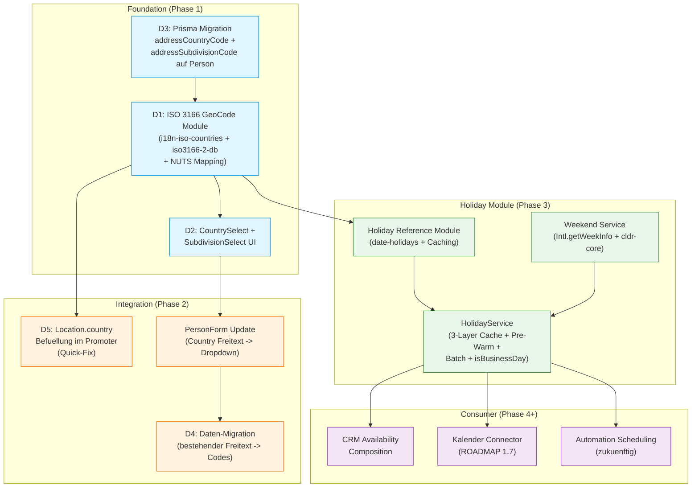
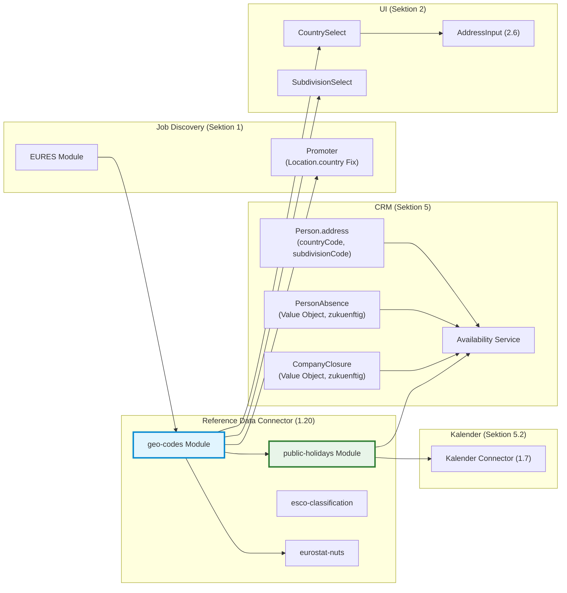
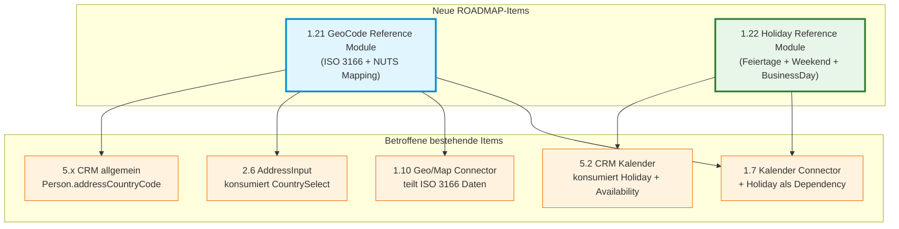

# Holiday Reference Data — Foundation Design Spec

**Datum:** 2026-05-28
**Letzte Änderung:** 2026-05-28 (Dreischicht-Architektur + Fallback-Chains)
**Status:** Design-Review abgeschlossen, Allium-Specs erstellt
**Scope:** Option B — Foundation-Sprint (Geo-Code-Pipeline + Holiday Module)
**Entscheidung:** Evaluiert und zur ROADMAP hinzugefügt

---

## Inhaltsverzeichnis

1. [Einordnung & Abgrenzung](#1-einordnung--abgrenzung)
2. [Datenmodell & Interface](#2-datenmodell--interface)
3. [Modul-Architektur](#3-modul-architektur)
4. [Dependency-Graph](#4-dependency-graph)
5. [ROADMAP-Eintraege](#5-roadmap-eintraege)
6. [Architektur-Entscheidungen](#6-architektur-entscheidungen)
7. [Bekannte Limitationen & Risiken](#7-bekannte-limitationen--risiken)

---

## 1. Einordnung & Abgrenzung

### Was es ist

Ein **Reference Data Module** (`taxonomy: "holidays"`) unter dem bestehenden Reference Data Connector (ROADMAP 1.20). Liefert Feiertags-Lookups fuer beliebige Laender/Subdivisions/Regionen/Jahre. Dazu ein **GeoCode Reference Module** (`taxonomy: "geo_codes"`) als Foundation fuer strukturierte ISO-Codes.

### Was es nicht ist

- **Kein Kalender-Feature** — das ist ROADMAP 5.2/1.7
- **Keine Business-Logik** — "verschiebe Reminder auf Werktag" ist Sache des CRM/Kalender-Consumers
- **Kein Availability-Service** — die Komposition aus Public Holiday + Company Closure + Personal Absence ist ein CRM-Concern
- **Kein Address-Parser** — Adress-Parsing/Geocoding ist ROADMAP 1.10 (Geo/Map Connector), separater Bounded Context
- **Keine eigene Persistenz** — kein Prisma-Model, keine DB-Tabelle. Reine In-Memory-Lookups
- **Keine eigene UI** — kein eigener API-Endpunkt. Consumer-Module stellen die Fragen

### Datenquellen — Dreischicht-Architektur

Drei komplementäre Datenquellen, jede mit eigener Stärke und gegenseitigen Fallbacks:

**Schicht 1: Ländernamen (npm)**

| Concern | Paket | Downloads/Woche | Begründung |
|---|---|---|---|
| Länder (ISO 3166-1) lokalisiert | `i18n-iso-countries` | 2.063.572 | 78 Sprachen, TypeScript nativ, aktiv maintained, Alpha-2/3/Numeric Conversion |

**Schicht 2: Subdivision-Namen + Übersetzungen (vendored)**

| Concern | Quelle | Begründung |
|---|---|---|
| Subdivision-Namen in 80+ Sprachen | `countries-data-json` (vendored JSON) | Automatisierter Export aus Ruby `countries` Gem (5.7K Stars). 200 Länder, 80+ Sprachen pro Subdivision, Geo-Koordinaten, Subdivision-Typ. Beste Übersetzungsabdeckung aller evaluierten Quellen. |
| Fallback Subdivision-Namen | `iso3166-2-db` (npm) | 9 Sprachen (en/de/fr/es), npm-ready, für Subdivisions die in `countries-data-json` fehlen |

**Schicht 3: Codes + Struktur + Geo + Flags (vendored JSON)**

| Concern | Quelle | Begründung |
|---|---|---|
| 5046 Subdivisions, Codes, Typen, Geo (100%), Flags (56%), Hierarchie (parentCode), History | `amckenna41/iso3166-2` (vendored JSON, 3.4MB) | Aktuellste Codes (Juli 2025), 100% Geo-Koordinaten, 2843 SVG-Flags, granulare Subdivision-Typen (50+), parentCode für Hierarchie, History-Tracking |
| Fuzzy-Suche + Geo→Subdivision | `amckenna41/iso3166-2` REST-API (Vercel) | Online-Erweiterung: Fuzzy Name Search, Geo-Koordinaten→Subdivision-Lookup. Optional, Offline-Betrieb ohne API möglich. |

**Schicht übergreifend:**

| Concern | Paket | Downloads/Woche | Begründung |
|---|---|---|---|
| Feiertage (200+ Länder, Subdivisions, Regionen) | `date-holidays` | 2.400.000 | Offline, i18n in 78 Sprachen, 3-stufige Hierarchie, islamischer+hebräischer Kalender |
| Weekend-Patterns pro Land | `Intl.Locale.getWeekInfo()` | Built-in (Node.js 22) | Zero-Dependency, CLDR/ICU-backed, automatische Updates |
| Weekend-Patterns Fallback | `cldr-core` weekData.json | 854.000 | Für Self-Hosted-Instanzen mit Node.js <21 |
| NUTS-zu-ISO-3166-2 Mapping | Custom File (Eurostat) | — | Kein npm-Paket verfügbar, Daten aus Eurostat Correspondence Tables |

### Evaluiert und nicht benötigt

| Paket | Grund |
|---|---|
| `@hebcal/core` | 0 Datums-Divergenzen zu date-holidays (verifiziert 2024-2027). 85 zusätzliche Events sind liturgisch, kein Public Holiday. |
| `@tabby_ai/hijri-converter` | Nur für Hijri-Datumsanzeige im UI, nicht für Holiday-Lookups. date-holidays hat eigene Hijri-Konversion. |
| Nager.Date API | Externe Abhängigkeit für statische Referenzdaten ist Over-Engineering. Später als zweites Modul hinzufügbar (Open-Closed). |
| `iso-3166-2` (olahol) + `@types/iso-3166-2` | Letztes npm-Publish 2017. Frankreich 2016 Regionen fehlen (0/13), Kosovo fehlt. Fatal veraltet trotz 192K DL/Woche und gepflegter @types. |
| `@siamf/iso3166` | 251 DL/Woche, kein i18n, kein 3166-2. Strikt inferior zu `i18n-iso-countries`. |
| `iso3166-1` (moimikey) | Seit 2020 abandoned, keine Types, keine Namen. |
| `@trustedshops-public/js-iso3166-converter` | Alpha-2/3 Converter, aber `i18n-iso-countries` hat dieselben Conversions built-in. Redundant. |

### Consumer-Beispiele

| Consumer | Lookup | Reaktion |
|---|---|---|
| CRM (5.x) | `isHoliday(date, "US", "CA")` | UI-Hinweis "Public holiday in California" |
| CRM Availability | `isBusinessDay(date, "AE")` | Beruecksichtigt Fr+Sa Weekend (UAE) statt Sa+So |
| Kalender (1.7) | `getHolidays("DE", 2026, "BY")` | Feiertage im Kalender-View anzeigen (inkl. Augsburger Friedensfest) |
| Automationen (zukuenftig) | `isBusinessDay(date, country)` | Run-Scheduling anpassen |
| CRM Timeline (rueckwirkend) | `isHoliday(pastDate, "IL")` | "Kontakt hat am Yom Kippur nicht geantwortet" |

### Update-Mechanismus

CI/CD (Renovate/Dependabot) erstellt automatisch PRs bei neuen `date-holidays` Releases. Tests laufen, User reviewed, nach Merge ist die neue Version in `bun.lock` gelockt bis zum naechsten Update-PR.

---

## 2. Datenmodell & Interface

### Domain-Typen

```typescript
/** Ein einzelner Feiertag */
interface HolidayEntry {
  date: string;                  // ISO 8601: "2026-12-25"
  name: string;                  // Lokalisierter Name (von date-holidays, User-Locale)
  type: HolidayType;             // Klassifikation
  country: string;               // ISO 3166-1 alpha-2: "DE", "US"
  subdivision: string | null;    // ISO 3166-2 code ("BY", "CA") oder null fuer landesweite
  region: string | null;         // 3. Ebene ("A" fuer Augsburg) oder null
  substitute: boolean;           // true wenn Ersatz-Feiertag (z.B. "Christmas (substitute day)")
  start: Date;                   // Beginn (kann 14:00 sein fuer Halbtags-Feiertage)
  end: Date;                     // Ende (kann > 1 Tag fuer mehrtaegige Feiertage)
}

/** Feiertags-Klassifikation (alle 5 Typen aus date-holidays) */
type HolidayType =
  | "public"       // Gesetzlicher Feiertag (arbeitsfrei)
  | "bank"         // Bankfeiertag (Banken/Aemter geschlossen)
  | "school"       // Schulferien (Familien nehmen oft frei)
  | "optional"     // Regional unterschiedlich gehandhabt
  | "observance";  // Gedenktag (kein freier Tag)
```

### Lookup-Interface

```typescript
interface HolidayLookup {
  /**
   * Alle Feiertage fuer ein Land/Jahr.
   * Wenn subdivision angegeben, nur Feiertage die in dieser Subdivision gelten.
   * Wenn region angegeben, inkl. regionaler Feiertage (3. Ebene).
   */
  getHolidays(
    country: string,
    year: number,
    subdivision?: string,
    region?: string
  ): HolidayEntry[];

  /**
   * Prueft ob ein Datum in einem Land ein Feiertag ist.
   * Gibt ALLE zutreffenden Feiertage zurueck (ein Datum kann mehrere haben).
   * Leeres Array = kein Feiertag.
   */
  isHoliday(
    date: Date,
    country: string,
    subdivision?: string,
    region?: string
  ): HolidayEntry[];

  /**
   * Wochenend-Tage fuer ein Land (1=Mo, 2=Di, ..., 7=So).
   * Quelle: Intl.Locale.getWeekInfo() / CLDR weekData.
   * Beispiel: DE -> [6, 7] (Sa+So), AE -> [6, 7] (seit 2022), IR -> [5] (nur Fr).
   */
  getWeekendDays(country: string): number[];

  /**
   * Kein Feiertag (public/bank) UND kein Wochenend-Tag im gegebenen Land.
   * Beruecksichtigt laenderspezifische Weekend-Patterns.
   */
  isBusinessDay(
    date: Date,
    country: string,
    subdivision?: string,
    region?: string
  ): boolean;

  /** Verfuegbare Subdivisions fuer ein Land (ISO 3166-2) */
  getSubdivisions(country: string): SubdivisionInfo[];

  /** Verfuegbare Regionen fuer eine Subdivision (3. Ebene) */
  getRegions(country: string, subdivision: string): RegionInfo[];

  /** Verfuegbare Laender */
  getCountries(): CountryInfo[];
}

interface SubdivisionInfo {
  code: string;    // ISO 3166-2: "BY", "CA"
  name: string;    // Lokalisiert: "Bayern", "California"
}

interface RegionInfo {
  code: string;    // Region-Code: "A" (Augsburg)
  name: string;    // Lokalisiert
}

interface CountryInfo {
  code: string;          // ISO 3166-1 alpha-2: "DE", "US"
  name: string;          // Lokalisiert
  hasSubdivisions: boolean;
  weekendDays: number[]; // [6, 7] fuer Sa+So
}
```

### Timezone-Handling

```typescript
interface HolidayCheckOptions {
  country: string;          // ISO 3166-1: "DE" (Pflicht)
  subdivision?: string;     // ISO 3166-2: "BY" -> auto-TZ-Ableitung
  region?: string;          // 3. Ebene: "A" (Augsburg)
  timezone?: string;        // IANA Override: "America/Denver" (Edge-Cases)
}
```

**Aufloesungs-Logik (in Reihenfolge):**
1. Wenn `timezone` explizit angegeben → diesen verwenden
2. Wenn `subdivision` angegeben → `date-holidays` leitet TZ automatisch ab (z.B. US.CA -> America/Los_Angeles)
3. Wenn nur `country` → erster TZ des Landes (date-holidays Default)

**Warum TZ nicht optional ist:** Am 31.12. 23:00 UTC ist es in CET bereits 01.01. — ohne TZ-Handling antwortet `isHoliday()` falsch ("kein Feiertag" statt "Neujahr"). Verifiziert durch Agent-Tests.

### Locale-Handling

`date-holidays` liefert eigene Uebersetzungen in 78 Sprachen. Integration:

```typescript
// User-Locale aus JobSync i18n-System durchreichen
const userLocale = settings.display.locale; // "en" | "de" | "fr" | "es"
const hd = new Holidays(countryCode, stateCode, {
  languages: [userLocale, 'en']  // Fallback-Kaskade
});
// holidays[].name ist bereits in der User-Sprache
```

**Keine eigenen i18n-Keys fuer Feiertags-Namen noetig.** Nur fuer Modul-UI-Chrome (Section-Header, Filter-Labels, Tooltip-Texte).

### Design-Entscheidungen Datenmodell

| Entscheidung | Wahl | Begruendung |
|---|---|---|
| `isHoliday()` Return | `HolidayEntry[]` (Array) | Ein Datum kann mehrere Feiertage haben (z.B. 25.12. = public Christmas + observance Feast). Consumer filtert nach `type`. |
| `date` als `string` | ISO 8601 | Keine Zeitzonen-Probleme fuer Kalender-Anzeige. `start`/`end` fuer praezise TZ-Berechnung. |
| `start`/`end` als `Date` | Volle TZ-aware Zeitstempel | Deckt Halbtags-Feiertage (Heiligabend ab 14:00) und mehrtaegige (Eid al-Fitr: 3 Tage, Chinesisches Neujahr: 7 Tage) ab. |
| `substitute: boolean` | Auf HolidayEntry | Consumer muss wissen ob es ein Ersatz-Tag ist ("Christmas (substitute day)" wenn 25.12. auf Sonntag faellt). |
| `school` im HolidayType | Aufgenommen | Arbeitende mit Familie nehmen an Schulfeiertagen oefter frei. Dienlich als zusaetzliche Info. |
| 3-stufige Hierarchie | `country` + `subdivision` + `region` | date-holidays kennt Country -> State -> Region (z.B. DE -> BY -> A fuer Augsburger Friedensfest am 8.8.). |
| `subdivision` auf Entry | `string \| null` | Daten-Eigenschaft: landesweit (null) vs. regional spezifisch. |
| Kein `isBusinessDay()` boolean-only | `isBusinessDay()` mit voller Semantik | Weekend-Patterns pro Land SIND Referenzdaten ("UAE hat Fr+Sa"). Das Modul sagt was ein Arbeitstag IST, nie was der Consumer damit TUN soll. |
| Weekend-Quelle | `Intl.Locale.getWeekInfo()` primary, `cldr-core` fallback | Zero-Dependency, CLDR-backed, automatische Updates mit Node.js. Fallback fuer Node <21 / Self-Hosted. |
| Historische Lookups | Unterstuetzt | `date-holidays` berechnet Feiertage fuer beliebige Jahre. CRM-Timeline: "War der 03.10.2024 ein Feiertag?" funktioniert. |

---

## 3. Modul-Architektur

### Neue Module unter Reference Data Connector (1.20)

```
src/lib/connector/reference-data/
  modules/
    esco-classification/     <-- bestehend
    eurostat-nuts/           <-- bestehend
    geo-codes/               <-- NEU: ISO 3166 + NUTS Mapping (Dreischicht)
      index.ts               <-- GeoCodeService: normalizeCountry(), nutsToIso3166_2()
      manifest.ts            <-- ReferenceDataManifest, taxonomy: "geo_codes"
      i18n.ts                <-- Modul-Name/Description in 4 Locales
      countries.ts           <-- Schicht 1: i18n-iso-countries Wrapper
      subdivisions.ts        <-- Schicht 2: countries-data-json + iso3166-2-db Fallback
      geo-data.ts            <-- Schicht 3: amckenna41/iso3166-2 JSON (Codes, Geo, Flags)
      nuts-mapping.ts        <-- Custom NUTS -> ISO 3166-2 Crosswalk
      data/                  <-- Vendored JSON-Dateien
        subdivisions/        <-- countries-data-json: DE.json, FR.json, US.json...
        iso3166-2.json       <-- amckenna41/iso3166-2: Codes, Geo, Flags, Typen
    public-holidays/         <-- NEU: Holiday Lookups
      index.ts               <-- HolidayService: getHolidays(), isHoliday(), isBusinessDay()
      manifest.ts            <-- ReferenceDataManifest, taxonomy: "holidays"
      i18n.ts                <-- Modul-Name/Description in 4 Locales
      caching.ts             <-- 3-Layer Cache (Day + Instance + Pre-Warm)
      weekend.ts             <-- Intl.Locale.getWeekInfo() + cldr-core Fallback
```

### GeoCode Module — Dreischicht-Architektur (geo-codes/)

**Verantwortung:** Single Source of Truth für geographische Code-Normalisierung, lokalisierte Namen, Geo-Koordinaten und Flags.

```typescript
interface GeoCodeService {
  /** ISO 3166-1 alpha-2 Länder mit lokalisierten Namen */
  getCountries(locale: string): CountryInfo[];

  /** ISO 3166-2 Subdivisions für ein Land mit lokalisierten Namen */
  getSubdivisions(country: string, locale: string): SubdivisionInfo[];

  /** Normalisiere beliebigen Country-Input zu ISO 3166-1 alpha-2 */
  normalizeCountry(input: string): string | undefined;

  /** NUTS-Code zu ISO 3166-2 Subdivision (best-effort) */
  nutsToIso3166_2(nutsCode: string): string | undefined;

  /** ISO 3166-1 alpha-2 aus NUTS-Code extrahieren */
  countryFromNuts(nutsCode: string): string | undefined;

  /** Validiere ob ein Country-Code gültig ist */
  isValidCountryCode(code: string): boolean;

  /** Validiere ob ein Subdivision-Code für ein Land gültig ist */
  isValidSubdivisionCode(country: string, subdivision: string): boolean;

  /** Geo-Koordinaten für eine Subdivision */
  getSubdivisionGeo(country: string, subdivision: string): { lat: number; lng: number } | null;

  /** Flag-URL für eine Subdivision */
  getSubdivisionFlag(country: string, subdivision: string): string | null;

  /** Subdivision-Typ (Land, State, Province, Canton, etc.) */
  getSubdivisionType(country: string, subdivision: string): string | null;
}
```

**Schicht 1 — Ländernamen (npm):**
- `i18n-iso-countries` — 78 Sprachen, 2M+ DL, TypeScript nativ
- Alpha-2/3/Numeric Conversion built-in

**Schicht 2 — Subdivision-Übersetzungen (vendored):**
- `countries-data-json` JSON-Dateien (primary) — 80+ Sprachen pro Subdivision
- `iso3166-2-db` (npm, fallback) — 9 Sprachen, für fehlende Einträge

**Schicht 3 — Codes + Struktur + Geo + Flags (vendored):**
- `amckenna41/iso3166-2` JSON (3.4MB) — 5046 Subdivisions, 100% Geo, 2843 Flags, 50+ Typen, parentCode, History
- REST-API (optional, online) — Fuzzy Search, Geo→Subdivision-Lookup

**Datenfiles:**
- `nuts-mapping.ts` — Custom Crosswalk aus Eurostat Correspondence Tables (DE2 → DE-BY)

**Update-Mechanismus für vendored Daten:**
- CI/CD-Job synchronisiert periodisch gegen Upstream-Repos (`countries-data-json`, `amckenna41/iso3166-2`)
- Erstellt PR bei Änderungen, analog zum `date-holidays` npm-Update-Flow
- npm-Pakete (`i18n-iso-countries`, `iso3166-2-db`, `cldr-core`) via Renovate/Dependabot

### Holiday Module (public-holidays/)

**Verantwortung:** Feiertags-Lookups + Weekend-Patterns + Business-Day-Berechnung.

**NPM-Dependencies:**
- `date-holidays` — Feiertage (200+ Länder, 2.4M DL)
- `cldr-core` — Weekend-Fallback (854K DL, nur weekData.json genutzt)

### HolidayService (Caching-Architektur)

```typescript
class HolidayService {
  // Layer 2: Instance-Cache — eine Holidays-Instanz pro Country[.Subdivision]
  private instances = new Map<string, Holidays>();

  // Layer 1: Day-Cache — Ergebnis pro Country.Subdivision:YYYY-MM-DD
  private dayCache = new Map<string, HolidayEntry[]>();

  /** Layer 3: Pre-Warm (PFLICHT bei Startup) */
  preWarm(countries: string[], year: number): void {
    for (const c of countries) {
      const h = this.getOrCreateInstance(c);
      h.getHolidays(year); // Waermt DateFn year-cache
    }
  }

  /** Single Lookup mit Result-Caching */
  isHoliday(date: Date, country: string, subdivision?: string, region?: string): HolidayEntry[] {
    const key = buildCacheKey(country, subdivision, region, date);
    const cached = this.dayCache.get(key);
    if (cached !== undefined) return cached;

    const h = this.getOrCreateInstance(country, subdivision, region);
    const raw = h.isHoliday(date);
    const result = raw ? mapToHolidayEntries(raw, country, subdivision, region) : [];
    this.dayCache.set(key, result);
    return result;
  }

  /** Batch: 50 Kontakte -> N unique Lookups + (50-N) Cache-Hits */
  isHolidayBatch(
    date: Date,
    locations: Array<{ country: string; subdivision?: string; region?: string }>
  ): Map<string, HolidayEntry[]> {
    const results = new Map<string, HolidayEntry[]>();
    for (const loc of locations) {
      const locKey = buildLocationKey(loc);
      if (!results.has(locKey)) {
        results.set(locKey, this.isHoliday(date, loc.country, loc.subdivision, loc.region));
      }
    }
    return results;
  }

  /** Taeglich oder bei Datums-Navigation aufrufen */
  clearDayCache(): void { this.dayCache.clear(); }

  private getOrCreateInstance(country: string, subdivision?: string, region?: string): Holidays {
    const key = buildInstanceKey(country, subdivision, region);
    let h = this.instances.get(key);
    if (!h) {
      h = new Holidays(country, subdivision ?? undefined, region ?? undefined, {
        languages: [currentUserLocale(), 'en'],
        timezone: undefined // auto-derive from country/subdivision
      });
      this.instances.set(key, h);
    }
    return h;
  }
}
```

**Performance-Erwartungen (verifiziert durch Agent-Benchmarks):**

| Szenario | Zeit |
|---|---|
| Erster Batch, 50 Kontakte, 10 Laender (cold) | ~126ms |
| Gleicher Batch, Instance-Cache warm | ~25ms |
| Gleicher Batch, Day-Cache warm | **<0.1ms** |
| Tageswechsel (Cache-Reset, neu berechnen) | ~54ms fuer 20 Laender |
| Pre-Warm bei Startup, 20 Laender | ~88ms (einmalig) |

**Memory:**
- date-holidays data.js: ~18MB (shared Singleton, einmalig)
- Pro Land-Instanz (warm): ~350KB
- 20 Laender: ~7MB total
- Kein LRU noetig bei <100 Laendern

### Schema-Erweiterungen (Prisma)

```prisma
model Person {
  // ... bestehende Felder ...
  addressCountryCode      String?  // NEU: ISO 3166-1 alpha-2 ("DE", "US")
  addressSubdivisionCode  String?  // NEU: ISO 3166-2 ("BY", "CA")
}
```

**Migration:** Neue nullable Felder, kein Breaking Change. Daten-Migration als separater Schritt (bestehender Freitext `addressCountry` -> `addressCountryCode` via Normalisierung).

### UI-Komponenten (Foundation)

- **CountrySelect** — Combobox mit ISO 3166-1 Codes, lokalisierte Namen, Suche. Emittiert alpha-2 Code.
- **SubdivisionSelect** — Cascading Combobox, erscheint nach Country-Auswahl. Emittiert ISO 3166-2 Code.
- **Einsatzorte:** PersonForm (CRM), AddressInput (ROADMAP 2.6), UserSettings (Benutzer-Standort), JobForm (zukuenftig)

---

## 4. Dependency-Graph

### Prerequisite-Kette



### Cross-Modul Abhaengigkeiten



### Fallback-Chain-Architektur

```mermaid
graph TD
    subgraph "Subdivision-Namen (UI-Anzeige)"
        SN1["countries-data-json<br/>80+ Sprachen, strukturiert"]
        SN2["iso3166-2-db (npm)<br/>9 Sprachen, Fallback"]
        SN3["Raw ISO-Code<br/>(DE-BY)"]
        SN1 -->|"Kein Eintrag<br/>für Locale"| SN2
        SN2 -->|"Kein Eintrag"| SN3
    end

    subgraph "Geo-Koordinaten"
        GE1["amckenna41/iso3166-2<br/>100% Abdeckung"]
        GE2["countries-data-json<br/>auch Geo-Daten"]
        GE3["null<br/>(graceful degradation)"]
        GE1 -->|"Fehlt"| GE2
        GE2 -->|"Fehlt"| GE3
    end

    subgraph "Code-Validierung + Normalisierung"
        CV1["amckenna41/iso3166-2<br/>5046 Subs, aktuellste 2025"]
        CV2["countries-data-json<br/>200 Länder, auto-sync"]
        CV3["i18n-iso-countries<br/>nur Länder-Codes, npm"]
        CV1 -->|"Unbekannter Code"| CV2
        CV2 -->|"Unbekannt"| CV3
    end

    subgraph "Fuzzy-Suche (Freitext → Code)"
        FS1["amckenna41 REST-API<br/>Fuzzy + Geo-Lookup, online"]
        FS2["amckenna41 JSON offline<br/>Name-Match"]
        FS3["i18n-iso-countries<br/>Länder-Name → Code, 78 Sprachen"]
        FS1 -->|"Offline /<br/>API nicht erreichbar"| FS2
        FS2 -->|"Kein Match"| FS3
    end

    subgraph "Feiertage"
        FE1["date-holidays<br/>offline, 200+ Länder"]
        FE2["Nager.Date API<br/>(zukünftiges 2. Modul)"]
        FE3["Leeres Array<br/>(graceful degradation)"]
        FE1 -->|"Fehler"| FE3
        FE2 -.->|"Open-Closed<br/>Erweiterung"| FE1
    end

    subgraph "Weekend-Patterns"
        WE1["Intl.Locale.getWeekInfo()<br/>Node.js 22, zero-dep"]
        WE2["cldr-core weekData.json<br/>npm, für ältere Node.js"]
        WE1 -->|"Node <21"| WE2
    end

    subgraph "Flags"
        FL1["amckenna41 iso3166-flags<br/>2843 SVGs"]
        FL2["Kein Flag anzeigen<br/>(dekorativ, kein Fallback nötig)"]
        FL1 -->|"Fehlt"| FL2
    end

    classDef primary fill:#e8f5e9,stroke:#2e7d32
    classDef fallback fill:#fff3e0,stroke:#ef6c00
    classDef degraded fill:#fce4ec,stroke:#c62828

    class SN1,GE1,CV1,FS1,FE1,WE1,FL1 primary
    class SN2,GE2,CV2,FS2,FE2,WE2 fallback
    class SN3,GE3,CV3,FS3,FE3,FL2 degraded
```



### ROADMAP-Impact-Map



---

## 5. ROADMAP-Eintraege

### 1.21 GeoCode Reference Module (NEU)

Reference Data Module (`taxonomy: "geo_codes"`) als Single Source of Truth fuer geographische Code-Normalisierung. Foundation fuer Holiday, Kalender, CRM und alle zukuenftigen geo-abhaengigen Features.

**Scope:**
- ISO 3166-1 Laender-Lookup mit lokalisierten Namen (78 Sprachen via `i18n-iso-countries`)
- ISO 3166-2 Subdivision-Lookup mit lokalisierten Namen (17 Sprachen via `iso3166-2-db`)
- NUTS-zu-ISO-3166-2 Crosswalk (Custom File aus Eurostat Correspondence Tables)
- Normalisierungsfunktion: Freitext -> ISO-Code (z.B. "Germany" -> "DE", "Bayern" -> "DE-BY")
- Validierungsfunktionen fuer Country- und Subdivision-Codes
- CountrySelect + SubdivisionSelect UI-Komponenten
- Prisma Migration: `addressCountryCode`, `addressSubdivisionCode` auf Person
- Location.country Befuellung im Promoter (Quick-Fix fuer Datenverlust)

**Abhaengigkeiten:**
- Konsumiert: `i18n-iso-countries`, `iso3166-2-db` (npm)
- Konsumiert von: Holiday Module (1.22), Kalender Connector (1.7), Geo/Map Connector (1.10), AddressInput (2.6), CRM (5.x)

**Abgrenzung:**
- =/= Geo/Map Connector (1.10): Geocoding = Koordinaten. GeoCode = administrative Klassifikation.
- =/= Address-Parsing: `localized-address-format`/libpostal sind ROADMAP 1.10/2.6 Concerns.

### 1.22 Holiday Reference Module (NEU)

Reference Data Module (`taxonomy: "holidays"`) als Single Source of Truth fuer Feiertage weltweit (international, national, Bundesebene/State-Level, regional). Liefert Lookups fuer Consumer-Module (Kalender, CRM, Automationen).

**Scope:**
- Feiertags-Lookup: `getHolidays(country, year, subdivision?, region?)` mit 5 Typen (public/bank/school/optional/observance)
- Holiday-Check: `isHoliday(date, country, subdivision?)` -> `HolidayEntry[]` (mehrere pro Datum moeglich)
- Weekend-Patterns: `getWeekendDays(country)` via `Intl.Locale.getWeekInfo()` + `cldr-core` Fallback
- Business-Day-Check: `isBusinessDay(date, country, subdivision?)` (kein Feiertag UND kein Wochenende)
- Batch-Lookup: `isHolidayBatch(date, locations[])` fuer CRM-Directory (50+ Kontakte)
- 3-Layer Caching: Day-Cache (Essential), Instance-Cache (Important), Pre-Warm (Pflicht)
- TZ-Handling: Subdivision-basiert auto-derive + IANA-Override fuer Edge-Cases
- i18n: date-holidays liefert Uebersetzungen in 78 Sprachen, User-Locale durchreichen
- 3-stufige Hierarchie: Country -> Subdivision -> Region
- Historische Lookups (rueckwirkend fuer CRM-Timeline)

**Datenquelle:** `date-holidays` npm-Paket (offline, 200+ Laender, Subdivisions, islamischer+hebraeischer Kalender).

**Abhaengigkeiten:**
- Benoetigt: GeoCode Reference Module (1.21) fuer ISO-Code-Validierung
- Konsumiert von: Kalender Connector (1.7), CRM Kalender (5.2), CRM Availability (5.x), Automationen (zukuenftig)

**Abgrenzung:**
- =/= Kalender-Feature (5.2/1.7): Holiday liefert Daten, Kalender zeigt sie an
- =/= Availability-Service: Holiday ist Supplier, CRM komponiert mit Company Closures + Personal Absences
- =/= Weekend-Kalender: Weekend-Patterns sind Referenzdaten ("UAE hat Fr+Sa"), keine Business-Logik

**Spaetere Erweiterung (Open-Closed):**
- Zweites Modul (z.B. Nager.Date API) hinzufuegbar ohne Aenderung am Interface
- Fallback-Chain-Orchestrierung analog zum Logo-Enrichment Pattern

### Betroffene bestehende ROADMAP-Items

| Item | Aenderung |
|---|---|
| 1.7 Kalender Connector | + Dependency auf Holiday Module (1.22) fuer Feiertags-Anzeige |
| 1.10 Geo/Map Connector | + Teilt ISO 3166 Daten mit GeoCode Module (1.21), kein Duplikat |
| 1.20 Reference Data Connector | + Zwei neue Module (geo-codes, public-holidays) |
| 2.6 AddressInput | + Konsumiert CountrySelect/SubdivisionSelect aus GeoCode Module |
| 5.2 CRM Kalender | + Konsumiert Holiday Module fuer Feiertags-Integration |
| 5.x CRM allgemein | + Person bekommt addressCountryCode/addressSubdivisionCode |

---

## 6. Architektur-Entscheidungen

| # | Entscheidung | Wahl | Begruendung |
|---|---|---|---|
| AD-1 | GeoCode-Normalisierung | Eigenes Reference Data Module (1.21) | Kein shared Enum (koppelt Bounded Contexts). Jeder Context behaelt eigene Codes, GeoCode Module uebersetzt an der Grenze. |
| AD-2 | Weekend-Quelle | `Intl.Locale.getWeekInfo()` primary, `cldr-core` fallback | Zero-Dependency (built-in Node 22), CLDR/ICU-backed (Autoritaet: Unicode Consortium), automatische Updates. `date-holidays.getDayOff()` ist unbrauchbar (nur 1 Tag, UAE leer). |
| AD-3 | Holiday-Modul Rolle | Reiner Supplier, kein Availability-Owner | Availability = Public Holiday + Company Closure + Personal Absence. Komposition im CRM-Layer, nicht im Holiday-Modul. Holiday sagt was ein Feiertag IST, nie was der Consumer damit TUN soll. |
| AD-4 | Islamische Kalender-Unsicherheit | Akzeptieren + dokumentieren | +-1-2 Tage ist eine Eigenschaft des islamischen Kalenders (Mondsichtung), kein Software-Problem. date-holidays nutzt Umm al-Qura (Saudi-Zivilkalender), beste verfuegbare Approximation. |
| AD-5 | Historische Weekend-Changes | Out of scope, dokumentieren | Keine Datenquelle (CLDR, Intl, date-holidays) speichert historische Weekend-Patterns. Fuer "ist heute ein Arbeitstag?" irrelevant (immer aktuelles Datum). Nur fuer rueckwirkende Analysen relevant. |
| AD-6 | Pre-Warm | Pflicht, nicht optional | Eliminiert 24ms Cold-Start-Penalty pro erstem Lookup. Kosten: ~88ms fuer 20 Laender (einmalig bei Startup). Consumer registrieren aktive Laender. |
| AD-7 | Timezone-Handling | Subdivision-basiert auto-derive + IANA-Override | date-holidays hat per-State TZ-Daten fuer 200+ Laender. Zero zusaetzliche TZ-Mapping-Arbeit. Ignorieren von TZ (Option D) ist nachweislich falsch bei Tagesuebergaengen. |
| AD-8 | Zusaetzliche Kalender-Pakete | Nicht noetig | @hebcal/core: 0 Datums-Divergenzen zu date-holidays, nur liturgische Extras. @tabby_ai/hijri-converter: nur fuer Hijri-Datumsanzeige, nicht fuer Lookups. date-holidays allein reicht. |
| AD-9 | ISO 3166 Paket-Strategie | Dreischicht: `i18n-iso-countries` (npm) + `countries-data-json` (vendor) + `amckenna41/iso3166-2` (vendor) | Kein einzelnes Paket deckt alles ab. Drei Quellen mit komplementären Stärken: Ländernamen (78 Sprachen), Subdivision-Übersetzungen (80+ Sprachen), Codes+Geo+Flags (5046 Subs, 100% Geo). Gegenseitige Fallbacks analog zum Logo-Enrichment-Pattern. `iso3166-2-db` als npm-Fallback für Subdivision-Namen. |
| AD-10 | Company Closures / Personal Absences | CRM Bounded Context (JSON Value Objects) | Nicht Holiday-Scope. CompanyClosure auf Company, PersonAbsence auf Person. Twenty CRM hat kein Absence-Konzept — JobSync-spezifisch. |
| AD-11 | Vendored Daten vs. npm-only | Vendor JSON + CI/CD-Sync | `countries-data-json` und `amckenna41/iso3166-2` haben kein npm-Paket. JSON-Daten direkt ins Projekt vendorn. CI/CD-Job synchronisiert periodisch gegen Upstream-Repos und erstellt PR bei Änderungen — analog zum npm-Update-Flow via Renovate/Dependabot. |

---

## 7. Bekannte Limitationen & Risiken

### Akzeptierte Limitationen

| # | Limitation | Impact | Mitigation |
|---|---|---|---|
| LIM-1 | Islamische Feiertage +-1-2 Tage Unsicherheit | Lookup kann um 1-2 Tage vom tatsaechlich beobachteten Tag abweichen (abhaengig von Mondsichtung pro Land) | Dokumentieren im UI: "Approximate date, actual observance may vary". date-holidays nutzt laenderspezifische Definitionen. |
| LIM-2 | Historische Weekend-Changes nicht abgebildet | "War 15.03.2021 ein Arbeitstag in UAE?" gibt falsch Sa+So statt damals geltendes Fr+Sa | Nur relevant fuer rueckwirkende Analysen. Fuer "soll ich heute anrufen?" irrelevant. Dokumentieren als bekannte Einschraenkung. |
| LIM-3 | Multi-TZ States | US-TX hat Chicago+Denver, Bibliothek waehlt erstes (Chicago). El Paso bekommt falsche TZ. | TZ-Override Parameter fuer Edge-Cases. Betrifft winzigen Bevoelkerungsanteil pro State. |
| LIM-4 | date-holidays 18MB Basis-Footprint | Shared Singleton parsed ~733KB JSON in ~18MB Heap | Akzeptabel fuer Server-Side. Optional: `holidays2json --pick DE,AT,CH,...` fuer Custom-Build mit weniger Laendern. |
| LIM-5 | Vendored JSON-Daten ohne TypeScript | `countries-data-json` und `amckenna41/iso3166-2` haben keine TypeScript-Typen | Custom TypeScript-Interfaces für die vendored JSON-Strukturen. Einmalige Arbeit, ~50 Zeilen. |
| LIM-6 | CLDR-Subdivisions unvollständig | de/fr/es haben nur 3 Einträge (GB-ENG/SCT/WLS) | `countries-data-json` mit 80+ Sprachen als Primary. CLDR nur für Weekend-Patterns via `Intl.Locale.getWeekInfo()`. |

### Systematische Luecken (aufgedeckt, zu schliessen in Phase 1-2)

| # | Luecke | Schwere | Phase |
|---|---|---|---|
| L1 | `Person.addressCountry` ist Freitext, kein ISO-Code | HIGH | Phase 1 (Prisma Migration + CountrySelect) |
| L2 | Kein `subdivision`/`state`-Feld auf Person | HIGH | Phase 1 (Prisma Migration) |
| L3 | `Location.country`/`stateProv` existieren im Schema, werden nie befuellt | HIGH | Phase 2 (Promoter Fix) |
| L4 | EURES-Codes gehen bei Promotion zu Freitext verloren | MEDIUM | Phase 2 (Promoter Fix) |
| L5 | Keine NUTS-zu-ISO-3166-2 Crosswalk-Tabelle | MEDIUM | Phase 1 (GeoCode Module) |
| L6 | `UserSettings` hat keine Location-Felder fuer den Benutzer selbst | LOW | Phase 2+ (Settings-Erweiterung) |

### Spec Drift (zu beheben)

| Spec | Drift | Wann |
|---|---|---|
| `crm.allium` Address | Fehlt `country_code`, `subdivision_code` | Phase 1 (mit Prisma Migration) |
| `shared-entities.allium` Company | Fehlt `domain` (bekannt aus Deferred) | Unabhaengig, eigenes Deferred-Item |
| `module-lifecycle.allium` | Keine Referenz auf GeoCode/Holiday Module | Phase 3 (nach Modul-Implementierung) |

### Risiken

| # | Risiko | Wahrscheinlichkeit | Impact | Mitigation |
|---|---|---|---|---|
| R1 | Einzelne Datenquelle wird nicht mehr maintained | Niedrig | Niedrig | Dreischicht-Architektur: jede Schicht hat Fallbacks. Wenn `iso3166-2-db` stirbt → `countries-data-json` übernimmt Übersetzungen. Wenn `amckenna41` stirbt → JSON ist vendored, Daten sind statisch. Wenn `countries-data-json` stirbt → `iso3166-2-db` als Fallback. Kein Single Point of Failure. |
| R2 | NUTS-zu-ISO Mapping ist nicht 1:1 fuer alle Laender | Niedrig | Mittel (betrifft state-level Holiday-Lookups via EURES) | Best-effort Mapping fuer EU-Kernlaender. NUTS L1 = Bundesland fuer DE/AT/CH. Andere Laender: Country-Level Fallback. |
| R3 | `date-holidays` Breaking Changes bei Major-Version | Niedrig | Hoch (Interface-Aenderungen) | Pinned Version in bun.lock. Thin Wrapper (`public-holidays/index.ts`) isoliert date-holidays API vom Rest. ACL-Pattern. |
| R4 | Daten-Migration Freitext->Codes verliert nicht-normalisierbare Eintraege | Mittel | Niedrig (Freitext bleibt erhalten, nur Code-Felder bleiben null) | Migration ist additive: neue Felder neben bestehenden. Nicht-normalisierbare Eintraege behalten Freitext, Holiday-Lookup degradiert gracefully (kein Code = keine Feiertags-Info). |

---

## Allium Specs

| Spec | Inhalt | Cross-Refs |
|---|---|---|
| [`specs/geo-codes.allium`](../../../specs/geo-codes.allium) | GeoCodeLookupContract (11 Signaturen), GeoCodeValidationContract, CountryInfo/SubdivisionInfo/RegionInfo/GeoCoordinate Value Objects, NormalizeCountryInput + MapNutsToSubdivision Rules, Dreischicht-Datenquellen | contract GeoCodeLookupContract |
| [`specs/holiday-reference-data.allium`](../../../specs/holiday-reference-data.allium) | HolidayLookupContract (8 Signaturen, 7 Invarianten), HolidayEntry + HolidayType, 5 Rules (Lookup/Check/BusinessDay/Batch/PreWarm), Caching-Invariant, 3 Open Questions | requires GeoCodeLookupContract |
| [`specs/crm.allium`](../../../specs/crm.allium) (Update) | Address Value Object erweitert um `country_code: String?`, `subdivision_code: String?` | consumes GeoCodeLookupContract |

---

## Naechste Schritte

1. **User-Review dieses Design-Docs**
2. **Allium-Specs schreiben** (`/tend` fuer geo-codes.allium + holiday-reference-data.allium + crm.allium Update)
3. **ROADMAP.md aktualisieren** (1.21, 1.22 hinzufuegen, bestehende Items Cross-Refs ergaenzen)
4. **Implementierungsplan** (Phase 1-4 mit konkreten Tasks)
